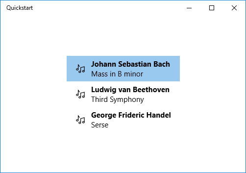

# <a name="data-binding-overview"></a>Übersicht über Datenbindung

In diesem Thema erfahren Sie, wie Sie in einer UWP-App (Universelle Windows-Plattform) ein Steuerelement (oder ein anderes Benutzeroberflächenelement) an ein einzelnes Element oder ein Elementsteuerelement an eine Sammlung von Elementen binden. Darüber hinaus wird erläutert, wie Sie die Anzeige von Elementen steuern, eine Detailansicht auf Grundlage einer Auswahl implementieren und Daten für die Anzeige umwandeln. Ausführliche Informationen finden Sie unter [Datenbindung im Detail](data-binding-in-depth.md).

## <a name="prerequisites"></a>Erforderliche Komponenten

In diesem Thema wird vorausgesetzt, dass Sie mit dem Erstellen von UWP-Apps vertraut sind. Eine Anleitung zum Erstellen Ihrer ersten UWP-App finden Sie unter [Erste Schritte mit Windows-Apps](https://docs.microsoft.com/windows/uwp/get-started/).

## <a name="create-the-project"></a>Erstellen des Projekts

Erstellen Sie ein neues Projekt vom Typ **Leere Anwendung (Windows Universal)** . Nennen Sie sie „Schnellstart“.

## <a name="binding-to-a-single-item"></a>Binden an ein einzelnes Element

Jede Bindung besteht aus einem Bindungsziel und einer Bindungsquelle. In der Regel ist das Ziel eine Eigenschaft eines Steuerelements oder anderen Benutzeroberflächenelements, und die Quelle ist eine Eigenschaft einer Klasseninstanz (ein Datenmodell oder ein Ansichtsmodell). In diesem Beispiel wird veranschaulicht, wie Sie ein Steuerelement an ein einzelnes Element binden. Das Ziel ist die **Text**-Eigenschaft eines **TextBlock**. Die Quelle ist eine Instanz einer einfachen Klasse namens **Recording**, die eine Audioaufnahme darstellt. Befassen wir uns zuerst mit der Klasse.

Wenn Sie oder C++/CX C# verwenden, fügen Sie dem Projekt eine neue Klasse hinzu, und benennen Sie die Klassen **Aufzeichnung**.

Wenn Sie [ C++/WinRT](/windows/uwp/cpp-and-winrt-apis/intro-to-using-cpp-with-winrt)verwenden, fügen Sie dem Projekt neue Dateien für die **mittlere Datei (. idl)** hinzu, wie im C++folgenden Beispiel gezeigt. Ersetzen Sie den Inhalt dieser neuen Dateien durch den in der Auflistung gezeigten [Mittelwert 3,0](/uwp/midl-3/intro) -Code, erstellen Sie das Projekt, um `Recording.h` und `.cpp` und `RecordingViewModel.h` und `.cpp` zu generieren, und fügen Sie dann den generierten Dateien Code hinzu, damit dieser der Auflistung entspricht. Weitere Informationen zu diesen generierten Dateien und zum Kopieren der Dateien in das Projekt finden Sie unter [XAML-Steuerelemente, binden C++an eine/WinRT-Eigenschaft](/windows/uwp/cpp-and-winrt-apis/binding-property).

```csharp
namespace Quickstart
{
    public class Recording
    {
        public string ArtistName { get; set; }
        public string CompositionName { get; set; }
        public DateTime ReleaseDateTime { get; set; }
        public Recording()
        {
            this.ArtistName = "Wolfgang Amadeus Mozart";
            this.CompositionName = "Andante in C for Piano";
            this.ReleaseDateTime = new DateTime(1761, 1, 1);
        }
        public string OneLineSummary
        {
            get
            {
                return $"{this.CompositionName} by {this.ArtistName}, released: "
                    + this.ReleaseDateTime.ToString("d");
            }
        }
    }
    public class RecordingViewModel
    {
        private Recording defaultRecording = new Recording();
        public Recording DefaultRecording { get { return this.defaultRecording; } }
    }
}
```

```cppwinrt
// Recording.idl
namespace Quickstart
{
    runtimeclass Recording
    {
        Recording(String artistName, String compositionName, Windows.Globalization.Calendar releaseDateTime);
        String ArtistName{ get; };
        String CompositionName{ get; };
        Windows.Globalization.Calendar ReleaseDateTime{ get; };
        String OneLineSummary{ get; };
    }
}

// RecordingViewModel.idl
import "Recording.idl";

namespace Quickstart
{
    runtimeclass RecordingViewModel
    {
        RecordingViewModel();
        Quickstart.Recording DefaultRecording{ get; };
    }
}

// Recording.h
// Add these fields:
...
#include <sstream>
...
private:
    std::wstring m_artistName;
    std::wstring m_compositionName;
    Windows::Globalization::Calendar m_releaseDateTime;
...

// Recording.cpp
// Implement like this:
...
Recording::Recording(hstring const& artistName, hstring const& compositionName, Windows::Globalization::Calendar const& releaseDateTime) :
    m_artistName{ artistName.c_str() },
    m_compositionName{ compositionName.c_str() },
    m_releaseDateTime{ releaseDateTime } {}

hstring Recording::ArtistName(){ return hstring{ m_artistName }; }
hstring Recording::CompositionName(){ return hstring{ m_compositionName }; }
Windows::Globalization::Calendar Recording::ReleaseDateTime(){ return m_releaseDateTime; }

hstring Recording::OneLineSummary()
{
    std::wstringstream wstringstream;
    wstringstream << m_compositionName.c_str();
    wstringstream << L" by " << m_artistName.c_str();
    wstringstream << L", released: " << m_releaseDateTime.MonthAsNumericString().c_str();
    wstringstream << L"/" << m_releaseDateTime.DayAsString().c_str();
    wstringstream << L"/" << m_releaseDateTime.YearAsString().c_str();
    return hstring{ wstringstream.str().c_str() };
}
...

// RecordingViewModel.h
// Add this field:
...
#include "Recording.h"
...
private:
    Quickstart::Recording m_defaultRecording{ nullptr };
...

// RecordingViewModel.cpp
// Implement like this:
...
Quickstart::Recording RecordingViewModel::DefaultRecording()
{
    Windows::Globalization::Calendar releaseDateTime;
    releaseDateTime.Year(1761);
    releaseDateTime.Month(1);
    releaseDateTime.Day(1);
    m_defaultRecording = winrt::make<Recording>(L"Wolfgang Amadeus Mozart", L"Andante in C for Piano", releaseDateTime);
    return m_defaultRecording;
}
...
```

```cppcx
// Recording.h
#include <sstream>
namespace Quickstart
{
    public ref class Recording sealed
    {
    private:
        Platform::String^ artistName;
        Platform::String^ compositionName;
        Windows::Globalization::Calendar^ releaseDateTime;
    public:
        Recording(Platform::String^ artistName, Platform::String^ compositionName,
            Windows::Globalization::Calendar^ releaseDateTime) :
            artistName{ artistName },
            compositionName{ compositionName },
            releaseDateTime{ releaseDateTime } {}
        property Platform::String^ ArtistName
        {
            Platform::String^ get() { return this->artistName; }
        }
        property Platform::String^ CompositionName
        {
            Platform::String^ get() { return this->compositionName; }
        }
        property Windows::Globalization::Calendar^ ReleaseDateTime
        {
            Windows::Globalization::Calendar^ get() { return this->releaseDateTime; }
        }
        property Platform::String^ OneLineSummary
        {
            Platform::String^ get()
            {
                std::wstringstream wstringstream;
                wstringstream << this->CompositionName->Data();
                wstringstream << L" by " << this->ArtistName->Data();
                wstringstream << L", released: " << this->ReleaseDateTime->MonthAsNumericString()->Data();
                wstringstream << L"/" << this->ReleaseDateTime->DayAsString()->Data();
                wstringstream << L"/" << this->ReleaseDateTime->YearAsString()->Data();
                return ref new Platform::String(wstringstream.str().c_str());
            }
        }
    };
    public ref class RecordingViewModel sealed
    {
    private:
        Recording ^ defaultRecording;
    public:
        RecordingViewModel()
        {
            Windows::Globalization::Calendar^ releaseDateTime = ref new Windows::Globalization::Calendar();
            releaseDateTime->Year = 1761;
            releaseDateTime->Month = 1;
            releaseDateTime->Day = 1;
            this->defaultRecording = ref new Recording{ L"Wolfgang Amadeus Mozart", L"Andante in C for Piano", releaseDateTime };
        }
        property Recording^ DefaultRecording
        {
            Recording^ get() { return this->defaultRecording; };
        }
    };
}

// Recording.cpp
#include "pch.h"
#include "Recording.h"
```

Machen Sie als Nächstes die Bindungsquellklasse aus der Klasse verfügbar, die die Markupseite darstellt. Zu diesem Zweck fügen Sie eine Eigenschaft vom Typ **RecordingViewModel** zu **MainPage** hinzu.

Wenn Sie [ C++/WinRT](/windows/uwp/cpp-and-winrt-apis/intro-to-using-cpp-with-winrt)verwenden, aktualisieren Sie zuerst `MainPage.idl`. Erstellen Sie das Projekt, um `MainPage.h` und `.cpp` neu zu generieren, und führen Sie die Änderungen in diesen generierten Dateien in den in Ihrem Projekt erstellten Dateien zusammen.

```csharp
namespace Quickstart
{
    public sealed partial class MainPage : Page
    {
        public MainPage()
        {
            this.InitializeComponent();
            this.ViewModel = new RecordingViewModel();
        }
        public RecordingViewModel ViewModel{ get; set; }
    }
}
```

```cppwinrt
// MainPage.idl
// Add this property:
import "RecordingViewModel.idl";
...
RecordingViewModel ViewModel{ get; };
...

// MainPage.h
// Add this property and this field:
...
#include "RecordingViewModel.h"
...
    Quickstart::RecordingViewModel ViewModel();

private:
    Quickstart::RecordingViewModel m_viewModel{ nullptr };
...

// MainPage.cpp
// Implement like this:
...
MainPage::MainPage()
{
    InitializeComponent();
    m_viewModel = winrt::make<RecordingViewModel>();
}
Quickstart::RecordingViewModel MainPage::ViewModel()
{
    return m_viewModel;
}
...
```

```cppcx
// MainPage.h
...
#include "Recording.h"

namespace Quickstart
{
    public ref class MainPage sealed
    {
    private:
        RecordingViewModel ^ viewModel;
    public:
        MainPage();

        property RecordingViewModel^ ViewModel
        {
            RecordingViewModel^ get() { return this->viewModel; };
        }
    };
}

// MainPage.cpp
...
MainPage::MainPage()
{
    InitializeComponent();
    this->viewModel = ref new RecordingViewModel();
}
```

Der letzte Codeteil ist das Binden eines **TextBlock** an die **ViewModel.DefaultRecording.OneLiner**-Eigenschaft.

```xml
<Page x:Class="Quickstart.MainPage" ... >
    <Grid Background="{ThemeResource ApplicationPageBackgroundThemeBrush}">
        <TextBlock Text="{x:Bind ViewModel.DefaultRecording.OneLineSummary}"
    HorizontalAlignment="Center"
    VerticalAlignment="Center"/>
    </Grid>
</Page>
```

Wenn Sie [ C++/WinRT](/windows/uwp/cpp-and-winrt-apis/intro-to-using-cpp-with-winrt)verwenden, müssen Sie die **MainPage:: ClickHandler** -Funktion entfernen, damit das Projekt erstellt werden kann.

Dies ist das Ergebnis.


## <a name="binding-to-a-collection-of-items"></a>Binden an eine Sammlung von Elementen

Ein häufiges Szenario ist das Binden an eine Sammlung von Geschäftsobjekten. In C# und Visual Basic stellt die generische [**ObservableCollection&lt;T&gt;** ](https://docs.microsoft.com/dotnet/api/system.collections.objectmodel.observablecollection-1)-Klasse eine gute Wahl für die Datenbindung bei Sammlungen dar, da sie die  [**INotifyPropertyChanged**](https://docs.microsoft.com/dotnet/api/system.componentmodel.inotifypropertychanged)-Schnittstelle und die [**INotifyCollectionChanged**](https://docs.microsoft.com/dotnet/api/system.collections.specialized.inotifycollectionchanged)-Schnittstelle implementiert. Diese Schnittstellen bieten eine Änderungsbenachrichtigung für Bindungen, wenn Elemente hinzugefügt oder entfernt werden oder eine Eigenschaft der Liste selbst geändert wird. Wenn Ihre gebundenen Steuerelemente bei Änderungen an Eigenschaften von Objekten in der Sammlung aktualisiert werden sollen, muss das Geschäftsobjekt auch **INotifyPropertyChanged** implementieren. Weitere Informationen finden Sie unter [Datenbindung im Detail](data-binding-in-depth.md).

Wenn Sie [ C++/WinRT](/windows/uwp/cpp-and-winrt-apis/intro-to-using-cpp-with-winrt)verwenden, können Sie weitere Informationen zum Binden an eine Observable-Auflistung in [XAML-Element Steuerelementen und zum Binden C++an eine/WinRT](/windows/uwp/cpp-and-winrt-apis/binding-collection)-Auflistung erhalten. Wenn Sie dieses Thema zuerst lesen, ist der Zweck der unten C++gezeigten/WinRT-Code Auflistung klarer.

In diesem nächsten Beispiel wird eine [**ListView**](https://docs.microsoft.com/uwp/api/Windows.UI.Xaml.Controls.ListView) an eine Sammlung von `Recording`-Objekten gebunden. Beginnen wir, indem wir die Sammlung zum Ansichtsmodell hinzufügen. Fügen Sie einfach diese neuen Member zur **RecordingViewModel**-Klasse hinzu.

```csharp
public class RecordingViewModel
{
    ...
    private ObservableCollection<Recording> recordings = new ObservableCollection<Recording>();
    public ObservableCollection<Recording> Recordings{ get{ return this.recordings; } }
    public RecordingViewModel()
    {
        this.recordings.Add(new Recording(){ ArtistName = "Johann Sebastian Bach",
            CompositionName = "Mass in B minor", ReleaseDateTime = new DateTime(1748, 7, 8) });
        this.recordings.Add(new Recording(){ ArtistName = "Ludwig van Beethoven",
            CompositionName = "Third Symphony", ReleaseDateTime = new DateTime(1805, 2, 11) });
        this.recordings.Add(new Recording(){ ArtistName = "George Frideric Handel",
            CompositionName = "Serse", ReleaseDateTime = new DateTime(1737, 12, 3) });
    }
}
```

```cppwinrt
// RecordingViewModel.idl
// Add this property:
...
#include <winrt/Windows.Foundation.Collections.h>
...
Windows.Foundation.Collections.IVector<IInspectable> Recordings{ get; };
...

// RecordingViewModel.h
// Change the constructor declaration, and add this property and this field:
...
    RecordingViewModel();
    Windows::Foundation::Collections::IVector<Windows::Foundation::IInspectable> Recordings();

private:
    Windows::Foundation::Collections::IVector<Windows::Foundation::IInspectable> m_recordings;
...

// RecordingViewModel.cpp
// Update/add implementations like this:
...
RecordingViewModel::RecordingViewModel()
{
    std::vector<Windows::Foundation::IInspectable> recordings;

    Windows::Globalization::Calendar releaseDateTime;
    releaseDateTime.Month(7); releaseDateTime.Day(8); releaseDateTime.Year(1748);
    recordings.push_back(winrt::make<Recording>(L"Johann Sebastian Bach", L"Mass in B minor", releaseDateTime));

    releaseDateTime = Windows::Globalization::Calendar{};
    releaseDateTime.Month(11); releaseDateTime.Day(2); releaseDateTime.Year(1805);
    recordings.push_back(winrt::make<Recording>(L"Ludwig van Beethoven", L"Third Symphony", releaseDateTime));

    releaseDateTime = Windows::Globalization::Calendar{};
    releaseDateTime.Month(3); releaseDateTime.Day(12); releaseDateTime.Year(1737);
    recordings.push_back(winrt::make<Recording>(L"George Frideric Handel", L"Serse", releaseDateTime));

    m_recordings = winrt::single_threaded_observable_vector<Windows::Foundation::IInspectable>(std::move(recordings));
}

Windows::Foundation::Collections::IVector<Windows::Foundation::IInspectable> RecordingViewModel::Recordings() { return m_recordings; }
...
```

```cppcx
// Recording.h
...
public ref class RecordingViewModel sealed
{
private:
    ...
    Windows::Foundation::Collections::IVector<Recording^>^ recordings;
public:
    RecordingViewModel()
    {
        ...
        releaseDateTime = ref new Windows::Globalization::Calendar();
        releaseDateTime->Year = 1748;
        releaseDateTime->Month = 7;
        releaseDateTime->Day = 8;
        Recording^ recording = ref new Recording{ L"Johann Sebastian Bach", L"Mass in B minor", releaseDateTime };
        this->Recordings->Append(recording);
        releaseDateTime = ref new Windows::Globalization::Calendar();
        releaseDateTime->Year = 1805;
        releaseDateTime->Month = 2;
        releaseDateTime->Day = 11;
        recording = ref new Recording{ L"Ludwig van Beethoven", L"Third Symphony", releaseDateTime };
        this->Recordings->Append(recording);
        releaseDateTime = ref new Windows::Globalization::Calendar();
        releaseDateTime->Year = 1737;
        releaseDateTime->Month = 12;
        releaseDateTime->Day = 3;
        recording = ref new Recording{ L"George Frideric Handel", L"Serse", releaseDateTime };
        this->Recordings->Append(recording);
    }
    ...
    property Windows::Foundation::Collections::IVector<Recording^>^ Recordings
    {
        Windows::Foundation::Collections::IVector<Recording^>^ get()
        {
            if (this->recordings == nullptr)
            {
                this->recordings = ref new Platform::Collections::Vector<Recording^>();
            }
            return this->recordings;
        };
    }
};
```

Binden Sie dann eine [**ListView**](https://docs.microsoft.com/uwp/api/Windows.UI.Xaml.Controls.ListView) an die **ViewModel.Recordings**-Eigenschaft.

```xml
<Page x:Class="Quickstart.MainPage" ... >
    <Grid Background="{ThemeResource ApplicationPageBackgroundThemeBrush}">
        <ListView ItemsSource="{x:Bind ViewModel.Recordings}"
        HorizontalAlignment="Center" VerticalAlignment="Center"/>
    </Grid>
</Page>
```

Wir haben noch keine Datenvorlage für die **Recording**-Klasse bereitgestellt. Daher kann das Benutzeroberflächenframework nur [**ToString**](https://docs.microsoft.com/dotnet/api/system.object.tostring#System_Object_ToString) für jedes Element in der [**ListView**](https://docs.microsoft.com/uwp/api/Windows.UI.Xaml.Controls.ListView) aufrufen. Die Standardimplementierung von **ToString** ist die Rückgabe des Typnamens.


Um dieses Problem zu beheben, können Sie entweder "$ [**String**](https://docs.microsoft.com/dotnet/api/system.object.tostring#System_Object_ToString) " außer Kraft setzen, um den Wert von " **onelinesenummary**" zurückzugeben, oder Sie können eine Daten Vorlage angeben. Die Option Daten Vorlage ist eine übliche Lösung und eine flexiblere Lösung. Sie legen eine Datenvorlage mithilfe der [**ContentTemplate**](https://docs.microsoft.com/uwp/api/windows.ui.xaml.controls.contentcontrol.contenttemplate)-Eigenschaft eines Inhaltssteuerelements oder mit der [**ItemTemplate**](https://docs.microsoft.com/uwp/api/windows.ui.xaml.controls.itemscontrol.itemtemplate)-Eigenschaft eines Elementsteuerelements fest. Nachfolgend sind zwei Möglichkeiten zum Entwerfen einer Datenvorlage für **Recording** dargestellt, zusammen mit einer Abbildung des Ergebnisses.

```xml
<ListView ItemsSource="{x:Bind ViewModel.Recordings}"
HorizontalAlignment="Center" VerticalAlignment="Center">
    <ListView.ItemTemplate>
        <DataTemplate x:DataType="local:Recording">
            <TextBlock Text="{x:Bind OneLineSummary}"/>
        </DataTemplate>
    </ListView.ItemTemplate>
</ListView>
```


```xml
<ListView ItemsSource="{x:Bind ViewModel.Recordings}"
HorizontalAlignment="Center" VerticalAlignment="Center">
    <ListView.ItemTemplate>
        <DataTemplate x:DataType="local:Recording">
            <StackPanel Orientation="Horizontal" Margin="6">
                <SymbolIcon Symbol="Audio" Margin="0,0,12,0"/>
                <StackPanel>
                    <TextBlock Text="{x:Bind ArtistName}" FontWeight="Bold"/>
                    <TextBlock Text="{x:Bind CompositionName}"/>
                </StackPanel>
            </StackPanel>
        </DataTemplate>
    </ListView.ItemTemplate>
</ListView>
```



Weitere Informationen zur XAML-Syntax finden Sie unter [Erstellen einer Benutzeroberfläche mit XAML](https://docs.microsoft.com/windows/uwp/design/basics/xaml-basics-ui). Weitere Informationen zum Steuerelementlayout finden Sie unter [Definieren von Layouts mit XAML](https://docs.microsoft.com/windows/uwp/layout/layouts-with-xaml).

## <a name="adding-a-details-view"></a>Hinzufügen einer Detailansicht

Sie können auch alle Details der **Recording**-Objekte in [**ListView**](https://docs.microsoft.com/uwp/api/Windows.UI.Xaml.Controls.ListView)-Elementen anzeigen. Dies nimmt jedoch sehr viel Platz in Anspruch. Stattdessen können Sie gerade so viele Daten im Element anzeigen, um es zu identifizieren, und wenn der Benutzer dann eine Auswahl vornimmt, können Sie alle Details des ausgewählten Elements in einem separaten Teil der Benutzeroberfläche anzeigen, der als „Detailansicht“ bezeichnet wird. Diese Anordnung wird auch als „Haupt-/Detailansicht“ oder „Listen-/Detailansicht“ bezeichnet.

Sie haben zwei Möglichkeiten, dieses Verhalten zu implementieren. Sie können die Detailansicht an die [**SelectedItem**](https://docs.microsoft.com/uwp/api/windows.ui.xaml.controls.primitives.selector.selecteditem)-Eigenschaft der [**ListView**](https://docs.microsoft.com/uwp/api/Windows.UI.Xaml.Controls.ListView) binden. Oder Sie können eine [**CollectionViewSource**](https://docs.microsoft.com/uwp/api/Windows.UI.Xaml.Data.CollectionViewSource)verwenden. in diesem Fall binden Sie sowohl die **ListView** -als auch die Detailansicht an die **CollectionViewSource** (dabei wird das aktuell ausgewählte Element für Sie übernommen). Beide Verfahren sind unten dargestellt, und beide weisen die gleichen Ergebnisse auf (in der Abbildung dargestellt).

> [!NOTE]
> Bisher haben wir in diesem Thema nur die [{x:Bind}-Markuperweiterung](https://docs.microsoft.com/windows/uwp/xaml-platform/x-bind-markup-extension) verwendet. Die beiden weiter unten aufgeführten Methoden benötigen jedoch die flexiblere (aber weniger leistungsfähige) [{Binding}-Markuperweiterung](https://docs.microsoft.com/windows/uwp/xaml-platform/binding-markup-extension).

Wenn Sie C++/WinRT oder Visual C++ Component Extensions (C++/CX) verwenden und dann die [{Binding}](https://docs.microsoft.com/windows/uwp/xaml-platform/binding-markup-extension) -Markup Erweiterung verwenden, müssen Sie der Lauf Zeit Klasse, an die Sie binden möchten, das [BindableAttribute](https://docs.microsoft.com/uwp/api/Windows.UI.Xaml.Data.BindableAttribute) -Attribut hinzufügen. Um [{x:Bind}](https://docs.microsoft.com/windows/uwp/xaml-platform/x-bind-markup-extension)verwenden zu können, benötigen Sie dieses Attribut nicht.

> [!IMPORTANT]
> Wenn Sie [ C++/WinRT](/windows/uwp/cpp-and-winrt-apis/intro-to-using-cpp-with-winrt)verwenden, ist das [BindableAttribute](https://docs.microsoft.com/uwp/api/Windows.UI.Xaml.Data.BindableAttribute) -Attribut verfügbar, wenn Sie die Windows SDK Version 10.0.17763.0 (Windows 10, Version 1809) oder höher installiert haben. Ohne dieses Attribut müssen Sie die [icustompropertyprovider](/uwp/api/windows.ui.xaml.data.icustompropertyprovider) -Schnittstelle und die [icustomproperty](/uwp/api/windows.ui.xaml.data.icustomproperty) -Schnittstelle implementieren, um die [{Binding}](https://docs.microsoft.com/windows/uwp/xaml-platform/binding-markup-extension) -Markup Erweiterung verwenden zu können.

Sehen wir uns zuerst die [**SelectedItem**](https://docs.microsoft.com/uwp/api/windows.ui.xaml.controls.primitives.selector.selecteditem)-Methode an.

```csharp
// No code changes necessary for C#.
```

```cppwinrt
// Recording.idl
// Add this attribute:
...
[Windows.UI.Xaml.Data.Bindable]
runtimeclass Recording
...
```

```cppcx
[Windows::UI::Xaml::Data::Bindable]
public ref class Recording sealed
{
    ...
};
```

Darüber hinaus muss nur noch eine Änderung am Markup vorgenommen werden.

```xml
<Page x:Class="Quickstart.MainPage" ... >
    <Grid Background="{ThemeResource ApplicationPageBackgroundThemeBrush}">
        <StackPanel HorizontalAlignment="Center" VerticalAlignment="Center">
            <ListView x:Name="recordingsListView" ItemsSource="{x:Bind ViewModel.Recordings}">
                <ListView.ItemTemplate>
                    <DataTemplate x:DataType="local:Recording">
                        <StackPanel Orientation="Horizontal" Margin="6">
                            <SymbolIcon Symbol="Audio" Margin="0,0,12,0"/>
                            <StackPanel>
                                <TextBlock Text="{x:Bind CompositionName}"/>
                            </StackPanel>
                        </StackPanel>
                    </DataTemplate>
                </ListView.ItemTemplate>
            </ListView>
            <StackPanel DataContext="{Binding SelectedItem, ElementName=recordingsListView}"
            Margin="0,24,0,0">
                <TextBlock Text="{Binding ArtistName}"/>
                <TextBlock Text="{Binding CompositionName}"/>
                <TextBlock Text="{Binding ReleaseDateTime}"/>
            </StackPanel>
        </StackPanel>
    </Grid>
</Page>
```

Fügen Sie für die [**CollectionViewSource**](https://docs.microsoft.com/uwp/api/Windows.UI.Xaml.Data.CollectionViewSource)-Methode zuerst eine **CollectionViewSource** als Seitenressource hinzu.

```xml
<Page.Resources>
    <CollectionViewSource x:Name="RecordingsCollection" Source="{x:Bind ViewModel.Recordings}"/>
</Page.Resources>
```

Passen Sie dann die Bindungen in der [**ListView**](https://docs.microsoft.com/uwp/api/Windows.UI.Xaml.Controls.ListView) (die nicht mehr benannt werden muss) und in der Detailansicht so an, dass die [**CollectionViewSource**](https://docs.microsoft.com/uwp/api/Windows.UI.Xaml.Data.CollectionViewSource) verwendet wird. Beachten Sie, dass Sie durch die direkte Bindung der Detailansicht an die **CollectionViewSource** implizieren, dass Sie in Bindungen, in denen der Pfad in der Sammlung selbst nicht gefunden werden kann, an das aktuelle Element binden möchten. Die **CurrentItem**-Eigenschaft muss nicht als Pfad für die Bindung angegeben werden, obwohl dies im Zweifelsfall möglich ist.

```xml
...
<ListView ItemsSource="{Binding Source={StaticResource RecordingsCollection}}">
...
<StackPanel DataContext="{Binding Source={StaticResource RecordingsCollection}}" ...>
...
```

Nachfolgend ist das identische Ergebnis für die beiden Methoden dargestellt.

> [!NOTE]
> Wenn Sie verwenden C++, sieht die Benutzeroberfläche nicht genau wie in der folgenden Abbildung aus: das Rendering der **releasedatetime** -Eigenschaft ist unterschiedlich. Weitere Informationen hierzu finden Sie im folgenden Abschnitt.


## <a name="formatting-or-converting-data-values-for-display"></a>Formatieren oder Konvertieren von Datenwerten für die Anzeige

Es liegt ein Problem mit dem obigen Rendering vor. Die **releasedatetime** -Eigenschaft ist nicht nur ein Datum, sondern ein [DateTime](/uwp/api/windows.foundation.datetime) -Wert (wenn Sie C++verwenden, ist es ein [Kalender](/uwp/api/windows.globalization.calendar)). In C#wird Sie also mit mehr Genauigkeit angezeigt, als wir benötigen. C++ Und darin wird als Typname gerendert. Eine Lösung besteht darin, der **Aufzeichnungs** Klasse eine Zeichen folgen Eigenschaft hinzuzufügen, die das Äquivalent von `this.ReleaseDateTime.ToString("d")` zurückgibt. Wenn Sie die Eigenschaft **ReleaseDate** benennen, geben Sie an, dass ein Datum und kein Datum und keine Uhrzeit zurückgegeben werden. Die Benennung als **ReleaseDateAsString** gibt dann auch noch an, dass sie eine Zeichenfolge zurückgibt.

Eine flexiblere Lösung ist die Verwendung eines so genannten „Wertkonverters“. Nachfolgend ist ein Beispiel zum Erstellen Ihres eigenen Wertkonverter aufgeführt. Wenn Sie verwenden C#, fügen Sie den folgenden Code zu ihrer `Recording.cs`-Quell Code Datei hinzu. Wenn Sie/WinRT verwenden C++, fügen Sie dem Projekt ein neues **(. idl-) Element (. idl)** hinzu, das wie im C++folgenden Beispiel gezeigt wird. Erstellen Sie das Projekt, um `StringFormatter.h` zu generieren, und `.cpp`, fügen Sie die Dateien dem Projekt hinzu, und fügen Sie dann das Code Auflistungen. Fügen Sie auch `#include "StringFormatter.h"` zu `MainPage.h` hinzu.

```csharp
public class StringFormatter : Windows.UI.Xaml.Data.IValueConverter
{
    // This converts the value object to the string to display.
    // This will work with most simple types.
    public object Convert(object value, Type targetType,
        object parameter, string language)
    {
        // Retrieve the format string and use it to format the value.
        string formatString = parameter as string;
        if (!string.IsNullOrEmpty(formatString))
        {
            return string.Format(formatString, value);
        }

        // If the format string is null or empty, simply
        // call ToString() on the value.
        return value.ToString();
    }

    // No need to implement converting back on a one-way binding
    public object ConvertBack(object value, Type targetType,
        object parameter, string language)
    {
        throw new NotImplementedException();
    }
}
```

```cppwinrt
// StringFormatter.idl
namespace Quickstart
{
    runtimeclass StringFormatter : [default] Windows.UI.Xaml.Data.IValueConverter
    {
        StringFormatter();
    }
}

// StringFormatter.h
#pragma once

#include "StringFormatter.g.h"
#include <sstream>

namespace winrt::Quickstart::implementation
{
    struct StringFormatter : StringFormatterT<StringFormatter>
    {
        StringFormatter() = default;

        Windows::Foundation::IInspectable Convert(Windows::Foundation::IInspectable const& value, Windows::UI::Xaml::Interop::TypeName const& targetType, Windows::Foundation::IInspectable const& parameter, hstring const& language);
        Windows::Foundation::IInspectable ConvertBack(Windows::Foundation::IInspectable const& value, Windows::UI::Xaml::Interop::TypeName const& targetType, Windows::Foundation::IInspectable const& parameter, hstring const& language);
    };
}

namespace winrt::Quickstart::factory_implementation
{
    struct StringFormatter : StringFormatterT<StringFormatter, implementation::StringFormatter>
    {
    };
}

// StringFormatter.cpp
#include "pch.h"
#include "StringFormatter.h"
#include "StringFormatter.g.cpp"

namespace winrt::Quickstart::implementation
{
    Windows::Foundation::IInspectable StringFormatter::Convert(Windows::Foundation::IInspectable const& value, Windows::UI::Xaml::Interop::TypeName const& /* targetType */, Windows::Foundation::IInspectable const& /* parameter */, hstring const& /* language */)
    {
        // Retrieve the value as a Calendar.
        Windows::Globalization::Calendar valueAsCalendar{ value.as<Windows::Globalization::Calendar>() };

        std::wstringstream wstringstream;
        wstringstream << L"Released: ";
        wstringstream << valueAsCalendar.MonthAsNumericString().c_str();
        wstringstream << L"/" << valueAsCalendar.DayAsString().c_str();
        wstringstream << L"/" << valueAsCalendar.YearAsString().c_str();
        return winrt::box_value(hstring{ wstringstream.str().c_str() });
    }

    Windows::Foundation::IInspectable StringFormatter::ConvertBack(Windows::Foundation::IInspectable const& /* value */, Windows::UI::Xaml::Interop::TypeName const& /* targetType */, Windows::Foundation::IInspectable const& /* parameter */, hstring const& /* language */)
    {
        throw hresult_not_implemented();
    }
}
```

```cppcx
...
public ref class StringFormatter sealed : Windows::UI::Xaml::Data::IValueConverter
{
public:
    virtual Platform::Object^ Convert(Platform::Object^ value, TypeName targetType, Platform::Object^ parameter, Platform::String^ language)
    {
        // Retrieve the value as a Calendar.
        Windows::Globalization::Calendar^ valueAsCalendar = dynamic_cast<Windows::Globalization::Calendar^>(value);

        std::wstringstream wstringstream;
        wstringstream << L"Released: ";
        wstringstream << valueAsCalendar->MonthAsNumericString()->Data();
        wstringstream << L"/" << valueAsCalendar->DayAsString()->Data();
        wstringstream << L"/" << valueAsCalendar->YearAsString()->Data();
        return ref new Platform::String(wstringstream.str().c_str());
    }

    // No need to implement converting back on a one-way binding
    virtual Platform::Object^ ConvertBack(Platform::Object^ value, TypeName targetType, Platform::Object^ parameter, Platform::String^ language)
    {
        throw ref new Platform::NotImplementedException();
    }
};
...
```

> [Hinweis!] Für das C++obige/WinRT-Codelisting in `StringFormatter.idl` verwenden wir das [default-Attribut](https://docs.microsoft.com/windows/desktop/midl/default) , um **IValueConverter** als Standardschnittstelle zu deklarieren. In der Auflistung hat **stringformatter** nur einen Konstruktor und keine Methoden, sodass keine Standardschnittstelle für Sie generiert wird. Das `default`-Attribut ist optimal, wenn Sie **stringformatter**keine Instanzmember hinzufügen, da keine QueryInterface erforderlich ist, um die **IValueConverter** -Methoden aufzurufen. Alternativ dazu können Sie eine standardmäßige **istringformatter** -Schnittstelle zur Generierung auffordern. dazu können Sie die Lauf Zeit Klasse selbst mit dem default_interface- [Attribut](https://docs.microsoft.com/uwp/midl-3/predefined-attributes#the-default_interface-attribute)versehen. Diese Option ist optimal, wenn Sie **stringformatter** Instanzmember hinzufügen, die häufiger als die Methoden von **IValueConverter** aufgerufen werden, da keine QueryInterface erforderlich ist, um die Instanzmember aufzurufen.

Nun können wir eine Instanz von **stringformatter** als Seiten Ressource hinzufügen und Sie in der Bindung des **TextBlock** -Objekts verwenden, das die **releasedatetime** -Eigenschaft anzeigt.

```xml
<Page.Resources>
    <local:StringFormatter x:Key="StringFormatterValueConverter"/>
</Page.Resources>
...
<TextBlock Text="{Binding ReleaseDateTime,
    Converter={StaticResource StringFormatterValueConverter},
    ConverterParameter=Released: \{0:d\}}"/>
...
```

Wie Sie oben sehen können, verwenden wir für die Formatierungs Flexibilität das Markup, um eine Format Zeichenfolge mithilfe des konverterparameters in den Konverter zu übergeben. In den in diesem Thema gezeigten Codebeispielen verwendet nur der C# Wert Konverter diesen Parameter. Sie könnten jedoch problemlos eine C++Format Zeichenfolge im Format als Konverterparameter übergeben und diese in ihrem Wert Konverter mit einer Formatierungsfunktion wie **wprintf** oder **tauprintf**verwenden.

Dies ist das Ergebnis.


> [!NOTE]
> Ab Windows 10, Version 1607, bietet das XAML-Framework einen integrierten booleschen-to-Visibility-Konverter. Der Konverter ordnet dem **Visibility. Visible** -Enumerationswert den Wert **true** zu, und die **Sichtbarkeit** ist auf " **false** ". reduziert, sodass Sie eine Sichtbarkeit an einen booleschen Wert binden können, ohne einen Konverter Für die Verwendung des integrierten Konverters muss die SDK-Zielversion der App mindestens 14393 lauten. Die Verwendung ist nicht möglich, wenn Ihre App für frühere Versionen von Windows 10 bestimmt ist. Weitere Informationen zu Ziel Versionen finden Sie unter [Version-Adaptive Code](https://docs.microsoft.com/windows/uwp/debug-test-perf/version-adaptive-code).

## <a name="see-also"></a>Siehe auch
* [Datenbindung](index.md)
