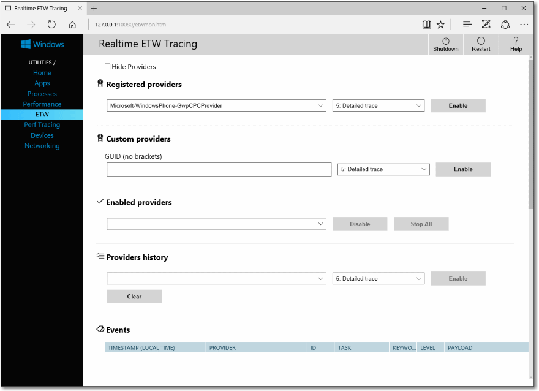

# <a name="windows-device-portal-overview"></a>Übersicht über das Windows Device Portal

Mit dem Windows Device Portal können Sie Ihr Gerät remote über ein Netzwerk oder eine USB-Verbindung konfigurieren und verwalten. Es bietet zudem erweiterte Diagnosetools, mit denen Sie Probleme beim Windows-Gerät behandeln und dessen Leistung in Echtzeit anzeigen können.

Das Windows-Geräteportal ist ein Webserver auf Ihrem Gerät, mit dem Sie über einen Webbrowser auf dem PC eine Verbindung herstellen können. Wenn Ihr Gerät über einen Webbrowser verfügt, können Sie auch mit dem Browser auf dem Gerät eine lokale Verbindung herstellen.

Das Windows-Geräteportal ist für jede Gerätefamilie verfügbar, die Features und die Einrichtung variieren jedoch abhängig von den Anforderungen des jeweiligen Geräts. Dieser Artikel enthält eine allgemeine Beschreibung des Device Portals und Links zu Artikeln mit ausführlicheren Informationen für jede Gerätefamilie.

Die Funktionalität des Windows-Geräteportals ist mithilfe von [REST-APIs](device-portal-api-core.md) implementiert, die Sie direkt für den Zugriff auf Daten und die programmatische Steuerung Ihres Geräts verwenden können.

## <a name="setup"></a>Setup

Für jedes Gerät gelten spezielle Anweisungen zum Herstellen der Verbindung mit dem Device Portal, diese allgemeinen Schritte sind jedoch für jedes Gerät erforderlich:

1. Aktivieren Sie den Entwicklermodus und das Geräteportal auf Ihrem Gerät (konfiguriert in der Einstellungen-App).

2. Verbinden Sie Ihr Gerät und den PC über ein lokales Netzwerk oder mittels USB.

3. Navigieren Sie im Browser zu der Seite für das Geräteportal. In dieser Tabelle sind die Ports und Protokolle aufgeführt, die von jeder Gerätefamilie verwendet werden.

Gerätefamilie | Standardmäßig aktiviert? | HTTP | HTTPS | USB
--------------|----------------|------|-------|----
HoloLens | Ja, im Entwicklermodus | 80 (Standard) | 443 (Standard) | http://127.0.0.1:10080
IoT | Ja, im Entwicklermodus | 8080 | Über Registrierungsschlüssel aktivieren | NICHT ZUTREFFEND
Xbox | Im Entwicklermodus aktivieren | Deaktiviert | 11443 | NICHT ZUTREFFEND
Desktop| Im Entwicklermodus aktivieren | 50080\* | 50043\* | NICHT ZUTREFFEND
Anschluss | Im Entwicklermodus aktivieren | 80| 443 | http://127.0.0.1:10080

\* Dies ist nicht stets der Fall, da das Geräteportal auf Desktops Ports in flüchtigen Bereich anfordert (> 50.000), um Konflikte mit vorhandenen Portanforderungen auf dem Gerät zu verhindern. Weitere Informationen hierzu finden Sie im Abschnitt zu [Porteinstellungen](device-portal-desktop.md#registry-based-configuration-for-device-portal) für den Desktop.  

Gerätespezifische Anweisungen zum Einrichten finden Sie in folgenden Artikeln:

- [Geräteportal für HoloLens](https://docs.microsoft.com/windows/uwp/debug-test-perf/device-portal-hololens)
- [Geräteportal für IoT](https://docs.microsoft.com/windows/iot-core/manage-your-device/DevicePortal)
- [Geräteportal für Mobilgeräte](device-portal-mobile.md)
- [Geräteportal für Xbox](../xbox-apps/device-portal-xbox.md)
- [Geräteportal für Windows-Desktop](device-portal-desktop.md#set-up-device-portal-on-windows-desktop)

## <a name="features"></a>Features

### <a name="toolbar-and-navigation"></a>Symbolleiste und Navigation

Die Symbolleiste am oberen Rand der Seite ermöglicht den Zugriff auf häufig verwendete Funktionen.

- **Stromversorgung**: Zugriff auf Energieoptionen.
  - **Herunterfahren**: Schaltet das Gerät aus.
  - **Neu starten**: Schaltet das Gerät aus und wieder ein.
- **Hilfe**: Öffnet die Hilfeseite.

Verwenden Sie die Links im Navigationsbereich am linken Rand der Seite, um zu den verfügbaren Verwaltungs- und Überwachungstools für Ihr Gerät zu navigieren.

Hier werden Tools beschrieben, die für Gerätefamilien verwendet werden können. Je nach Gerät sind möglicherweise andere Optionen verfügbar. Weitere Informationen finden Sie auf der entsprechenden Seite für Ihren Gerätetyp.

### <a name="apps-manager"></a>App-Manager

Der App-Manager bietet Installations-/Deinstallations- und Verwaltungsfunktionen für App-Pakete und -Bündel auf dem Hostgerät.


* **Apps bereitstellen**: Bereitstellen von App-Paketen von lokalen, Netzwerk- oder Webhosts und Registrieren einzelner Dateien von Netzwerkfreigaben.
* **Installierte Apps**: Verwenden Sie das Dropdownmenü, um Apps, die auf dem Gerät installiert sind, zu entfernen oder zu starten.
* **Ausgeführte Apps**: Sie erhalten Informationen zu den Apps, die derzeit ausgeführt werden, und können sie nach Bedarf schließen.

#### <a name="install-sideload-an-app"></a>Installieren (Querladen) einer App

Sie können Apps während der Entwicklung mithilfe des Windows-Geräteportals querladen:

1. Wenn Sie ein App-Paket erstellt haben, können Sie es per Remotezugriff auf Ihrem Gerät installieren. Nachdem Sie es in Visual Studio erstellt haben, wird ein Ausgabeordner generiert.

    

2. Navigieren Sie im Windows-Geräteportal zu der Seite **App-Manager**.

3. Wählen Sie im Abschnitt **Apps bereitstellen** die Option **Lokaler Speicher** aus.

4. Wählen Sie unter **Anwendungspaket auswählen** die Option **Datei auswählen** aus, und navigieren Sie zu dem App-Paket, das Sie querladen möchten.

5. Wählen Sie unter **Zum Signieren des App-Pakets verwendete Zertifikatdatei (CER) auswählen** die Option **Datei auswählen** aus, und navigieren Sie zu dem Zertifikat, das dem App-Paket zugeordnet ist.

6. Aktivieren Sie die entsprechenden Kontrollkästchen, wenn Sie optionale oder Frameworkpakete zusammen mit der App-Installation installieren möchten, und wählen Sie **Weiter** aus, um Sie auszuwählen.

7. Wählen Sie zum Initiieren der Installation **Installieren** aus.

8. Wenn auf dem Gerät Windows 10 im S-Modus ausgeführt wird und das angegebene Zertifikat zum ersten Mal auf dem Gerät installiert wurde, starten Sie das Gerät neu.

#### <a name="install-a-certificate"></a>Installieren eines Zertifikats

Alternativ können Sie das Zertifikat über das Windows-Geräteportal installieren und die App auf andere Weise:

1. Navigieren Sie im Windows-Geräteportal zu der Seite **App-Manager**.

2. Wählen Sie im Abschnitt **Apps bereitstellen** die Option **Zertifikat installieren** aus.

3. Wählen Sie unter **Zum Signieren des App-Pakets verwendete Zertifikatdatei (CER) auswählen** die Option **Datei auswählen** aus, und navigieren Sie zu dem Zertifikat, das dem App-Paket zugeordnet ist, das Sie querladen möchten.

4. Wählen Sie zum Initiieren der Installation **Installieren** aus.

5. Wenn auf dem Gerät Windows 10 im S-Modus ausgeführt wird und das angegebene Zertifikat zum ersten Mal auf dem Gerät installiert wurde, starten Sie das Gerät neu.

#### <a name="uninstall-an-app"></a>Deinstallieren einer App

1. Stellen Sie sicher, dass die App nicht ausgeführt wird.
2. Wenn sie ausgeführt wird, wechseln Sie zu **Ausgeführte Apps**, und schließen Sie sie. Wenn Sie versuchen, eine App zu deinstallieren, die gerade ausgeführt wird, verursacht dies Probleme beim Versuch einer erneuten Installation der App.
3. Wählen Sie die App in der Dropdownliste aus, und klicken Sie auf **Entfernen**.

### <a name="running-processes"></a>Ausgeführte Prozesse

Auf dieser Seite werden Details zu derzeit auf dem Hostgerät ausgeführten Prozessen angezeigt. Diese umfassen Apps und Systemprozesse. Auf manchen Plattformen (Desktop, IoT und HoloLens) können Sie Prozesse beenden.


### <a name="file-explorer"></a>Datei-Explorer

Auf dieser Seite können Sie Dateien, die von quergeladenen Apps gespeichert wurden, anzeigen und mit ihnen interagieren. Weitere Informationen zum Datei-Explorer und seiner Verwendung finden Sie im Blogbeitrag [Verwenden des App-Datei-Explorers](https://blogs.windows.com/buildingapps/2016/06/08/using-the-app-file-explorer-to-see-your-app-data/).


### <a name="performance"></a>Leistung

Auf der Seite „Leistung“ werden Echtzeitgraphen mit Informationen zur Systemdiagnose angezeigt, z. B. Stromverbrauch, Bildfrequenz und CPU-Last.

Die folgenden Metriken sind verfügbar:

- **CPU**: Auslastung der CPU in Prozent der Gesamtverfügbarkeit
- **Arbeitsspeicher**: Gesamter Arbeitsspeicher, genutzter Arbeitsspeicher, verfügbarer zugesicherter Arbeitsspeicher, ausgelagerter Arbeitsspeicher und nicht ausgelagerter Arbeitsspeicher
- **E/A**: Datenmengen von Lese- und Schreibvorgängen
- **Netzwerk**: Empfangene und gesendete Daten
- **GPU**: Auslastung des GPU-Moduls in Prozent der Gesamtverfügbarkeit


### <a name="event-tracing-for-windows-etw-logging"></a>Ereignisablaufverfolgung für Windows-Protokollierung (ETW)

Auf der Seite mit der ETW-Protokollierung werden die Echtzeit-Ereignisablaufverfolgungsinformationen für Windows (ETW) auf dem Gerät verwaltet.



Aktivieren Sie **Anbieter ausblenden**, um nur die Liste der Ereignisse anzuzeigen.

- **Registrierte Anbieter**: Wählen Sie den Ereignisanbieter und die Ablaufverfolgungsebene aus. Für die Ablaufverfolgungsebene wird einer der folgenden Werte festgelegt:
  1. Abnormal exit or termination
  2. Severe errors
  3. Warnungen
  4. Non-error warnings
  5. Detailed trace

  Klicken oder tippen Sie auf **Aktivieren**, um die Ablaufverfolgung zu starten. Der Anbieter wird der Liste **Aktivierte Anbieter** hinzugefügt.
- **Benutzerdefinierte Anbieter**: Wählen Sie einen benutzerdefinierten ETW-Anbieter und die Ablaufverfolgungsebene aus. Identifizieren Sie den Anbieter anhand seiner GUID. Fügen Sie keine Klammern in die GUID ein.
- **Aktivierte Anbieter**: Listet die aktivierten Anbieter auf. Wählen Sie einen Anbieter aus der Dropdownliste aus, und klicken oder tippen Sie auf **Deaktivieren**, um die Ablaufverfolgung zu beenden. Klicken oder tippen Sie auf **Beenden**, um sämtliche Ablaufverfolgung anzuhalten.
- **Providers history** (Anbieterverlauf): Zeigt die ETW-Anbieter an, die während der aktuellen Sitzung aktiviert wurden. Klicken oder tippen Sie auf **Aktivieren**, um einen Anbieter zu aktivieren, der deaktiviert war. Klicken oder tippen Sie auf **Löschen**, um den Verlauf zu löschen.
- **Filter/Ereignisse**: Im Abschnitt **Ereignisse** werden ETW-Ereignisse der ausgewählten Anbieter im Tabellenformat aufgelistet. Die Tabelle wird in Echtzeit aktualisiert. Mit dem Menü **Filter** können Sie benutzerdefinierte Filter dafür einrichten, welche Ereignisse angezeigt werden sollen. Klicken Sie auf die Schaltfläche **Löschen**, um alle ETW-Ereignisse aus der Tabelle zu löschen. Hierdurch werden keine Anbieter deaktiviert. Sie können auf **In Datei speichern** klicken, um die derzeit erfassten ETW-Ereignisse in eine lokale CSV-Datei zu exportieren.

Weitere Informationen zur Verwendung der ETW-Protokollierung finden Sie im Blogbeitrag [Verwenden des Geräteportals zum Anzeigen von Debugprotokollen](https://blogs.windows.com/buildingapps/2016/06/10/using-device-portal-to-view-debug-logs-for-uwp/).

### <a name="performance-tracing"></a>Leistungsüberwachung

Auf der Seite „Leistungsüberwachung“ können Sie die Ablaufverfolgungen des [Windows Performance Recorder (WPD)](https://docs.microsoft.com/previous-versions/windows/it-pro/windows-8.1-and-8/hh448205(v=win.10)) vom Hostgerät anzeigen.


- **Verfügbare Profile**: Wählen Sie in der Dropdownliste das WPR-Profil aus, und klicken oder tippen Sie auf **Starten**, um die Ablaufverfolgung zu starten.
- **Benutzerdefinierte Profile**: Klicken oder tippen Sie auf **Durchsuchen**, um ein WPR-Profil vom PC auszuwählen. Klicken oder tippen Sie auf **Hochladen und starten**, um die Ablaufverfolgung zu starten.

Klicken Sie auf **Beenden**, um die Ablaufverfolgung zu beenden. Bleiben Sie auf dieser Seite, bis der Download der Ablaufverfolgungsdatei (ETL) abgeschlossen ist.

Aufgezeichnete ETL-Dateien können in [Windows Performance Analyzer](https://docs.microsoft.com/previous-versions/windows/it-pro/windows-8.1-and-8/hh448170(v=win.10)) zur Analyse geöffnet werden.

### <a name="device-manager"></a>Geräte-Manager

Auf der Seite „Geräte-Manager“ werden alle Peripheriegeräte aufgelistet, die an Ihr Gerät angeschlossen sind. Sie können auf die Einstellungensymbole klicken, um die Eigenschaften des jeweiligen Geräts anzuzeigen.


### <a name="networking"></a>Netzwerk

Auf der Seite „Netzwerk“ werden die Netzwerkverbindungen auf dem Gerät verwaltet. Durch das Ändern dieser Einstellungen wird das Gerät wahrscheinlich vom Geräteportal getrennt, sofern es nicht per USB mit dem Geräteportal verbunden ist.

- **Verfügbare Netzwerke**: Zeigt die auf dem Gerät verfügbaren WLAN-Netzwerke an. Durch Klicken oder Tippen auf ein Netzwerk können Sie eine Verbindung mit ihm herstellen und ggf. ein Kennwort eingeben. Das Geräteportal unterstützt noch keine Unternehmensauthentifizierung. Mithilfe der Dropdownliste **Profile** können Sie auch versuchen, eine Verbindung mit einem der WLAN-Profile herzustellen, die dem Gerät bekannt sind.
- **IP-Konfiguration**: Zeigt Adressinformationen zu den einzelnen Netzwerkports des Hostgeräts an.


## <a name="service-features-and-notes"></a>Dienstfunktionen und Hinweise

### <a name="dns-sd"></a>DNS-SD

Das Geräteportal kündigt seine Präsenz im lokalen Netzwerk mithilfe von DNS-SD an. Alle Geräteportalinstanzen, unabhängig von deren Gerätetyp, kündigen sich unter „WDP._wdp._tcp.local“ an. Die TXT-Datensätze für die Instanz des Dienstes liefern Folgendes:

Schlüssel | Type | Beschreibung
----|------|-------------
E | int | Sicherer Port für Geräteportal. Wenn 0 (null), lauscht das Geräteportal nicht auf HTTPS-Verbindungen.
D | string | Typ des Geräts. Dieser wird das Format „Windows.*“ aufweisen, z. B. Windows.Xbox oder Windows.Desktop
A | string | Gerätearchitektur. Diese ist ARM, x86 oder AMD64.  
T | Mit NULL-Zeichen getrennt Liste mit Zeichenfolgen | Vom Benutzer angewendete Tags für das Gerät. Informationen zur Verwendung finden Sie unter der Tags-REST-API. Liste wird durch Doppelnull beendet.  

Es wird vorgeschlagen, die Verbindung über den HTTPS-Anschluss herzustellen, da nicht alle Geräte auf dem vom DNS-SD-Datensatz angekündigten HTTP-Port lauschen.

### <a name="csrf-protection-and-scripting"></a>CSRF-Schutz und -Skripting

Zum Schutz vor [CSRF-Angriffen](https://en.wikipedia.org/wiki/Cross-site_request_forgery) ist bei allen Nicht-GET-Anfragen ein eindeutiges Token erforderlich. Dieses Token, der X-CSFR-Token-Anforderungsheader, wird von einem Sitzungscookie CSRF-Token, abgeleitet. In der Web-Benutzeroberfläche des Geräteportals wird das CSRF-Token-Cookie bei jeder Anforderung in den X-CSRF-Token-Header kopiert.

> [!IMPORTANT]
> Dieser Schutz verhindert die Verwendung der REST-APIs auf einem eigenständigen Client (z. B. Befehlszeilenprogramme). Dies kann auf drei Arten gelöst werden:
> - Verwenden des „Auto-“-Benutzernamens. Clients, die ihrem Benutzernamen „Auto-“ voranstellen, umgehen CSRF-Schutz. Es ist wichtig, dass dieser Benutzername nicht zur Anmeldung beim Geräteportal über den Browser verwendet wird, da dies den Dienst für CSRF-Angriffe öffnet. Beispiel: Wenn der Benutzername des Geräteportals „Admin“ lautet, sollte ```curl -u auto-admin:password <args>``` zum Umgehen des CSRF Schutzes verwendet werden.
> - Implementieren des Cookie-zu-Header-Schemas in den Client. Dies erfordert eine GET-Anforderung zur Erstellung des Sitzungscookies und dann die Aufnahme von Header und Cookie in alle nachfolgenden Anforderungen.
> - Deaktivieren der Authentifizierung und Verwenden von HTTP. CSRF-Schutz bezieht sich nur auf HTTPS-Endpunkte, sodass für Verbindungen auf HTTP-Endpunkten keine der oben genannten Schritte ausgeführt werden müssen.

#### <a name="cross-site-websocket-hijacking-cswsh-protection"></a>Schutz vor websiteübergreifendem WebSocket-Hijacking (Cross-Site WebSocket Hijacking, CSWSH)

Zum Schutz vor [CSWSH-Angriffen](https://www.christian-schneider.net/CrossSiteWebSocketHijacking.html) müssen alle Clients, die eine WebSocket-Verbindung mit einem Geräteportal herstellen, einen dem Hostheader entsprechenden Origin-Header angeben. Dadurch wird gegenüber dem Geräteportal belegt, dass die Anforderung entweder von der Benutzeroberfläche des Geräteportals oder von einer gültigen Clientanwendung stammt. Anforderungen ohne Origin-Header werden abgelehnt.
