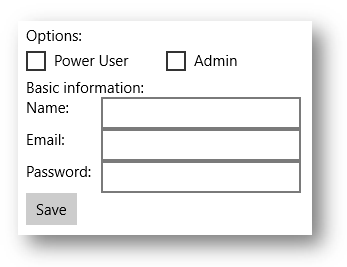

# <a name="optimize-your-xaml-layout"></a>Optimieren des XAML-Layouts


**Wichtige APIs**

-   [**Panel**](/uwp/api/Windows.UI.Xaml.Controls.Panel)

Unter Layout wird das Definieren der visuellen Struktur der Benutzeroberfläche verstanden. Der primäre Mechanismus zum Beschreiben des Layouts in XAML sind Bereiche, d. h. Containerobjekte, mit denen Sie UI-Elemente positionieren und anzuordnen können. Das Layout kann sowohl bezüglich der CPU-Auslastung als auch des Aufwands ein ressourcenintensiver Teil einer XAML-App sein. Hier sind einige einfache Schritte, mit denen Sie die Layoutleistung Ihrer XAML-App verbessern können.

## <a name="reduce-layout-structure"></a>Reduzieren der Layout-Struktur

Die größte Verbesserung der Layoutleistung lässt sich durch die Vereinfachung der hierarchischen Struktur der UI-Elementstruktur erzielen. Bereiche sind in der visuellen Struktur vorhanden, aber es sind Strukturelemente, keine *pixelerzeugenden Elemente*, wie ein [**Button**](/uwp/api/Windows.UI.Xaml.Controls.Button)- oder ein [**Rectangle**](/uwp/api/Windows.UI.Xaml.Shapes.Rectangle)-Objekt. Die Vereinfachung der Struktur durch die Verringerung der Anzahl der nicht pixelerzeugenden Elemente führt in der Regel zu einer deutlichen Leistungssteigerung.

Viele Benutzeroberflächen werden durch eine Schachtelung von Bereichen implementiert, was zu tiefen, komplexen Strukturen von Bereichen und Elementen führt. Es ist komfortabel, Bereiche zu schachteln, aber in vielen Fällen kann die gleiche Benutzeroberfläche mit einem komplexeren einzelnen Bereich erstellt werden. Die Verwendung eines einzelnen Bereichs sorgt für eine höhere Leistung.

### <a name="when-to-reduce-layout-structure"></a>Gründe für die Reduzierung der Layoutstruktur

Eine einfache Reduzierung der Layoutstruktur – z. B. indem ein verschachtelter Bereich aus der Seite der obersten Ebene entfernt wird – hat keinen merklichen Effekt.

Die größten Leistungsgewinne werden durch die Reduzierung von Layoutstrukturen erzielt, die in der Benutzeroberfläche wiederholt vorkommen, z. B. ein [**ListView**](/uwp/api/Windows.UI.Xaml.Controls.ListView)- oder [**GridView**](/uwp/api/Windows.UI.Xaml.Controls.GridView)-Objekt. Diese [**ItemsControl**](/uwp/api/Windows.UI.Xaml.Controls.ItemsControl)-Elemente verwenden eine [**DataTemplate**](/uwp/api/Windows.UI.Xaml.DataTemplate)-Vorlage, welche eine häufig instanziierte Unterstruktur der UI-Elemente definiert. Wenn die gleiche Unterstruktur in Ihrer App oft repliziert wird, hat jede Leistungsverbesserung dieser Teilstruktur einen multiplikativen Effekt auf die allgemeine Leistung der App.

### <a name="examples"></a>Beispiele

Beachten Sie die folgende Benutzeroberfläche.



In diesen Beispielen werden drei Methoden zur Implementierung der gleichen Benutzeroberfläche gezeigt. Die einzelnen Implementierungsoptionen resultieren in nahezu identischen Pixeln auf dem Bildschirm, unterscheidet sich jedoch grundlegend in den Implementierungsdetails.

Option 1: Geschachtelte [**StackPanel**](/uwp/api/Windows.UI.Xaml.Controls.StackPanel)-Elemente

Obwohl dieses Modell am einfachsten ist, werden darin 5 Bereichselemente verwendet, was zu erheblichem Mehraufwand führt.

```xml
  <StackPanel>
  <TextBlock Text="Options:" />
  <StackPanel Orientation="Horizontal">
      <CheckBox Content="Power User" />
      <CheckBox Content="Admin" Margin="20,0,0,0" />
  </StackPanel>
  <TextBlock Text="Basic information:" />
  <StackPanel Orientation="Horizontal">
      <TextBlock Text="Name:" Width="75" />
      <TextBox Width="200" />
  </StackPanel>
  <StackPanel Orientation="Horizontal">
      <TextBlock Text="Email:" Width="75" />
      <TextBox Width="200" />
  </StackPanel>
  <StackPanel Orientation="Horizontal">
      <TextBlock Text="Password:" Width="75" />
      <TextBox Width="200" />
  </StackPanel>
  <Button Content="Save" />
</StackPanel>
```

Option 2: Ein einzelnes [**Grid**](/uwp/api/Windows.UI.Xaml.Controls.Grid)-Element

Das [**Grid**](/uwp/api/Windows.UI.Xaml.Controls.Grid)-Element erhöht die Komplexität, jedoch wird nur ein einzelnes Bereichselement verwendet.

```xml
<Grid>
  <Grid.RowDefinitions>
      <RowDefinition Height="Auto" />
      <RowDefinition Height="Auto" />
      <RowDefinition Height="Auto" />
      <RowDefinition Height="Auto" />
      <RowDefinition Height="Auto" />
      <RowDefinition Height="Auto" />
      <RowDefinition Height="Auto" />
  </Grid.RowDefinitions>
  <Grid.ColumnDefinitions>
      <ColumnDefinition Width="Auto" />
      <ColumnDefinition Width="Auto" />
  </Grid.ColumnDefinitions>
  <TextBlock Text="Options:" Grid.ColumnSpan="2" />
  <CheckBox Content="Power User" Grid.Row="1" Grid.ColumnSpan="2" />
  <CheckBox Content="Admin" Margin="150,0,0,0" Grid.Row="1" Grid.ColumnSpan="2" />
  <TextBlock Text="Basic information:" Grid.Row="2" Grid.ColumnSpan="2" />
  <TextBlock Text="Name:" Width="75" Grid.Row="3" />
  <TextBox Width="200" Grid.Row="3" Grid.Column="1" />
  <TextBlock Text="Email:" Width="75" Grid.Row="4" />
  <TextBox Width="200" Grid.Row="4" Grid.Column="1" />
  <TextBlock Text="Password:" Width="75" Grid.Row="5" />
  <TextBox Width="200" Grid.Row="5" Grid.Column="1" />
  <Button Content="Save" Grid.Row="6" />
</Grid>
```

Option 3: Ein einzelnes [**RelativePanel**](/uwp/api/Windows.UI.Xaml.Controls.RelativePanel)-Element:

Dieser einzelne Bereich ist etwas komplexer als die Verwendung der geschachtelten Bereiche, aber möglicherweise leichter zu verstehen und zu verwalten als ein [**Grid**](/uwp/api/Windows.UI.Xaml.Controls.Grid)-Element.

```xml
<RelativePanel>
  <TextBlock Text="Options:" x:Name="Options" />
  <CheckBox Content="Power User" x:Name="PowerUser" RelativePanel.Below="Options" />
  <CheckBox Content="Admin" Margin="20,0,0,0" 
            RelativePanel.RightOf="PowerUser" RelativePanel.Below="Options" />
  <TextBlock Text="Basic information:" x:Name="BasicInformation"
           RelativePanel.Below="PowerUser" />
  <TextBlock Text="Name:" RelativePanel.AlignVerticalCenterWith="NameBox" />
  <TextBox Width="200" Margin="75,0,0,0" x:Name="NameBox"               
           RelativePanel.Below="BasicInformation" />
  <TextBlock Text="Email:"  RelativePanel.AlignVerticalCenterWith="EmailBox" />
  <TextBox Width="200" Margin="75,0,0,0" x:Name="EmailBox"
           RelativePanel.Below="NameBox" />
  <TextBlock Text="Password:" RelativePanel.AlignVerticalCenterWith="PasswordBox" />
  <TextBox Width="200" Margin="75,0,0,0" x:Name="PasswordBox"
           RelativePanel.Below="EmailBox" />
  <Button Content="Save" RelativePanel.Below="PasswordBox" />
</RelativePanel>
```

Wie die folgenden Beispiele zeigen, gibt es viele Möglichkeiten, die gleiche Benutzeroberfläche zu erzielen. Sie sollten bei der Wahl der Methode alle Nachteile, darunter die Aspekte Leistung, Lesbarkeit und Wartungsfreundlichkeit, sorgfältig prüfen.

## <a name="use-single-cell-grids-for-overlapping-ui"></a>Verwenden von Rastern mit einzelnen Zellen für überlappende UI-Elemente

Eine allgemeine UI-Anforderung ist ein Layout, in dem Elemente einander überlappen. In der Regel werden Abstand, Rand, Ausrichtung und Transformationen verwendet, um Elementen in dieser Weise zu positionieren. Das [**Grid**](/uwp/api/Windows.UI.Xaml.Controls.Grid)-Steuerelement in XAML wurde zur Verbesserung der Layoutleistung für sich überschneidende Elemente optimiert.

**Wichtig**   Um eine Verbesserung festzustellen, verwende ein einzelliges [**Grid**](/uwp/api/Windows.UI.Xaml.Controls.Grid)-Element. Definieren Sie weder [**RowDefinitions**](/uwp/api/windows.ui.xaml.controls.grid.rowdefinitions) noch [**ColumnDefinitions**](/uwp/api/windows.ui.xaml.controls.grid.columndefinitions).

### <a name="examples"></a>Beispiele

```xml
<Grid>
    <Ellipse Fill="Red" Width="200" Height="200" />
    <TextBlock Text="Test" 
               HorizontalAlignment="Center" 
               VerticalAlignment="Center" />
</Grid>
```


```xml
<Grid Width="200" BorderBrush="Black" BorderThickness="1">
    <TextBlock Text="Test1" HorizontalAlignment="Left" />
    <TextBlock Text="Test2" HorizontalAlignment="Right" />
</Grid>
```


## <a name="use-a-panels-built-in-border-properties"></a>Verwenden der integrierten Rahmeneigenschaften von Bereichen

Die Steuerelemente [**Grid**](/uwp/api/Windows.UI.Xaml.Controls.Grid), [**StackPanel**](/uwp/api/Windows.UI.Xaml.Controls.StackPanel), [**RelativePanel**](/uwp/api/Windows.UI.Xaml.Controls.RelativePanel) und [**ContentPresenter**](/uwp/api/Windows.UI.Xaml.Controls.ContentPresenter) haben integrierte Rahmeneigenschaften, mit denen du einen Rahmen um sie herum zeichnen kannst, ohne XAML ein zusätzliches [**Border**](/uwp/api/Windows.UI.Xaml.Controls.Border)-Element hinzufügen zu müssen. Die neuen Eigenschaften, die den integrierten Rahmen unterstützen sind: **BorderBrush**, **BorderThickness**, **CornerRadius** und **Padding**. Jede davon ist eine [**DependencyProperty**](/uwp/api/Windows.UI.Xaml.DependencyProperty)-Eigenschaft, sodass sie mit Bindungen und Animationen verwendet werden können. Sie sind als vollständiger Ersatz für ein separates **Border**-Element konzipiert.

Wenn Ihre Benutzeroberfläche über [**Border**](/uwp/api/Windows.UI.Xaml.Controls.Border)-Elemente um Bereiche verfügt, verwenden Sie stattdessen den integrierten Rahmen. Dadurch wird ein zusätzliches Element in der Layoutstruktur Ihrer App eingespart. Wie bereits erwähnt, kann die Struktur dadurch deutlich vereinfacht werden, insbesondere bei einer UI mit sich wiederholenden Elementen.

### <a name="examples"></a>Beispiele

```xml
<RelativePanel BorderBrush="Red" BorderThickness="2" CornerRadius="10" Padding="12">
    <TextBox x:Name="textBox1" RelativePanel.AlignLeftWithPanel="True"/>
    <Button Content="Submit" RelativePanel.Below="textBox1"/>
</RelativePanel>
```

## <a name="use-sizechanged-events-to-respond-to-layout-changes"></a>Verwendung von **SizeChanged**-Ereignissen infolge von Layoutänderungen

Die [**FrameworkElement**](/uwp/api/Windows.UI.Xaml.FrameworkElement)-Klasse umfasst zwei ähnliche Ereignisse für die Reaktion auf Layoutänderungen: [**LayoutUpdated**](/uwp/api/windows.ui.xaml.frameworkelement.layoutupdated) und [**SizeChanged**](/uwp/api/windows.ui.xaml.frameworkelement.sizechanged). Möglicherweise verwenden Sie eines dieser Ereignisse, um Benachrichtigungen zu empfangen, wenn ein Element während des Layouts geändert wird. Die Semantik der beiden Ereignisse unterscheiden sich, und es gibt wichtige Leistungsaspekte, die bei der Auswahl zu berücksichtigen sind.

Wenn eine gute Leistung Priorität hat, ist [**SizeChanged**](/uwp/api/windows.ui.xaml.frameworkelement.sizechanged) fast immer die richtige Wahl. **SizeChanged** hat eine intuitive Semantik. Es wird während des Layouts ausgelöst, wenn die Größe des [**FrameworkElement**](/uwp/api/Windows.UI.Xaml.FrameworkElement)-Objekts aktualisiert wurde.

[**LayoutUpdated**](/uwp/api/windows.ui.xaml.frameworkelement.layoutupdated) wird auch während des Layouts ausgelöst, hat aber eine globale Semantik. Es wird für jedes Element ausgelöst, sobald ein Element aktualisiert wird. Es ist üblich, Ereignishandler nur lokal zu verarbeiten, wodurch der Code häufiger als nötig ausgeführt wird. Verwenden Sie **LayoutUpdated** nur, wenn Sie wissen müssen, wann ein Element ohne Größenänderung neu angeordnet wird (was ungewöhnlich ist).

## <a name="choosing-between-panels"></a>Auswahl von Bereichen

Die Leistung wird bei der Wahl zwischen einzelnen Bereichen in der Regel nicht berücksichtigt. Die Auswahl erfolgt in der Regel erfolgt, indem betrachtet wird, welcher Bereich das Layoutverhalten bereitstellt, das der zu implementierenden UI am ähnlichsten ist. Wenn Sie z. B. zwischen [**Grid**](/uwp/api/Windows.UI.Xaml.Controls.Grid), [**StackPanel**](/uwp/api/Windows.UI.Xaml.Controls.StackPanel) und [**RelativePanel**](/uwp/api/Windows.UI.Xaml.Controls.RelativePanel) wählen, sollten Sie den Bereich wählen, der am ehesten Ihrer Vorstellung von der Implementierung entspricht.

Jede XAML-Bereich ist hinsichtlich einer guten Leistung optimiert, und alle Bereiche stellen eine ähnliche Leistung für ähnliche UIs bereit.