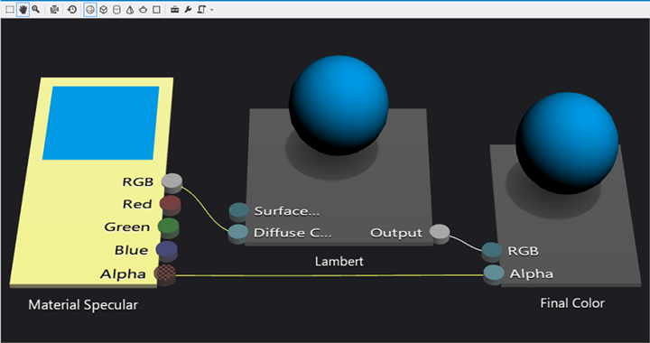

# <a name="visual-studio-tools-for-game-programming"></a>Visual Studio-Tools für die Spieleprogrammierung


**Zusammenfassung**

-   [Erstellen eines DirectX-Spieleprojekts aus einer Vorlage](user-interface.md)
-   Visual Studio-Tools für die Programmierung von DirectX-Spielen


Wenn Sie Visual Studio Ultimate zum Entwickeln von DirectX-Apps verwenden, können Sie zusätzliche Tools zum Erstellen, Bearbeiten, Anzeigen in der Vorschau und Exportieren von Bild-, Modell- und Shaderressourcen nutzen. Außerdem sind Tools verfügbar, mit denen Sie Ressourcen zur Erstellungszeit konvertieren und DirectX-Grafikcode debuggen können.

Dieses Thema enthält eine Übersicht über diese Grafiktools.

## <a name="image-editor"></a>Bildbearbeitung


Nutzen Sie den Grafik-Editor zum Arbeiten mit den Arten von umfassenden Textur- und Bildformaten, die von DirectX verwendet werden. Der Grafik-Editor unterstützt die folgenden Formate:

-   .png
-   .jpg, .jpeg, .jpe, .jfif
-   .dds
-   .gif
-   BMP
-   DIB
-   .tif, .tiff
-   .tga

Erstellen Sie [Buildanpassungsdateien](#build-customizations-for-3d-assets), um diese Formate zur Buildzeit in DDS-Dateien zu konvertieren.

Weitere Informationen finden Sie unter [Arbeiten mit Texturen und Bildern](/visualstudio/designers/working-with-textures-and-images?view=vs-2015).

> **Hinweis**    Der Bild-Editor ist nicht als Ersatz für eine vollständige App zum Bearbeiten von Features gedacht, eignet sich jedoch für viele einfache Anzeige-und Bearbeitungs Szenarien.

 

## <a name="model-editor"></a>Modell-Editor


Sie können den Modell-Editor verwenden, um grundlegende 3D-Modelle ganz neu zu erstellen oder um komplexere 3D-Modelle aus umfassenden 3D-Modelliertools anzuzeigen oder zu ändern. Der Modell-Editor unterstützt mehrere 3D-Modellformate, die bei der Entwicklung von DirectX-Apps verwendet werden. Sie können [Buildanpassungsdateien](#build-customizations-for-3d-assets) erstellen, um diese Formate zur Buildzeit in CMO-Dateien zu konvertieren.

-   FBX
-   DAE
-   OBJ

Dies ist ein Screenshot eines Modells im Editor, auf das Beleuchtungsfunktionen angewendet wurden.


Weitere Informationen finden Sie unter [Arbeiten mit 3D-Modellen](/visualstudio/designers/working-with-3-d-models?view=vs-2015).

> **Hinweis**    Der Modell-Editor ist nicht als Ersatz für eine vollständige App zum Bearbeiten von Features gedacht, eignet sich jedoch für viele einfache Anzeige-und Bearbeitungs Szenarien.

 

## <a name="shader-designer"></a>Shader-Designer


Verwenden Sie den Shader-Designer zum Erstellen benutzerdefinierter visueller Effekte für das Spiel oder die App, auch wenn Sie nicht mit der HLSL-Programmierung vertraut sind.

Sie erstellen einen Shader visuell als Diagramm. Jeder Knoten zeigt eine Vorschau der Ausgabe bis zum jeweiligen Vorgang an. Im nächsten Beispiel wird Lambert-Beleuchtung mit einer Kugelvorschau angewendet.



Verwenden Sie den Shader-Editor, um Shader im DGSL-Format zu entwerfen, zu bearbeiten und zu speichern. Außerdem können die folgenden Formate exportiert werden:

-   HLSL (Quellcode)
-   CSO (Bytecode)
-   H (HLSL-Bytecode-Array)

Erstellen Sie [Buildanpassungsdateien](#build-customizations-for-3d-assets), um diese Formate zur Buildzeit in CSO-Dateien zu konvertieren.

Unten ist ein Abschnitt eines HLSL-Codes angegeben, der vom Shader-Editor exportiert wurde. Dies ist nur der Code für den Lambert-Beleuchtungsknoten.

```hlsl
//
// Lambert lighting function
//
float3 LambertLighting(
    float3 lightNormal,
    float3 surfaceNormal,
    float3 materialAmbient,
    float3 lightAmbient,
    float3 lightColor,
    float3 pixelColor
    )
{
    // Compute the amount of contribution per light.
    float diffuseAmount = saturate(dot(lightNormal, surfaceNormal));
    float3 diffuse = diffuseAmount * lightColor * pixelColor;

    // Combine ambient with diffuse.
    return saturate((materialAmbient * lightAmbient) + diffuse);
}
```

Weitere Informationen finden Sie unter [Arbeiten mit Shadern](/visualstudio/designers/working-with-shaders?view=vs-2015).

## <a name="build-customizations-for-3d-assets"></a>Buildanpassungen für 3D-Objekte


Sie können dem Projekt Buildanpassungen hinzufügen, sodass Ressourcen von Visual Studio in nutzbare Formate konvertiert werden. Danach können Sie die Ressourcen in die App laden und sie verwenden. Dazu erstellen und füllen Sie DirectX-Ressourcen so, wie Sie es in jeder anderen DirectX-App tun würden.

Um eine Buildanpassung hinzuzufügen, klicken Sie im **Projektmappen-Explorer** mit der rechten Maustaste auf das Projekt, und wählen Sie buildanpassungen **...** aus. Sie können dem Projekt die folgenden Typen von buildananpassungen hinzufügen.

-   Von der Bildinhaltpipeline werden Bilddateien als Eingaben verwendet und DirectDraw Surface-Dateien (.dds) ausgegeben.
-   Von der Gitterinhaltpipeline werden Gitterdateien (z. B. FBX) als Eingabe verwendet und CMO-Gitterdateien ausgegeben.
-   Von der Shaderinhaltpipeline werden visuelle Shaderdiagramme (.dgsl) aus dem Shader-Editor von Visual Studio verwendet und kompilierte Shaderausgabedateien (.cso) ausgegeben.

Weitere Informationen finden Sie unter [Verwenden von 3D-Objekten im Spiel oder in der App](/visualstudio/designers/using-3-d-assets-in-your-game-or-app?view=vs-2015).

## <a name="debugging-directx-graphics"></a>Debuggen von DirectX-Grafiken


Visual Studio enthält grafikspezifische Debugtools. Verwenden Sie diese Tools zum Debuggen der folgenden Komponenten:

-   Grafikpipeline
-   Ereignisaufrufliste
-   Objekttabelle
-   Gerätestatus
-   Shaderfehler
-   Nicht initialisierte oder fehlerhafte Konstantenpuffer und Parameter
-   DirectX-Versionskompatibilität
-   Begrenzte Direct2D-Unterstützung
-   Betriebssystem- und SDK-Anforderungen

Weitere Informationen finden Sie unter [Debuggen von DirectX-Grafiken](/visualstudio/debugger/visual-studio-graphics-diagnostics?view=vs-2015).


 

 

 