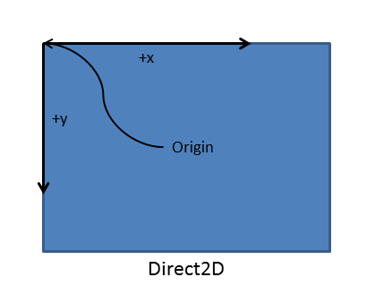

# <a name="supporting-screen-orientation-directx-and-c"></a>Unterstützen der Bildschirmausrichtung (DirectX und C++)


Ihre App für die universelle Windows-Plattform (UWP) kann beim Behandeln des [**DisplayInformation::OrientationChanged**](https://docs.microsoft.com/uwp/api/windows.graphics.display.displayinformation.orientationchanged)-Ereignisses mehrere Bildschirmausrichtungen unterstützen. Here, we'll discuss best practices for handling screen rotation in your UWP DirectX app, so that the Windows 10 device's graphics hardware are used efficiently and effectively.

Beachten Sie vor Beginn, dass Grafikhardware grundsätzlich auf irgendeine Art und Weise Pixeldaten ausgibt und dass die Ausrichtung des Geräts dabei keine Rolle spielt. Windows 10 devices can determine their current display orientation (with some sort of sensor, or with a software toggle) and allow users to change the display settings. Because of this, Windows 10 itself handles the rotation of the images to ensure they are "upright" based on the orientation of the device. Standardmäßig empfangen Apps eine Benachrichtigung mit dem Hinweis, dass bezüglich der Ausrichtung eine Änderung vorgenommen wurde (beispielsweise eine Änderung der Fenstergröße). When this happens, Windows 10 immediately rotates the image for final display. For three of the four specific screen orientations (discussed later), Windows 10 uses additional graphic resources and computation to display the final image.

Für UWP-DirectX-Apps stellt das [**DisplayInformation**](https://docs.microsoft.com/uwp/api/Windows.Graphics.Display.DisplayInformation)-Objekt grundlegende Bildschirmausrichtungsdaten bereit, die von der App abgefragt werden können. Die Standardausrichtung lautet *Querformat*, wobei die Pixelbreite der Anzeige größer ist als die Höhe. Die alternative Ausrichtung lautet *Hochformat*, in der die Anzeige um 90 Grad in eine Richtung gedreht und die Breite kleiner als die Höhe wird.

Windows 10 defines four specific display orientation modes:

-   Landscape—the default display orientation for Windows 10, and is considered the base or identity angle for rotation (0 degrees).
-   Hochformat – die Anzeige wurde um 90 Grad im Uhrzeigersinn gedreht (oder um 270 entgegen dem Uhrzeigersinn).
-   Querformat, gedreht – die Anzeige wurde um 180 Grad gedreht (auf den Kopf gedreht).
-   Hochformat, gedreht – die Anzeige wurde um 270 Grad im Uhrzeigersinn gedreht (oder um 90 Grad entgegen dem Uhrzeigersinn).

When the display rotates from one orientation to another, Windows 10 internally performs a rotation operation to align the drawn image with the new orientation, and the user sees an upright image on the screen.

Also, Windows 10 displays automatic transition animations to create a smooth user experience when shifting from one orientation to another. Einen Wechsel der Bildschirmausrichtung nimmt der Benutzer mit einer festen Vergrößerung und einer Drehungsanimation des auf dem Bildschirm angezeigten Bilds wahr. Time is allocated by Windows 10 to the app for layout in the new orientation.

Im Großen und Ganzen lautet der allgemeine Prozess zum Behandeln von Änderungen bezüglich der Bildschirmausrichtung wie folgt:

1.  Verwenden Sie eine Kombination aus den Fensterabgrenzungswerten und den Bildschirmausrichtungsdaten, um die Ausrichtung der Swapchain an der systemeigenen Bildschirmausrichtung des Geräts beizubehalten.
2.  Notify Windows 10 of the orientation of the swap chain using [**IDXGISwapChain1::SetRotation**](https://docs.microsoft.com/windows/desktop/api/dxgi1_2/nf-dxgi1_2-idxgiswapchain1-setrotation).
3.  Ändern Sie den Code zum Rendern, um Bilder zu generieren, die an die benutzerdefinierte Ausrichtung des Geräts angepasst sind.

## <a name="resizing-the-swap-chain-and-pre-rotating-its-contents"></a>Ändern der Swapchaingröße und Vorgeben der Bildschirmausrichtung für die Inhalte


Wenn Sie eine einfache Änderung der Anzeigegröße in der UWP-DirectX-App ausführen und ihre Inhalte vorab drehen möchten, führen Sie die folgenden Schritte aus:

1.  Behandeln Sie das [**DisplayInformation::OrientationChanged**](https://docs.microsoft.com/uwp/api/windows.graphics.display.displayinformation.orientationchanged)-Ereignis.
2.  Ändern Sie die Swapchaingröße in die neuen Fensterabmessungen.
3.  Rufen Sie [**IDXGISwapChain1::SetRotation**](https://docs.microsoft.com/windows/desktop/api/dxgi1_2/nf-dxgi1_2-idxgiswapchain1-setrotation) auf, um die Ausrichtung der Swapchain festzulegen.
4.  Erstellen Sie die von der Fenstergröße abhängigen Ressourcen neu, beispielsweise die Renderziele und andere Pixeldatenpuffer.

Jetzt wollen wir uns die Schritte etwas genauer ansehen.

Im ersten Schritt registrieren Sie einen Handler für das [**DisplayInformation::OrientationChanged**](https://docs.microsoft.com/uwp/api/windows.graphics.display.displayinformation.orientationchanged)-Ereignis. Dieses Ereignis wird immer dann in der App ausgelöst, wenn sich die Bildschirmausrichtung ändert (beispielsweise beim Drehen der Anzeige).

Zum Behandeln des [**DisplayInformation::OrientationChanged**](https://docs.microsoft.com/uwp/api/windows.graphics.display.displayinformation.orientationchanged)-Ereignisses verbinden Sie den Handler für **DisplayInformation::OrientationChanged** in der erforderlichen [**SetWindow**](https://docs.microsoft.com/uwp/api/windows.applicationmodel.core.iframeworkview.setwindow)-Methode. Dabei handelt es sich um eine der Methoden der [**IFrameworkView**](https://docs.microsoft.com/uwp/api/Windows.ApplicationModel.Core.IFrameworkView)-Schnittstelle, die vom Ansichtsanbieter implementiert werden muss.

In diesem Codebeispiel ist der Ereignishandler für [**DisplayInformation::OrientationChanged**](https://docs.microsoft.com/uwp/api/windows.graphics.display.displayinformation.orientationchanged) eine Methode namens **OnOrientationChanged**. Beim Auslösen von **DisplayInformation::OrientationChanged** wird wiederum eine Methode mit der Bezeichnung **SetCurrentOrientation** aufgerufen, die dann **CreateWindowSizeDependentResources** aufruft.

```cpp
void App::SetWindow(CoreWindow^ window)
{
  // ... Other UI event handlers assigned here ...
  
    currentDisplayInformation->OrientationChanged +=
        ref new TypedEventHandler<DisplayInformation^, Object^>(this, &App::OnOrientationChanged);

  // ...
}
}
```

```cpp
void App::OnOrientationChanged(DisplayInformation^ sender, Object^ args)
{
    m_deviceResources->SetCurrentOrientation(sender->CurrentOrientation);
    m_main->CreateWindowSizeDependentResources();
}

// This method is called in the event handler for the OrientationChanged event.
void DX::DeviceResources::SetCurrentOrientation(DisplayOrientations currentOrientation)
{
    if (m_currentOrientation != currentOrientation)
    {
        m_currentOrientation = currentOrientation;
        CreateWindowSizeDependentResources();
    }
}
```

Anschließend ändern Sie die Swapchaingröße für die neue Bildschirmausrichtung und bereiten sie auf die Drehung der Inhalte der Grafikpipeline vor, wenn das Rendern erfolgt. In diesem Beispiel ist **DirectXBase::CreateWindowSizeDependentResources** eine Methode, die das Aufrufen von „IDXGISwapChain::ResizeBuffers“ behandelt, eine 3D- und eine 2D-Drehungsmatrix festlegt, „SetRotation“ aufruft und Ihre Ressourcen neu erstellt.

```cpp
void DX::DeviceResources::CreateWindowSizeDependentResources() 
{
    // Clear the previous window size specific context.
    ID3D11RenderTargetView* nullViews[] = {nullptr};
    m_d3dContext->OMSetRenderTargets(ARRAYSIZE(nullViews), nullViews, nullptr);
    m_d3dRenderTargetView = nullptr;
    m_d2dContext->SetTarget(nullptr);
    m_d2dTargetBitmap = nullptr;
    m_d3dDepthStencilView = nullptr;
    m_d3dContext->Flush();

    // Calculate the necessary render target size in pixels.
    m_outputSize.Width = DX::ConvertDipsToPixels(m_logicalSize.Width, m_dpi);
    m_outputSize.Height = DX::ConvertDipsToPixels(m_logicalSize.Height, m_dpi);
    
    // Prevent zero size DirectX content from being created.
    m_outputSize.Width = max(m_outputSize.Width, 1);
    m_outputSize.Height = max(m_outputSize.Height, 1);

    // The width and height of the swap chain must be based on the window's
    // natively-oriented width and height. If the window is not in the native
    // orientation, the dimensions must be reversed.
    DXGI_MODE_ROTATION displayRotation = ComputeDisplayRotation();

    bool swapDimensions = displayRotation == DXGI_MODE_ROTATION_ROTATE90 || displayRotation == DXGI_MODE_ROTATION_ROTATE270;
    m_d3dRenderTargetSize.Width = swapDimensions ? m_outputSize.Height : m_outputSize.Width;
    m_d3dRenderTargetSize.Height = swapDimensions ? m_outputSize.Width : m_outputSize.Height;

    if (m_swapChain != nullptr)
    {
        // If the swap chain already exists, resize it.
        HRESULT hr = m_swapChain->ResizeBuffers(
            2, // Double-buffered swap chain.
            lround(m_d3dRenderTargetSize.Width),
            lround(m_d3dRenderTargetSize.Height),
            DXGI_FORMAT_B8G8R8A8_UNORM,
            0
            );

        if (hr == DXGI_ERROR_DEVICE_REMOVED || hr == DXGI_ERROR_DEVICE_RESET)
        {
            // If the device was removed for any reason, a new device and swap chain will need to be created.
            HandleDeviceLost();

            // Everything is set up now. Do not continue execution of this method. HandleDeviceLost will reenter this method 
            // and correctly set up the new device.
            return;
        }
        else
        {
            DX::ThrowIfFailed(hr);
        }
    }
    else
    {
        // Otherwise, create a new one using the same adapter as the existing Direct3D device.
        DXGI_SWAP_CHAIN_DESC1 swapChainDesc = {0};

        swapChainDesc.Width = lround(m_d3dRenderTargetSize.Width); // Match the size of the window.
        swapChainDesc.Height = lround(m_d3dRenderTargetSize.Height);
        swapChainDesc.Format = DXGI_FORMAT_B8G8R8A8_UNORM; // This is the most common swap chain format.
        swapChainDesc.Stereo = false;
        swapChainDesc.SampleDesc.Count = 1; // Don't use multi-sampling.
        swapChainDesc.SampleDesc.Quality = 0;
        swapChainDesc.BufferUsage = DXGI_USAGE_RENDER_TARGET_OUTPUT;
        swapChainDesc.BufferCount = 2; // Use double-buffering to minimize latency.
        swapChainDesc.SwapEffect = DXGI_SWAP_EFFECT_FLIP_SEQUENTIAL; // All UWP apps must use this SwapEffect.
        swapChainDesc.Flags = 0;    
        swapChainDesc.Scaling = DXGI_SCALING_NONE;
        swapChainDesc.AlphaMode = DXGI_ALPHA_MODE_IGNORE;

        // This sequence obtains the DXGI factory that was used to create the Direct3D device above.
        ComPtr<IDXGIDevice3> dxgiDevice;
        DX::ThrowIfFailed(
            m_d3dDevice.As(&dxgiDevice)
            );

        ComPtr<IDXGIAdapter> dxgiAdapter;
        DX::ThrowIfFailed(
            dxgiDevice->GetAdapter(&dxgiAdapter)
            );

        ComPtr<IDXGIFactory2> dxgiFactory;
        DX::ThrowIfFailed(
            dxgiAdapter->GetParent(IID_PPV_ARGS(&dxgiFactory))
            );

        DX::ThrowIfFailed(
            dxgiFactory->CreateSwapChainForCoreWindow(
                m_d3dDevice.Get(),
                reinterpret_cast<IUnknown*>(m_window.Get()),
                &swapChainDesc,
                nullptr,
                &m_swapChain
                )
            );

        // Ensure that DXGI does not queue more than one frame at a time. This both reduces latency and
        // ensures that the application will only render after each VSync, minimizing power consumption.
        DX::ThrowIfFailed(
            dxgiDevice->SetMaximumFrameLatency(1)
            );
    }

    // Set the proper orientation for the swap chain, and generate 2D and
    // 3D matrix transformations for rendering to the rotated swap chain.
    // Note the rotation angle for the 2D and 3D transforms are different.
    // This is due to the difference in coordinate spaces.  Additionally,
    // the 3D matrix is specified explicitly to avoid rounding errors.

    switch (displayRotation)
    {
    case DXGI_MODE_ROTATION_IDENTITY:
        m_orientationTransform2D = Matrix3x2F::Identity();
        m_orientationTransform3D = ScreenRotation::Rotation0;
        break;

    case DXGI_MODE_ROTATION_ROTATE90:
        m_orientationTransform2D = 
            Matrix3x2F::Rotation(90.0f) *
            Matrix3x2F::Translation(m_logicalSize.Height, 0.0f);
        m_orientationTransform3D = ScreenRotation::Rotation270;
        break;

    case DXGI_MODE_ROTATION_ROTATE180:
        m_orientationTransform2D = 
            Matrix3x2F::Rotation(180.0f) *
            Matrix3x2F::Translation(m_logicalSize.Width, m_logicalSize.Height);
        m_orientationTransform3D = ScreenRotation::Rotation180;
        break;

    case DXGI_MODE_ROTATION_ROTATE270:
        m_orientationTransform2D = 
            Matrix3x2F::Rotation(270.0f) *
            Matrix3x2F::Translation(0.0f, m_logicalSize.Width);
        m_orientationTransform3D = ScreenRotation::Rotation90;
        break;

    default:
        throw ref new FailureException();
    }


    //SDM: only instance of SetRotation
    DX::ThrowIfFailed(
        m_swapChain->SetRotation(displayRotation)
        );

    // Create a render target view of the swap chain back buffer.
    ComPtr<ID3D11Texture2D> backBuffer;
    DX::ThrowIfFailed(
        m_swapChain->GetBuffer(0, IID_PPV_ARGS(&backBuffer))
        );

    DX::ThrowIfFailed(
        m_d3dDevice->CreateRenderTargetView(
            backBuffer.Get(),
            nullptr,
            &m_d3dRenderTargetView
            )
        );

    // Create a depth stencil view for use with 3D rendering if needed.
    CD3D11_TEXTURE2D_DESC depthStencilDesc(
        DXGI_FORMAT_D24_UNORM_S8_UINT, 
        lround(m_d3dRenderTargetSize.Width),
        lround(m_d3dRenderTargetSize.Height),
        1, // This depth stencil view has only one texture.
        1, // Use a single mipmap level.
        D3D11_BIND_DEPTH_STENCIL
        );

    ComPtr<ID3D11Texture2D> depthStencil;
    DX::ThrowIfFailed(
        m_d3dDevice->CreateTexture2D(
            &depthStencilDesc,
            nullptr,
            &depthStencil
            )
        );

    CD3D11_DEPTH_STENCIL_VIEW_DESC depthStencilViewDesc(D3D11_DSV_DIMENSION_TEXTURE2D);
    DX::ThrowIfFailed(
        m_d3dDevice->CreateDepthStencilView(
            depthStencil.Get(),
            &depthStencilViewDesc,
            &m_d3dDepthStencilView
            )
        );
    
    // Set the 3D rendering viewport to target the entire window.
    m_screenViewport = CD3D11_VIEWPORT(
        0.0f,
        0.0f,
        m_d3dRenderTargetSize.Width,
        m_d3dRenderTargetSize.Height
        );

    m_d3dContext->RSSetViewports(1, &m_screenViewport);

    // Create a Direct2D target bitmap associated with the
    // swap chain back buffer and set it as the current target.
    D2D1_BITMAP_PROPERTIES1 bitmapProperties = 
        D2D1::BitmapProperties1(
            D2D1_BITMAP_OPTIONS_TARGET | D2D1_BITMAP_OPTIONS_CANNOT_DRAW,
            D2D1::PixelFormat(DXGI_FORMAT_B8G8R8A8_UNORM, D2D1_ALPHA_MODE_PREMULTIPLIED),
            m_dpi,
            m_dpi
            );

    ComPtr<IDXGISurface2> dxgiBackBuffer;
    DX::ThrowIfFailed(
        m_swapChain->GetBuffer(0, IID_PPV_ARGS(&dxgiBackBuffer))
        );

    DX::ThrowIfFailed(
        m_d2dContext->CreateBitmapFromDxgiSurface(
            dxgiBackBuffer.Get(),
            &bitmapProperties,
            &m_d2dTargetBitmap
            )
        );

    m_d2dContext->SetTarget(m_d2dTargetBitmap.Get());

    // Grayscale text anti-aliasing is recommended for all UWP apps.
    m_d2dContext->SetTextAntialiasMode(D2D1_TEXT_ANTIALIAS_MODE_GRAYSCALE);

}

```

Nachdem Sie die aktuellen Höhen- und Breitenwerte des Fensters für den nächsten Aufruf dieser Methode gespeichert haben, konvertieren Sie die DIP (Device Independent Pixel)-Werte für die Bildschirmbegrenzungen in Pixel. In dem Beispiel rufen Sie **ConvertDipsToPixels** auf. Dabei handelt es sich um eine einfache Funktion, die den folgenden Code ausführt:

` floor((dips * dpi / 96.0f) + 0.5f);`

0\.5f wird hinzugefügt, um die Rundung auf den nächsten ganzzahligen Wert sicherzustellen.

Beachten Sie dabei, dass [**CoreWindow**](https://docs.microsoft.com/uwp/api/Windows.UI.Core.CoreWindow)-Koordinaten immer in DIPs definiert werden. For Windows 10 and earlier versions of Windows, a DIP is defined as 1/96th of an inch, and aligned to the OS's definition of *up*. Beim Drehen der Bildschirmausrichtung in das Hochformat vertauscht die App die Breite und Höhe von **CoreWindow**, und die Renderzielgröße (Begrenzungen) muss entsprechend geändert werden. Da die Direct3D-Koordinaten immer in physischen Pixeln angegeben sind, müssen Sie die DIP-Werte von **CoreWindow** in ganzzahlige Pixelwerte konvertieren, bevor Sie diese Werte zum Einrichten der Swapchain an Direct3D übergeben.

Für die einzelnen Prozesse ist die Arbeit ein wenig umfangreicher als bei einer einfachen Änderung der Swapchaingröße: Sie drehen die Direct2D- und Direct3D-Komponenten Ihres Bilds, bevor Sie sie für die Darstellung zusammenstellen, und Sie informieren die Swapchain darüber, dass Sie die Ergebnisse in einer neuen Ausrichtung gerendert haben. Nachstehend finden Sie etwas mehr Details zu diesem Prozess, wie im Codebeispiel für **DX::DeviceResources::CreateWindowSizeDependentResources** veranschaulicht wird:

-   Bestimmen Sie die neue Ausrichtung der Anzeige. Wenn die Anzeige vom Querformat in das Hochformat oder umgekehrt geändert wurde, tauschen Sie die Höhen- und Breitenwerte – die natürlich von DIP-Werten in Pixel geändert wurden – für die Bildschirmbegrenzungen aus.

-   Überprüfen Sie dann, ob die Swapchain erstellt wurde. Wenn dies nicht der Fall ist, erstellen Sie sie durch Aufrufen von [**IDXGIFactory2::CreateSwapChainForCoreWindow**](https://docs.microsoft.com/windows/desktop/api/dxgi1_2/nf-dxgi1_2-idxgifactory2-createswapchainforcorewindow). Ändern Sie anderenfalls die Puffergröße der vorhandenen Swapchain in die neuen Anzeigeabmessungen, indem Sie [**IDXGISwapchain:ResizeBuffers**](https://docs.microsoft.com/windows/desktop/api/dxgi/nf-dxgi-idxgiswapchain-resizebuffers) aufrufen. Obwohl Sie die Größe der Swapchain für das Drehungsereignis nicht ändern müssen – schließlich geben Sie Inhalte aus, die bereits von der Pipeline zum Rendern gedreht wurden –, existieren auch andere Größenänderungsereignisse, beispielsweise Andock- und Füllungsereignisse, für die Größenänderungen erforderlich sind.

-   Legen Sie danach die entsprechende 2D- oder 3D-Matrixtransformation fest, die beim Rendern in der Swapchain auf die Pixel bzw. Vertizes in der Grafikpipeline angewendet werden soll. Es existieren vier mögliche Drehungsmatrizen:

    -   landscape (DXGI\_MODE\_ROTATION\_IDENTITY)
    -   portrait (DXGI\_MODE\_ROTATION\_ROTATE270)
    -   landscape, flipped (DXGI\_MODE\_ROTATION\_ROTATE180)
    -   portrait, flipped (DXGI\_MODE\_ROTATION\_ROTATE90)

    The correct matrix is selected based on the data provided by Windows 10 (such as the results of [**DisplayInformation::OrientationChanged**](https://docs.microsoft.com/uwp/api/windows.graphics.display.displayinformation.orientationchanged)) for determining display orientation, and it will be multiplied by the coordinates of each pixel (Direct2D) or vertex (Direct3D) in the scene, effectively rotating them to align to the orientation of the screen. (Beachten Sie, dass der Bildschirmursprung in Direct2D als obere linke Ecke und in Direct3D als logische Mitte des Fensters definiert ist.)

> **Note**   For more info about the 2-D transformations used for rotation and how to define them, see [Defining matrices for screen rotation (2-D)](#appendix-a-applying-matrices-for-screen-rotation-2-d). Weitere Informationen zu den für die Drehung verwendeten 3D-Transformationen finden Sie unter [Definieren von Matrizen für die Bildschirmdrehung (3D)](#appendix-b-applying-matrices-for-screen-rotation-3-d).

 

Nun zum wichtigen Teil: rufen Sie [**IDXGISwapChain1::SetRotation**](https://docs.microsoft.com/windows/desktop/api/dxgi1_2/nf-dxgi1_2-idxgiswapchain1-setrotation) auf, und stellen Sie dafür die aktualisierte Rotationsmatrix bereit – Beispiel:

`m_swapChain->SetRotation(rotation);`

Die ausgewählte Rotationsmatrix wird auch unter dem Verzeichnis gespeichert, in dem sie von der Rendermethode beim Berechnen der neuen Projektion abgerufen werden kann. Sie verwenden diese Matrix beim Rendern der endgültigen 3-D-Projektion oder beim Zusammenstellen des endgültigen 2-D-Layouts. (Sie wird nicht automatisch angewendet.)

Erstellen Sie nun ein neues Renderziel für die gedrehte 3-D-Ansicht sowie einen neuen Tiefenschablonenpuffer für die Ansicht. Legen Sie den Viewport zum 3D-Rendern für die gedrehte Szene fest, indem Sie [**ID3D11DeviceContext:RSSetViewports**](https://docs.microsoft.com/windows/desktop/api/d3d11/nf-d3d11-id3d11devicecontext-rssetviewports) aufrufen.

Wenn Sie 2D-Bilder drehen oder ein Layout für 2D-Bilder erzeugen müssen, erstellen Sie zuletzt mithilfe von [**ID2D1DeviceContext::CreateBitmapFromDxgiSurface**](https://docs.microsoft.com/windows/desktop/api/d2d1_1/nf-d2d1_1-id2d1devicecontext-createbitmapfromdxgisurface(idxgisurface_constd2d1_bitmap_properties1__id2d1bitmap1)) ein 2D-Renderziel als beschreibbare Bitmap-Datei für die Swapchain mit geänderter Größe, und stellen Sie das neue Layout für die aktualisierte Ausrichtung zusammen. Legen Sie die erforderlichen Eigenschaften für das Renderziel fest, beispielsweise den Antialiasing-Modus (siehe Codebeispiel).

Stellen Sie nun die Swapchain dar.

## <a name="reduce-the-rotation-delay-by-using-corewindowresizemanager"></a>Reduzieren der Rotationsverzögerung mit „CoreWindowResizeManager“


By default, Windows 10 provides a short but noticeable window of time for any app, regardless of app model or language, to complete the rotation of the image. Wenn die App die Drehungsberechnung mithilfe einer der hier beschriebenen Techniken ausführt, ist dieser Vorgang möglicherweise bereits abgeschlossen, bevor dieses Zeitfenster abgelaufen ist. Es wäre doch wünschenswert, diese Zeit zurückzugewinnen und die Drehungsanimation abzuschließen, oder? An dieser Stelle kommt [**CoreWindowResizeManager**](https://docs.microsoft.com/uwp/api/Windows.UI.Core.CoreWindowResizeManager) ins Spiel.

So verwenden Sie [**CoreWindowResizeManager**](https://docs.microsoft.com/uwp/api/Windows.UI.Core.CoreWindowResizeManager): Beim Auslösen eines [**DisplayInformation::OrientationChanged**](https://docs.microsoft.com/uwp/api/windows.graphics.display.displayinformation.orientationchanged)-Ereignisses rufen Sie [**CoreWindowResizeManager::GetForCurrentView**](https://docs.microsoft.com/previous-versions/hh404170(v=vs.85)) innerhalb des Handlers für das Ereignis auf, um eine Instanz von **CoreWindowResizeManager** zu erhalten. Wenn das Layout für die neue Ausrichtung abgeschlossen ist und dargestellt wird, rufen Sie [**NotifyLayoutCompleted**](https://docs.microsoft.com/uwp/api/windows.ui.core.corewindowresizemanager.notifylayoutcompleted) auf, um Windows darüber zu informieren, dass die Drehungsanimation abgeschlossen und der App-Bildschirm angezeigt werden kann.

Der Code im Ereignishandler für [**DisplayInformation::OrientationChanged**](https://docs.microsoft.com/uwp/api/windows.graphics.display.displayinformation.orientationchanged) kann wie folgt aussehen:

```cpp
CoreWindowResizeManager^ resizeManager = Windows::UI::Core::CoreWindowResizeManager::GetForCurrentView();

// ... build the layout for the new display orientation ...

resizeManager->NotifyLayoutCompleted();
```

When a user rotates the orientation of the display, Windows 10 shows an animation independent of your app as feedback to the user. Diese Animation besteht aus drei Teilen, die in der folgenden Reihenfolge ablaufen:

-   Windows 10 shrinks the original image.
-   Windows 10 holds the image for the time it takes to rebuild the new layout. Dies entspricht dem Zeitfenster, das Sie verkürzen möchten, weil die App wahrscheinlich nicht das gesamte Zeitfenster benötigt.
-   Bei Ablauf des Zeitfensters für das Layout oder beim Empfang einer Benachrichtigung über den Layoutabschluss dreht Windows das Bild, und es erfolgt eine Vergrößerung mit Überblendung in die neue Ausrichtung.

As suggested in the third bullet, when an app calls [**NotifyLayoutCompleted**](https://docs.microsoft.com/uwp/api/windows.ui.core.corewindowresizemanager.notifylayoutcompleted), Windows 10 stops the timeout window, completes the rotation animation and returns control to your app, which is now drawing in the new display orientation. In der Gesamtheit fühlt sich die App nun ein wenig flüssiger und schneller an, und sie arbeitet etwas effizienter!

## <a name="appendix-a-applying-matrices-for-screen-rotation-2-d"></a>Anhang A: Anwenden von Matrizen für die automatische Bildschirmausrichtung (2-D)


In dem Beispielcode unter [Ändern der Swapchaingröße und Vorgeben der Bildschirmausrichtung für die Inhalte](#resizing-the-swap-chain-and-pre-rotating-its-contents) (und im [DXGI-Swapchain-Drehungsbeispiel](https://code.msdn.microsoft.com/windowsapps/DXGI-swap-chain-rotation-21d13d71)) haben Sie möglicherweise bemerkt, dass wir für die Direct2D- und die Direct3D-Ausgabe separate Drehungsmatrizen verwendet haben. Sehen wir uns zunächst die 2-D-Matrizen an.

Es gibt zwei Ursachen dafür, warum wir für Direct2D- und Direct3D-Inhalte nicht dieselben Drehungsmatrizen anwenden können:

-   Erstens: Sie verwenden unterschiedliche kartesische Koordinatenmodelle. Direct2D verwendet die rechtshändige Regel, wobei der positive Wert der Y-Koordinate vom Ausgangspunkt nach oben hin ansteigt. Für Direct3D wird jedoch die linkshändige Regel verwendet, wobei der positive Wert der Y-Koordinate vom Ausgangspunkt nach rechts hin ansteigt. Demzufolge befindet sich der Ausgangspunkt für die Bildschirmkoordinaten bei Direct2D oben links, während der Ausgangspunkt für den Bildschirm (Projektionsebene) für Direct3D unten links liegt. (Weitere Informationen finden Sie unter [3D-Koordinatensysteme](https://docs.microsoft.com/previous-versions/windows/desktop/bb324490(v=vs.85)) .)

    

-   Zweitens: Die 3D-Drehungsmatrizen müssen explizit angegeben werden, um Rundungsfehler zu vermeiden.

Die Swapchain geht davon aus, dass der Ausgangspunkt unten links liegt. Daher müssen Sie eine Drehung ausführen, um das rechtshändige Direct2D-Koordinatensystem an das von der Swapchain verwendete linkshändige Koordinatensystem anzupassen. Insbesondere ordnen Sie das Bild unter der neuen linkshändigen Ausrichtung neu an, indem Sie die Drehungsmatrix mit einer Übersetzungsmatrix für den Ausgangspunkt des gedrehten Koordinatensystems multiplizieren. Zudem transformieren Sie das Bild aus dem Koordinatenbereich von [**CoreWindow**](https://docs.microsoft.com/uwp/api/Windows.UI.Core.CoreWindow) in den Koordinatenbereich der Swapchain. Die App muss diese Transformation auch konsistent anwenden, wenn das Direct2D-Renderziel mit der Swapchain verbunden ist. Wenn die App jedoch in Zwischenflächen zeichnet, die der Swapchain nicht direkt zugeordnet sind, wenden Sie diese Transformation des Koordinatenbereichs nicht an.

Der Code zum Auswählen der richtigen Matrix aus den vier möglichen Drehungen kann beispielsweise wie folgt lauten (beachten Sie die Übersetzung in den neuen Koordinatensystemursprung):

```cpp
   
// Set the proper orientation for the swap chain, and generate 2D and
// 3D matrix transformations for rendering to the rotated swap chain.
// Note the rotation angle for the 2D and 3D transforms are different.
// This is due to the difference in coordinate spaces.  Additionally,
// the 3D matrix is specified explicitly to avoid rounding errors.

switch (displayRotation)
{
case DXGI_MODE_ROTATION_IDENTITY:
    m_orientationTransform2D = Matrix3x2F::Identity();
    m_orientationTransform3D = ScreenRotation::Rotation0;
    break;

case DXGI_MODE_ROTATION_ROTATE90:
    m_orientationTransform2D = 
        Matrix3x2F::Rotation(90.0f) *
        Matrix3x2F::Translation(m_logicalSize.Height, 0.0f);
    m_orientationTransform3D = ScreenRotation::Rotation270;
    break;

case DXGI_MODE_ROTATION_ROTATE180:
    m_orientationTransform2D = 
        Matrix3x2F::Rotation(180.0f) *
        Matrix3x2F::Translation(m_logicalSize.Width, m_logicalSize.Height);
    m_orientationTransform3D = ScreenRotation::Rotation180;
    break;

case DXGI_MODE_ROTATION_ROTATE270:
    m_orientationTransform2D = 
        Matrix3x2F::Rotation(270.0f) *
        Matrix3x2F::Translation(0.0f, m_logicalSize.Width);
    m_orientationTransform3D = ScreenRotation::Rotation90;
    break;

default:
    throw ref new FailureException();
}
    
```

Nachdem Sie die richtige Drehungsmatrix und den Ursprung für das 2D-Bild ausgewählt haben, legen Sie sie bzw. ihn durch Aufrufen von [**ID2D1DeviceContext::SetTransform**](https://docs.microsoft.com/windows/desktop/Direct2D/id2d1rendertarget-settransform) zwischen den Aufrufen von [**ID2D1DeviceContext::BeginDraw**](https://docs.microsoft.com/windows/desktop/api/d2d1/nf-d2d1-id2d1rendertarget-begindraw) und [**ID2D1DeviceContext::EndDraw**](https://docs.microsoft.com/windows/desktop/api/d2d1/nf-d2d1-id2d1rendertarget-enddraw) fest.

**Warning**   Direct2D doesn't have a transformation stack. Wenn die App zudem [**ID2D1DeviceContext::SetTransform**](https://docs.microsoft.com/windows/desktop/Direct2D/id2d1rendertarget-settransform) als Teil des zugehörigen Zeichnungscodes verwendet, muss diese Matrix im Nachhinein für alle angewendeten Transformationen multipliziert werden.

 

```cpp
    ID2D1DeviceContext* context = m_deviceResources->GetD2DDeviceContext();
    Windows::Foundation::Size logicalSize = m_deviceResources->GetLogicalSize();

    context->SaveDrawingState(m_stateBlock.Get());
    context->BeginDraw();

    // Position on the bottom right corner.
    D2D1::Matrix3x2F screenTranslation = D2D1::Matrix3x2F::Translation(
        logicalSize.Width - m_textMetrics.layoutWidth,
        logicalSize.Height - m_textMetrics.height
        );

    context->SetTransform(screenTranslation * m_deviceResources->GetOrientationTransform2D());

    DX::ThrowIfFailed(
        m_textFormat->SetTextAlignment(DWRITE_TEXT_ALIGNMENT_TRAILING)
        );

    context->DrawTextLayout(
        D2D1::Point2F(0.f, 0.f),
        m_textLayout.Get(),
        m_whiteBrush.Get()
        );

    // Ignore D2DERR_RECREATE_TARGET here. This error indicates that the device
    // is lost. It will be handled during the next call to Present.
    HRESULT hr = context->EndDraw();
```

Bei der nächsten Darstellung der Swapchain wird das 2D-Bild gedreht, sodass es mit der neuen Bildschirmausrichtung übereinstimmt.

## <a name="appendix-b-applying-matrices-for-screen-rotation-3-d"></a>Anhang B: Anwenden von Matrizen für die automatische Bildschirmausrichtung (3-D)


In dem Beispielcode unter [Ändern der Swapchaingröße und Vorgeben der Bildschirmausrichtung für die Inhalte](#resizing-the-swap-chain-and-pre-rotating-its-contents) (und im [DXGI-Swapchain-Drehungsbeispiel](https://code.msdn.microsoft.com/windowsapps/DXGI-swap-chain-rotation-21d13d71)) haben wir für alle möglichen Bildschirmausrichtungen eine spezielle Transformationsmatrix definiert. Nun sehen wir uns die Matrizen zum Drehen von 3-D-Szenen an. Genau wie zuvor erstellen Sie für jede der vier möglichen Ausrichtungen eine Matrizengruppe. Zum Vermeiden von Rundungsfehlern und somit von kleineren visuellen Artefakten deklarieren Sie die Matrizen explizit in Ihrem Code.

Diese 3-D-Rundungsmatrizen werden wie folgt eingerichtet. Bei den Matrizen im folgenden Codebeispiel handelt es sich um Standarddrehungsmatrizen für Drehungen der Vertizes um 0, 90, 180 und 270 Grad, die im 3D-Szenenraum der Kamera zum Definieren von Punkten dienen. Each vertex's \[x, y, z\] coordinate value in the scene is multiplied by this rotation matrix when the 2-D projection of the scene is computed.

```cpp
   
// 0-degree Z-rotation
static const XMFLOAT4X4 Rotation0( 
    1.0f, 0.0f, 0.0f, 0.0f,
    0.0f, 1.0f, 0.0f, 0.0f,
    0.0f, 0.0f, 1.0f, 0.0f,
    0.0f, 0.0f, 0.0f, 1.0f
    );

// 90-degree Z-rotation
static const XMFLOAT4X4 Rotation90(
    0.0f, 1.0f, 0.0f, 0.0f,
    -1.0f, 0.0f, 0.0f, 0.0f,
    0.0f, 0.0f, 1.0f, 0.0f,
    0.0f, 0.0f, 0.0f, 1.0f
    );

// 180-degree Z-rotation
static const XMFLOAT4X4 Rotation180(
    -1.0f, 0.0f, 0.0f, 0.0f,
    0.0f, -1.0f, 0.0f, 0.0f,
    0.0f, 0.0f, 1.0f, 0.0f,
    0.0f, 0.0f, 0.0f, 1.0f
    );

// 270-degree Z-rotation
static const XMFLOAT4X4 Rotation270( 
    0.0f, -1.0f, 0.0f, 0.0f,
    1.0f, 0.0f, 0.0f, 0.0f,
    0.0f, 0.0f, 1.0f, 0.0f,
    0.0f, 0.0f, 0.0f, 1.0f
    );            
    }
```

Der Drehungstyp wird wie folgt über einen Aufruf von [**IDXGISwapChain1::SetRotation**](https://docs.microsoft.com/windows/desktop/api/dxgi1_2/nf-dxgi1_2-idxgiswapchain1-setrotation) für die Swapchain festgelegt:

`   m_swapChain->SetRotation(rotation);`

Implementieren Sie nun in der Rendermethode einen Code, der dem folgenden Code ähnelt:

``` syntax
struct ConstantBuffer // This struct is provided for illustration.
{
    // Other constant buffer matrices and data are defined here.

    float4x4 projection; // Current matrix for projection
} ;
ConstantBuffer  m_constantBufferData;          // Constant buffer resource data

// ...

// Rotate the projection matrix as it will be used to render to the rotated swap chain.
m_constantBufferData.projection = mul(m_constantBufferData.projection, m_rotationTransform3D);
```

Now, when you call your render method, it multiplies the current rotation matrix (as specified by the class variable **m\_orientationTransform3D**) with the current projection matrix, and assigns the results of that operation as the new projection matrix for your renderer. Stellen Sie die Swapchain dar, um die Szene in der aktualisierten Bildschirmausrichtung anzuzeigen.

 

 


