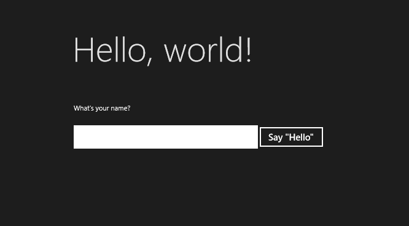

# <a name="create-a-hello-world-app-using-cwinrt"></a>Erstellen einer „Hello, World“- -App mit C++/WinRT

Dieses Thema führt Sie durch die Erstellung einer Windows 10 UWP (Universelle Windows-Plattform) „Hello, World!“- App mithilfe von C++/WinRT. Die Benutzeroberfläche (UI) der App wird in XAML (Extensible Application Markup Language) definiert.

C++/WinRT ist eine vollständig standardmäßige und moderne C++17-Sprachprojektion für Windows-Runtime-APIs (WinRT). Weitere Informationen und weitere exemplarische Vorgehensweisen sowie Codebeispiele finden Sie in der Dokumentation zu [C++/WinRT](/windows/uwp/cpp-and-winrt-apis/). Ein gutes Thema, um damit zu beginnen, ist [Erste Schritte mit C++/WinRT](/windows/uwp/cpp-and-winrt-apis/get-started).

## <a name="set-up-visual-studio-for-cwinrt"></a>Einrichten von Visual Studio für C++/WinRT

Informationen zum Einrichten von Visual Studio für die C++/WinRT-Entwicklung&mdash;einschließlich Installieren und Verwenden der C++/WinRT Visual Studio-Erweiterung (VSIX) und des NuGet-Pakets (die zusammen die Projektvorlage und Buildunterstützung bereitstellen)&mdash; finden Sie unter [Visual Studio-Unterstützung für C++/WinRT](/windows/uwp/cpp-and-winrt-apis/intro-to-using-cpp-with-winrt#visual-studio-support-for-cwinrt-xaml-the-vsix-extension-and-the-nuget-package).

Informationen zum Herunterladen von Visual Studio finden Sie unter [Downloads](https://visualstudio.microsoft.com/downloads/).

Eine Einführung in XAML finden Sie unter [Übersicht über XAML](/windows/uwp/xaml-platform/xaml-overview).

## <a name="create-a-blank-app-helloworldcppwinrt"></a>Erstellen einer leeren App (HelloWorldCppWinRT)

Unsere erste App ist eine „Hello, World!“- App, die einige grundlegende Funktionen von Interaktivität, Layout und Stilen veranschaulicht.

Erstelle zunächst ein neues Projekt in Microsoft Visual Studio. Erstellen Sie ein Projekt vom Typ **Leere App (C++/WinRT)** , und nennen Sie es *HelloWorldCppWinRT*. Stellen Sie sicher, dass **Platzieren Sie die Projektmappe und das Projekt im selben Verzeichnis** deaktiviert ist. Die neueste allgemein verfügbare Version von Windows SDK (d. h. keine Vorschauversion).

Führe den Buildvorgang für dein Projekt erst aus, wenn du weiter unten in diesem Thema dazu aufgefordert wirst.

### <a name="about-the-project-files"></a>Informationen zu Projektdateien

In der Regel besitzt jede `.xaml`-Datei (XAML-Markup) im Projektordner eine entsprechende `.idl`-, `.h`- und `.cpp`-Datei. Zusammen werden diese Dateien in einen XAML-Seitentyp kompiliert.

Sie können eine XAML-Markupdatei ändern, um Benutzeroberflächenelemente zu erstellen, und Sie können diese Elemente an Datenquellen binden (eine Aufgabe, die auch als [Datenbindung](/windows/uwp/data-binding/) bezeichnet wird). Sie ändern die `.h`- und `.cpp`-Dateien (und manchmal auch die `.idl`-Datei), um benutzerdefinierte Logik für Ihre XAML-Seite hinzuzufügen, z. B. Ereignishandler.

Befassen wir uns mit einigen der Projektdateien.

- `App.idl`, `App.xaml`, `App.h` und `App.cpp`. Diese Dateien stellen die Spezialisierung Ihrer App der [**Windows::UI::Xaml::Application**](/uwp/api/windows.ui.xaml.application)-Klasse dar, die den Einstiegspunkt Ihrer App einschließt. `App.xaml` enthält kein seitenspezifisches Markup, aber Sie können dort Benutzeroberflächenstile sowie alle anderen Elemente hinzufügen, die von allen Seiten aus verfügbar sein sollen. Die `.h`- und `.cpp`-Dateien enthalten Handler für verschiedene Ereignisse des Anwendungslebenszyklus. In der Regel können Sie hier benutzerdefinierten Code hinzufügen, um Ihre App zu initialisieren, wenn sie gestartet wird, und um eine Bereinigung durchzuführen, wenn sie angehalten oder beendet wird.
- `MainPage.idl`, `MainPage.xaml`, `MainPage.h` und `MainPage.cpp`. Enthalten das XAML-Markup und die Implementierung für den standardmäßigen Hauptseitentyp (Startseite) in einer App, bei dem es sich um die **MainPage**-Laufzeitklasse handelt. **MainPage** besitzt keine Navigationsunterstützung, bietet jedoch einige Standardbenutzeroberflächen-Elemente und einen Ereignishandler, um Ihnen den Einstieg zu erleichtern.
- `pch.h` und `pch.cpp`. Diese Dateien stellen die vorkompilierte Headerdatei Ihres Projekts dar. Nehmen Sie in `pch.h` alle Headerdateien auf, die sich nicht häufig ändern, und schließen Sie dann `pch.h` in andere Dateien im Projekt ein.

## <a name="a-first-look-at-the-code"></a>Ein erster Blick auf den Code

### <a name="runtime-classes"></a>Laufzeitklassen

Wie Sie vielleicht wissen, sind alle Klassen in einer UWP-App (Universelle Windows-Plattform), die in C# geschrieben ist, Windows-Runtime-Typen. Wenn Sie jedoch einen Typ in einer C++/WinRT-Anwendung erstellen, können Sie auswählen, ob dieser Typ ein Windows-Runtime-Typ oder eine reguläre C++-Klasse/Struktur/Enumeration sein soll.

Jeder XAML-Seitentyp in Ihrem Projekt muss ein Windows-Runtime Typ sein. Somit ist **MainPage** auch ein Windows-Runtime-Typ. Es handelt sich insbesondere um eine *Laufzeitklasse*. Jeder Typ, der von einer XAML-Seite verwendet wird, muss also auch ein Windows-Runtime-Typ sein. Wenn Sie eine [Windows-Runtime-Komponenten](/windows/uwp/winrt-components/create-a-windows-runtime-component-in-cppwinrt) schreiben und einen Typ erstellen möchten, der von einer anderen App genutzt werden kann, erstellen Sie einen Windows-Runtime-Typ. In anderen Fällen kann Ihr Typ auch ein regulärer C++-Typ sein. Im Allgemeinen kann ein Windows-Runtime-Typ mithilfe jeder beliebigen Windows-Runtime-Sprache genutzt werden.

Ein guter Indikator, dass ein Typ ein Windows-Runtime-Typ ist, ist, dass er in der [Microsoft Interface Definition Language (MIDL) in einer Schnittstellendefinitionssprach-Datei (Interface Definition Language-Datei, ) definiert ist. Nehmen wir **MainPage** als Beispiel.

```idl
// MainPage.idl
namespace HelloWorldCppWinRT
{
    [default_interface]
    runtimeclass MainPage : Windows.UI.Xaml.Controls.Page
    {
        MainPage();
        Int32 MyProperty;
    }
}
```

Hier ist die grundlegende Struktur der Implementierung der **MainPage**-Laufzeitklasse sowie ihre Aktivierungsfactory, wie in `MainPage.h` zu sehen.

```cppwinrt
// MainPage.h
...
namespace winrt::HelloWorldCppWinRT::implementation
{
    struct MainPage : MainPageT<MainPage>
    {
        MainPage();

        int32_t MyProperty();
        void MyProperty(int32_t value);
        ...
    };
}

namespace winrt::HelloWorldCppWinRT::factory_implementation
{
    struct MainPage : MainPageT<MainPage, implementation::MainPage>
    {
    };
}
```    

Weitere Informationen dazu, ob Sie eine Laufzeitklasse für einen bestimmten Typ erstellen oder nicht erstellen sollten, finden Sie im Thema [Erstellen von APIs mit C++/WinRT](/windows/uwp/cpp-and-winrt-apis/author-apis). Weitere Informationen über die Verbindung zwischen Laufzeitklassen und IDL (`.idl`-Dateien) finden Sie im Thema [XAML-Steuerelemente: Binden an eine C++/WinRT-Eigenschaft](/windows/uwp/cpp-and-winrt-apis/binding-property), das Sie auch durcharbeiten können. Dieses Thema führt Sie durch den Vorgang der Erstellung einer neuen Laufzeitklasse, wobei der erste Schritt darin besteht, dem Projekt ein neues Element vom Typ **Midl-Datei (.idl)** hinzuzufügen.

Fügen wir nun dem **HelloWorldCppWinRT**-Projekt ein paar Funktionen hinzu.

## <a name="step-1-modify-your-startup-page"></a>Schritt 1 Ändern Ihrer Startseite

Öffnen Sie im **Projektmappen-Explorer** die Datei `MainPage.xaml`, damit Sie die Steuerelemente erstellen können, aus denen die Benutzeroberfläche (UI) bestehen soll.

Löschen Sie den **StackPanel-** , der dort bereits vorhanden ist, sowie seinen Inhalt. Fügen Sie an seiner Stelle den folgenden XAML-Code ein.

```xaml
<StackPanel x:Name="contentPanel" Margin="120,30,0,0">
    <TextBlock HorizontalAlignment="Left" Text="Hello, World!" FontSize="36"/>
    <TextBlock Text="What's your name?"/>
    <StackPanel x:Name="inputPanel" Orientation="Horizontal" Margin="0,20,0,20">
        <TextBox x:Name="nameInput" Width="300" HorizontalAlignment="Left"/>
        <Button x:Name="inputButton" Content="Say &quot;Hello&quot;"/>
    </StackPanel>
    <TextBlock x:Name="greetingOutput"/>
</StackPanel>
```

Dieser neue [**StackPanel**](/uwp/api/Windows.UI.Xaml.Controls.StackPanel) enthält einen [**TextBlock**](/uwp/api/Windows.UI.Xaml.Controls.TextBlock), in dem der Benutzer zur Eingabe seines Namens aufgefordert wird, ein [**TextBox**](/uwp/api/Windows.UI.Xaml.Controls.TextBox)-Element, in das der Name eingegeben wird, sowie ein [**Button**](/uwp/api/Windows.UI.Xaml.Controls.Button)- und ein weiteres **TextBlock**-Element.

Da wir das **Button**-Element mit dem Namen *myButton* gelöscht haben, müssen wir den Verweis darauf aus dem Code entfernen. Löschen Sie also in `MainPage.cpp` die Codezeile in der Funktion **MainPage::ClickHandler**.

Sie haben nun eine sehr einfache universelle Windows-App erstellt. Falls Sie wissen möchten, wie die UWP-App aussieht, erstellen Sie die App, und führen Sie sie aus.



In der App können Sie Eingaben in das Textfeld vornehmen. Wenn Sie aber auf die Schaltfläche klicken, passiert noch nichts.

## <a name="step-2-add-an-event-handler"></a>Schritt 2 Hinzufügen eines Ereignishandlers

Suchen Sie in `MainPage.xaml` das Element **Button** mit dem Namen *inputButton*, und deklarieren Sie einen Ereignishandler für sein [**ButtonBase::Click**](/uwp/api/windows.ui.xaml.controls.primitives.buttonbase.click)-Ereignis. Das Markup für das **Button**-Element sollte nun wie folgt aussehen.

```xaml
<Button x:Name="inputButton" Content="Say &quot;Hello&quot;" Click="inputButton_Click"/>
```

Implementieren Sie den Ereignishandler wie folgt.

```cppwinrt
// MainPage.h
struct MainPage : MainPageT<MainPage>
{
    ...
    void inputButton_Click(
        winrt::Windows::Foundation::IInspectable const& sender,
        winrt::Windows::UI::Xaml::RoutedEventArgs const& e);
};

// MainPage.cpp
namespace winrt::HelloWorldCppWinRT::implementation
{
    ...
    void MainPage::inputButton_Click(
        winrt::Windows::Foundation::IInspectable const& sender,
        winrt::Windows::UI::Xaml::RoutedEventArgs const& e)
    {
        greetingOutput().Text(L"Hello, " + nameInput().Text() + L"!");
    }
}
```

Weitere Informationen finden Sie unter [Verarbeiten von Ereignissen mittels Delegaten](/windows/uwp/cpp-and-winrt-apis/handle-events).

Die Implementierung ruft den Namen des Benutzers aus dem Textfeld ab, verwendet ihn zum Erstellen einer Begrüßung und zeigt diese im Textblock *greetingOutput* an.

Erstellen Sie die App, und führen Sie sie aus. Geben Sie Ihren Namen in das Textfeld ein, und klicken Sie auf die Schaltfläche. Die App zeigt eine personalisierte Begrüßung an.


## <a name="step-3-style-the-startup-page"></a>Schritt 3 Gestalten der Startseite

### <a name="choose-a-theme"></a>Auswählen eines Designs

Das Erscheinungsbild Ihrer App lässt sich ganz einfach anpassen. Standardmäßig verwendet Ihre App Ressourcen mit einem Stil in hellen Farben. Die Systemressourcen umfassen auch ein dunkles Design.

Um das dunkle Design auszuprobieren, bearbeiten Sie `App.xaml`, und fügen Sie einen Wert für [**Application::RequestedTheme**](/uwp/api/windows.ui.xaml.application.requestedtheme) hinzu.

```xaml
<Application
    ...
    RequestedTheme="Dark">

</Application>
```

Bei Apps, die hauptsächlich Bilder oder Videos anzeigen, sollten Sie das dunkle Design verwenden, während sich bei Apps mit viel Text die Verwendung des hellen Designs empfiehlt. Falls Sie ein benutzerdefiniertes Farbschema verwenden, wählen Sie das Design, das am besten zum Erscheinungsbild Ihrer App passt.

> [!NOTE]
> Ein Design wird angewendet, wenn Ihre App gestartet wird. Während die App ausgeführt wird, kann es nicht geändert werden.

### <a name="use-system-styles"></a>Verwenden von Systemstilen

In diesem Abschnitt ändern wir die Darstellung des Texts (z. B. vergrößern wir die Schrift).

Suchen Sie in `MainPage.xaml` den „What‘s your name?“- **TextBlock**. Legen Sie seine Eigenschaft [**Style**](/uwp/api/windows.ui.xaml.style) auf einen Verweis auf den Systemressourcenschlüssel *BaseTextBlockStyle* fest.

```xaml
<TextBlock Text="What's your name?" Style="{ThemeResource BaseTextBlockStyle}"/>
```

*BaseTextBlockStyle* ist der Schlüssel einer im [**ResourceDictionary**](/uwp/api/Windows.UI.Xaml.ResourceDictionary)-Element in `\Program Files (x86)\Windows Kits\10\DesignTime\CommonConfiguration\Neutral\UAP\<version>\Generic\generic.xaml` definierten Ressource. Hier finden Sie die Eigenschaftswerte, die von diesem Stil festgelegt werden.

```xaml
<Style x:Key="BaseTextBlockStyle" TargetType="TextBlock">
    <Setter Property="FontFamily" Value="XamlAutoFontFamily" />
    <Setter Property="FontWeight" Value="SemiBold" />
    <Setter Property="FontSize" Value="14" />
    <Setter Property="TextTrimming" Value="None" />
    <Setter Property="TextWrapping" Value="Wrap" />
    <Setter Property="LineStackingStrategy" Value="MaxHeight" />
    <Setter Property="TextLineBounds" Value="Full" />
</Style>
```

Suchen Sie ebenfalls in `MainPage.xaml` den **TextBlock** namens `greetingOutput`. Legen Sie seinen **Style** ebenfalls auf *BaseTextBlockStyle* fest. Wenn Sie die App jetzt erstellen und ausführen, sehen Sie, dass sich die Darstellung beider Textblöcke geändert hat (z. B. ist die Schrift jetzt ).

## <a name="step-4-have-the-ui-adapt-to-different-window-sizes"></a>Schritt 4 Anpassen der Benutzeroberfläche an verschiedene Fenstergrößen

Nun sorgen wir dafür, dass sich die Benutzeroberfläche dynamisch an sich ändernde Fenstergrößen anpasst, sodass sie auch auf Geräten mit kleinem Display gut aussieht. Hierzu fügen Sie in `MainPage.xaml` einen Abschnitt [**VisualStateManager**](/uwp/api/Windows.UI.Xaml.VisualStateManager) hinzu. Sie definieren verschiedene visuelle Zustände für unterschiedliche Fenstergrößen und legen dann die Eigenschaften fest, die für jeden dieser visuellen Zustände gelten sollen.

### <a name="adjust-the-ui-layout"></a>Anpassen des Benutzeroberflächenlayouts

Fügen Sie diesen XAML-Block als erstes untergeordnetes Element des **StackPanel**-Stammelements hinzu.

```xaml
<StackPanel ...>
    <VisualStateManager.VisualStateGroups>
        <VisualStateGroup>
            <VisualState x:Name="wideState">
                <VisualState.StateTriggers>
                    <AdaptiveTrigger MinWindowWidth="641" />
                </VisualState.StateTriggers>
            </VisualState>
            <VisualState x:Name="narrowState">
                <VisualState.StateTriggers>
                    <AdaptiveTrigger MinWindowWidth="0" />
                </VisualState.StateTriggers>
                <VisualState.Setters>
                    <Setter Target="contentPanel.Margin" Value="20,30,0,0"/>
                    <Setter Target="inputPanel.Orientation" Value="Vertical"/>
                    <Setter Target="inputButton.Margin" Value="0,4,0,0"/>
                </VisualState.Setters>
            </VisualState>
        </VisualStateGroup>
    ...
</StackPanel>
```

Erstellen Sie die App, und führen Sie sie aus. Sie sehen, dass die Benutzeroberfläche genau wie vorher aussieht, bis die Fensterbreite auf weniger als 641 DIP (geräteunabhängige Pixel) geändert wird. An diesem Punkt wird der visuelle Zustand *narrowState* zusammen mit allen Settern für Eigenschaften angewendet, die für diesen Zustand definiert sind.

Das [**VisualState**](/uwp/api/Windows.UI.Xaml.VisualState)-Element mit dem Namen `wideState` verfügt über ein [**AdaptiveTrigger**](/uwp/api/Windows.UI.Xaml.AdaptiveTrigger)-Element, für das die [**MinWindowWidth**](/uwp/api/windows.ui.xaml.adaptivetrigger.minwindowwidth)-Eigenschaft auf den Wert 641 festgelegt ist. Das bedeutet, dass der Zustand nur angewendet wird, wenn die Fensterbreite nicht geringer als die Mindestgröße von 641 DIP ist. Da Sie keine [**Setter**](/uwp/api/Windows.UI.Xaml.Setter)-Objekte für diesen Zustand definieren, werden die Layouteigenschaften verwendet, die Sie im XAML-Code für den Seiteninhalt festgelegt haben.

Das zweite [**VisualState**](/uwp/api/Windows.UI.Xaml.VisualState)-Element `narrowState` verfügt über ein [**AdaptiveTrigger**](/uwp/api/Windows.UI.Xaml.AdaptiveTrigger)-Element, für das die [**MinWindowWidth**](/uwp/api/windows.ui.xaml.adaptivetrigger.minwindowwidth)-Eigenschaft auf 0 festgelegt ist. Dieser Zustand wird angewendet, wenn die Fensterbreite größer 0, aber kleiner als 641 DIP ist. Bei exakt 641 DIPs ist `wideState` wirksam. Im `narrowState` diesem definieren Sie [**Setter**](/uwp/api/Windows.UI.Xaml.Setter)-Objekte, um die Layouteigenschaften der Steuerelemente in der Benutzeroberfläche zu ändern.

- Verringern Sie den linken Rand des *contentPanel*-Elements von 120 auf 20.
- Ändern Sie die [**Orientation**](/uwp/api/windows.ui.xaml.controls.stackpanel.orientation) des *inputPanel*-Elements von **Horizontal** in **Vertical**.
- Fügen Sie dem *inputButton*-Element einen oberen Rand mit einer Breite von 4 DIP hinzu.

## <a name="summary"></a>Zusammenfassung

In dieser exemplarischen Vorgehensweise haben Sie gesehen, wie Sie einer universellen Windows-App Inhalte hinzufügen, wie Sie sie interaktiv hinzufügen, und wie Sie die Darstellung der Benutzeroberfläche ändern.
