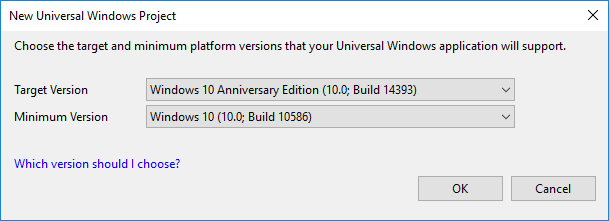

# <a name="create-a-hello-world-app-js"></a>Erstellen der App „Hello, world“ (JS)

In diesem Tutorial erfahren Sie, wie Sie JavaScript und HTML zum Erstellen einer einfachen „Hello, World“-App für die universelle Windows-Plattform (UWP) unter Windows 10 verwenden. Mit nur einem Projekt in Microsoft Visual Studio können Sie eine App erstellen, die auf allen Geräten mit Windows 10 ausgeführt werden kann.

> [!NOTE]
> In diesem Tutorial wird Visual Studio Community 2017 verwendet. Wenn du eine andere Version von Visual Studio verwendest, sieht die Oberfläche unter Umständen etwas anders aus.

> [!WARNING]
> Die Entwicklung von JavaScript-UWP-Apps wird in Visual Studio 2019 nicht unterstützt. Sie müssen Visual Studio 2017 verwenden, um eine JavaScript-UWP-App zu entwickeln.

In diesem Artikel werden folgende Aktionen beschrieben:

-   Erstellen eines neuen **Visual Studio 2017**-Projekts für **Windows 10** und die **UWP**.
-   Hinzufügen von HTML und JavaScript-Inhalten
-   Ausführen des Projekts auf dem lokalen Desktop in Visual Studio

## <a name="before-you-start"></a>Bevor Sie beginnen

-   [Was ist eine UWP-App?](universal-application-platform-guide.md)
-   Zum Durcharbeiten dieses Tutorials benötigen Sie Windows 10 und Visual Studio. [Vorbereiten](get-set-up.md).
-   Außerdem wird davon ausgegangen, dass Sie das Standardfensterlayout in Visual Studio verwenden. Wenn Sie das Standardlayout ändern, können Sie es im Menü **Fenster** mit dem Befehl **Fensterlayout zurücksetzen** wiederherstellen.

## <a name="step-1-create-a-new-project-in-visual-studio"></a>Schritt 1: Erstellen eines neuen Projekts in Visual Studio

1.  Starten Sie Visual Studio 2017.

2.  Wählen Sie im Menü **Datei** die Befehle **Neu > Projekt** aus, um das Dialogfeld **Neues Projekt erstellen** zu öffnen.

3.  Wählen Sie **Leere App (Universelles Windows: JavaScript)** aus, und klicken Sie dann auf **Weiter**.

    (Werden keine universellen Vorlagen angezeigt, fehlen möglicherweise die Komponenten zum Erstellen von UWP-Apps. Sie können die Installation wiederholen und UWP-Unterstützung hinzufügen, indem Sie im Dialogfeld **Neues Projekt erstellen** die Option **Visual Studio-Installer öffnen** auswählen. Siehe [Vorbereiten](get-set-up.md).

4.  Geben Sie im Dialogfeld **Neues Projekt konfigurieren** die Zeichenfolge **HelloWorld** als **Projektname** ein, und wählen Sie dann **Erstellen** aus.

> [!NOTE]
> Wenn du Visual Studio zum ersten Mal verwendest, wird möglicherweise das Dialogfeld „Einstellungen“ angezeigt, in dem du zur Aktivierung von **Entwicklermodus** aufgefordert wirst. Der Entwicklermodus ist eine spezielle Einstellung, die bestimmte Features unterstützt, z. B. die direkte Ausführung von Apps und nicht nur die Ausführung aus dem Store. Weitere Informationen findest du unter [Aktivieren deines Geräts für die Entwicklung](enable-your-device-for-development.md). Wählen Sie **Entwicklermodus** aus, wählen Sie **Ja** aus, und schließen Sie das Dialogfeld, um mit dem Lernprogramm fortzufahren.

 

5.  Das Dialogfeld für die Zielversion/mindestens erforderliche Version wird angezeigt. Da die Standardeinstellungen für dieses Tutorial geeignet sind, wähle **OK** aus, um das Projekt zu erstellen.

    

6.  Wenn das neue Projekt geöffnet wird, werden die Dateien im Bereich **Projektmappen-Explorer** auf der rechten Seite angezeigt. Möglicherweise müssen Sie die Registerkarte **Projektmappen-Explorer** anstelle der Registerkarte **Eigenschaften** auswählen, um die Dateien anzuzeigen.

    

**Leere App (universelle Windows-App)** ist zwar nur eine Minimalvorlage, umfasst aber trotzdem eine Reihe von Dateien. Diese Dateien werden für alle UWP-Apps mit JavaScript benötigt. Sie sind Teil jedes Projekts, das Sie mit Visual Studio erstellen.


### <a name="whats-in-the-files"></a>Inhalt der Dateien

Doppelklicken Sie zum Anzeigen und Bearbeiten einer Datei im Projekt im **Projektmappen-Explorer** auf die gewünschte Datei.

*default.css*

-  Das von der App verwendete Standard-Stylesheet

*main.js*

- Die JavaScript-Standarddatei. Auf sie wird in der Datei „index.html“ verwiesen.

*index.html*

- Die Webseite der App, die beim Start der App geladen und angezeigt wird.

*Ein Satz mit Logobildern*
-   „Assets/Square150x150Logo.scale-200.png“ stellt Ihre App im Menü **Start** dar.
-   „Assets/StoreLogo.png“ stellt deine App im Microsoft Store dar.
-   „Assets/SplashScreen.scale-200.png“ ist der Begrüßungsbildschirm, der beim Start der App angezeigt wird.

## <a name="step-2-adding-a-button"></a>Schritt 2: Hinzufügen einer Schaltfläche

Wählen Sie **index.html** aus, um die Datei im Editor auszuwählen, und ändern Sie den darin enthaltenen HTML-Code wie folgt.

```html
<!DOCTYPE html>
<html>

<head>
    <meta charset="utf-8" />
    <title>Hello World</title>
    <script src="js/main.js"></script>
    <link href="css/default.css" rel="stylesheet" />
</head>

<body>
    <p>Click the button..</p>
    <button id="button">Hello world!</button>
</body>

</html>
```

Die Datei sollte wie folgt aussehen.

 

Dieser HTML-Code verweist auf die Datei *main.js*, die das JavaScript enthält. Anschließend werden dem Hauptteil der Webseite eine einzelne Textzeile und eine Schaltfläche hinzugefügt. Die Schaltfläche erhält eine *ID*, damit JavaScript darauf verweisen kann.


## <a name="step-3-adding-some-javascript"></a>Schritt 3: Hinzufügen von JavaScript-Code

Jetzt fügen wir JavaScript-Code hinzu. Wählen Sie die Datei **main.js** aus, und fügen Sie Folgendes hinzu.

```javascript
// Your code here!

window.onload = function () {
    document.getElementById("button").onclick = function (evt) {
        sayHello()
    }
}


function sayHello() {
    var messageDialog = new Windows.UI.Popups.MessageDialog("Hello, world!", "Alert");
    messageDialog.showAsync();
}

```

Die Datei sollte wie folgt aussehen.

 

In diesem JavaScript-Code werden zwei Funktionen deklariert. Die Funktion *window.onload* wird automatisch aufgerufen, wenn *index.html* angezeigt wird. Die Schaltfläche wird (anhand der angegebenen ID) ermittelt, und es wird ein Onclick-Handler hinzugefügt. Dies ist die Methode, die beim Klicken auf die Schaltfläche aufgerufen wird.

Durch die zweite Funktion, *sayHello()* , wird ein Dialogfeld erstellt und angezeigt. Diese Funktion ist der Funktion *Alert()* sehr ähnlich, die Sie möglicherweise aus früheren Entwicklungsszenarien mit JavaScript kennen.


## <a name="step-4-run-the-app"></a>Schritt 4: Führen Sie die App aus.

Jetzt können Sie die App ausführen, indem Sie F5 drücken. Die App wird geladen, und die Webseite wird angezeigt. Wählen Sie die Schaltfläche aus, um das Meldungsfeld einzublenden.

 


## <a name="summary"></a>Zusammenfassung


Herzlichen Glückwunsch, Sie haben eine JavaScript-App für Windows 10 und die UWP erstellt! Dies ist ein sehr einfaches Beispiel, allerdings können Sie nun Ihre bevorzugten JavaScript-Bibliotheken und -Frameworks zum Erstellen Ihrer eigenen App hinzufügen. Und da es sich um eine UWP-App handelt, können Sie sie im Store veröffentlichen. Beispiele zum Hinzufügen von Drittanbieter-Frameworks finden Sie in diesen Projekten:

* [Ein einfaches 2D-UWP-Spiel für den Microsoft Store, geschrieben in JavaScript und CreateJS](get-started-tutorial-game-js2d.md)
* [Ein 3D-UWP-Spiel für den Microsoft Store, geschrieben in JavaScript und ThreeJS](get-started-tutorial-game-js3d.md)
