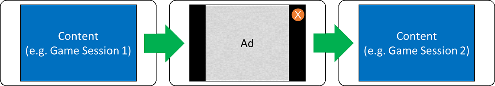

# <a name="interstitial-ads"></a>Interstitialwerbung

>[!WARNING]
> Ab dem 1. Juni 2020 wird die Microsoft AD-Monetarisierungsplattform für Windows UWP-apps heruntergefahren. [Weitere Informationen](https://social.msdn.microsoft.com/Forums/windowsapps/en-US/db8d44cb-1381-47f7-94d3-c6ded3fea36f/microsoft-ad-monetization-platform-shutting-down-june-1st?forum=aiamgr)

In dieser exemplarischen Vorgehensweise wird gezeigt, wie Sie Interstitial-Werbeeinblendungen in universelle Windows-Plattform (UWP)-apps und Spiele für Windows 10 Vollständige Beispielprojekte, die das Hinzufügen von Interstitialwerbung zu JavaScript-/HTML- und XAML-Apps unter Verwendung von C# und C++ zeigen, finden Sie in den [Anzeigenbeispielen auf GitHub](https://github.com/Microsoft/Windows-universal-samples/tree/master/Samples/Advertising).

<span id="whatareinterstitialads10"/>

## <a name="what-are-interstitial-ads"></a>Was ist Interstitialwerbung?

Anders als bei Standard Banner-Werbeeinblendungen, die auf einen Teil der Benutzeroberfläche in einer APP oder einem Spiel beschränkt sind, werden auf dem gesamten Bildschirm Interstitial-Werbung angezeigt. In Spielen werden häufig zwei grundlegende Formen verwendet.

* Bei *Paywall*-Anzeigen muss der Benutzer eine Anzeige in regelmäßigen Intervallen ansehen. Dies findet beispielsweise zwischen Spiellevels statt:

    

* Mit Bonus *basierten* Werbeeinblendungen sucht der Benutzer explizit nach einem Vorteil, z. b. einem Hinweis oder zusätzlicher Zeit, um die Ebene abzuschließen, und initialisiert die Werbe Einblendung über die Benutzeroberfläche der app.

Wir bieten zwei Arten von Interstitial-Werbeeinblendungen, die in ihren apps und spielen verwendet werden: **Interstitial-Videowerbung** und **Interstitial Banner Ads**.

> [!NOTE]
> Die API für Interstitial-Werbeeinblendungen verarbeitet keine Benutzeroberfläche außer dem Zeitpunkt der Videowiedergabe. Informieren Sie sich in den [bewährten Methoden für Interstitialwerbung](ui-and-user-experience-guidelines.md#interstitialbestpractices10) über Richtlinien für das, was Sie tun und was Sie vermeiden sollten, wenn Sie sich überlegen, wie Sie Interstitialwerbung in Ihre App integrieren können.

## <a name="prerequisites"></a>Voraussetzungen

* Installieren Sie das [Microsoft Advertising SDK](https://marketplace.visualstudio.com/items?itemName=AdMediator.MicrosoftAdvertisingSDK) mit Visual Studio 2015 oder einer neueren Version von Visual Studio. Installationsanweisungen finden Sie in [diesem Artikel](install-the-microsoft-advertising-libraries.md).

## <a name="integrate-an-interstitial-ad-into-your-app"></a>Integrieren einer Interstitial-Werbe einformationen in Ihre APP

Befolgen Sie zum Anzeigen von Interstitialwerbung in Ihrer App die Anweisungen für den jeweiligen Projekttyp:

* [XAML/.NET](#interstitialadsxaml10)
* [HTML/JavaScript](#interstitialadshtml10)
* [C++ (DirectX Interop)](#interstitialadsdirectx10)

<span id="interstitialadsxaml10"/>

### <a name="xamlnet"></a>XAML/.NET

Dieser Abschnitt enthält Beispiele für C#. Visual Basic und C++ werden jedoch ebenfalls für XAML-/.NET-Projekte unterstützt. Ein vollständiges C#-Codebeispiel finden Sie unter [Beispielcode für Interstitialwerbung in C#](interstitial-ad-sample-code-in-c.md).

1. Öffnen Sie Ihr Projekt in Visual Studio.
    > [!NOTE]
    > Wenn Sie ein vorhandenes Projekt verwenden, öffnen Sie die Datei "Package. appxmanifest" in Ihrem Projekt, und stellen Sie sicher, dass die Funktion " **Internet (Client)** " ausgewählt ist. Ihre APP benötigt diese Funktion zum Empfangen von Test-und Live-Werbeeinblendungen.

2. Sollte in Ihrem Projekt die Zielplattform **ANYCPU** definiert sein, müssen Sie eine architekturspezifische Buildausgabe verwenden (z. B. **X86**) und das Projekt entsprechend aktualisieren. Sollte in Ihrem Projekt die Zielplattform **ANYCPU** definiert sein, können Sie bei den folgenden Schritten keinen Verweis auf die Microsoft Advertising-Bibliotheken hinzufügen. Weitere Informationen finden Sie unter [Referenzfehler, die durch die Ausrichtung auf eine beliebige CPU (Any CPU) in Ihrem Projekt verursacht werden](known-issues-for-the-advertising-libraries.md#reference_errors).

3. Fügen Sie einen Verweis auf das Microsoft Advertising SDK in Ihrem Projekt hinzu:

    1. Klicken Sie im **Projektmappen-Explorer** Fenster mit der rechten Maustaste auf **Verweise**, und wählen Sie **Verweis hinzufügen... aus.**
    2.  Erweitern Sie im **Verweis-Manager** den Knoten **Universal Windows**, klicken Sie auf **Erweiterungen**, und wählen Sie dann das Kontrollkästchen neben **Microsoft Advertising SDK für XAML** (Version 10.0).
    3.  Klicken Sie im **Verweis-Manager** auf „OK“.

3.  Fügen Sie in der geeigneten Codedatei in Ihrer App (z. B. in „MainPage.xaml.cs“ oder einer Codedatei für eine andere Seite) den folgenden Namespaceverweis hinzu.

    [!code-csharp[InterstitialAd](./code/AdvertisingSamples/InterstitialAdSamples/cs/MainPage.xaml.cs#Snippet1)]

4.  Deklarieren Sie an einer geeigneten Stelle in Ihrer App (z. B. in ```MainPage``` oder einer anderen Seite) ein [InterstitialAd](/uwp/api/microsoft.advertising.winrt.ui.interstitialad)-Objekt und mehrere Zeichenfolgenfelder, die die Anwendungs-ID und Anzeigeneinheits-ID für die Interstitialwerbung darstellen. Im folgenden Codebeispiel werden die `myAppId` `myAdUnitId` Felder und den [Testwerten](set-up-ad-units-in-your-app.md#test-ad-units) für Interstitial ADS zugewiesen.

    > [!NOTE]
    > Jeder **interstitialad** verfügt über eine entsprechende *Ad-Einheit* , die von unseren Diensten verwendet wird, um Werbung für das Steuerelement bereitzustellen, und jede Ad-Einheit besteht aus einer Ad-Einheiten- *ID* und einer Anwendungs- *ID*. In den folgenden Schritten weisen Sie dem Steuerelement Test Ad Unit ID-und Anwendungs-ID-Werte zu. Diese Testwerte können nur in einer Testversion der APP verwendet werden. Bevor Sie Ihre APP im Store veröffentlichen, müssen Sie [diese Testwerte durch livewerte](#release) aus Partner Center ersetzen.

    [!code-csharp[InterstitialAd](./code/AdvertisingSamples/InterstitialAdSamples/cs/MainPage.xaml.cs#Snippet2)]

5.  Instanziieren Sie in Code, der beim Start ausgeführt wird (z. B. im Konstruktor der Seite) das **InterstitialAd**-Objekt, und verbinden Sie Ereignishandler für die Ereignisse des Objekts.

    [!code-csharp[InterstitialAd](./code/AdvertisingSamples/InterstitialAdSamples/cs/MainPage.xaml.cs#Snippet3)]

6.  Wenn Sie eine *Interstitial-Video* Anzeige anzeigen möchten: ungefähr 30-60 Sekunden, bevor Sie die Werbe einformationen benötigen, verwenden Sie die [requestad](/uwp/api/microsoft.advertising.winrt.ui.interstitialad.requestad) -Methode, um das AD vorab abzurufen. Dadurch bleibt genügend Zeit, um die Anzeige anzufordern und vorzubereiten, bevor sie angezeigt werden soll. Achten Sie darauf, **adtype. Video** für den AD-Typ anzugeben.

    [!code-csharp[InterstitialAd](./code/AdvertisingSamples/InterstitialAdSamples/cs/MainPage.xaml.cs#Snippet4)]

    Wenn Sie ein *Interstitial Banner* AD anzeigen möchten: ungefähr 5-8 Sekunden, bevor Sie die Werbe einformationen benötigen, verwenden Sie die [requestad](/uwp/api/microsoft.advertising.winrt.ui.interstitialad.requestad) -Methode, um das AD vorab abzurufen. Dadurch bleibt genügend Zeit, um die Anzeige anzufordern und vorzubereiten, bevor sie angezeigt werden soll. Achten Sie darauf, **adtype. Display** für den AD-Typ anzugeben.

    ```csharp
    myInterstitialAd.RequestAd(AdType.Display, myAppId, myAdUnitId);
    ```

6.  Überprüfen Sie an der Stelle im Code, an der Sie das Interstitial-Video oder das Interstitial Banner Ad anzeigen möchten, ob **interstitialad** bereit ist, um angezeigt zu werden, und zeigen Sie es dann mit der [Show](/uwp/api/microsoft.advertising.winrt.ui.interstitialad.show) -Methode an.

    [!code-csharp[InterstitialAd](./code/AdvertisingSamples/InterstitialAdSamples/cs/MainPage.xaml.cs#Snippet5)]

7.  Definieren Sie die Ereignishandler für das **InterstitialAd**-Objekt.

    [!code-csharp[InterstitialAd](./code/AdvertisingSamples/InterstitialAdSamples/cs/MainPage.xaml.cs#Snippet6)]

8.  Erstellen und testen Sie Ihre App, um zu überprüfen, ob sie Testanzeigen anzeigt.

<span id="interstitialadshtml10"/>

### <a name="htmljavascript"></a>HTML/JavaScript

In den folgenden Anweisungen wird davon ausgegangen, dass Sie ein universelles Windows-Projekt für JavaScript in Visual Studio erstellt haben und eine bestimmte CPU als Ziel haben. Ein vollständiges Codebeispiel finden Sie unter [Beispielcode für Interstitialwerbung in JavaScript](interstitial-ad-sample-code-in-javascript.md).

1. Öffnen Sie Ihr Projekt in Visual Studio.

2. Sollte in Ihrem Projekt die Zielplattform **ANYCPU** definiert sein, müssen Sie eine architekturspezifische Buildausgabe verwenden (z. B. **X86**) und das Projekt entsprechend aktualisieren. Sollte in Ihrem Projekt die Zielplattform **ANYCPU** definiert sein, können Sie bei den folgenden Schritten keinen Verweis auf die Microsoft Advertising-Bibliotheken hinzufügen. Weitere Informationen finden Sie unter [Referenzfehler, die durch die Ausrichtung auf eine beliebige CPU (Any CPU) in Ihrem Projekt verursacht werden](known-issues-for-the-advertising-libraries.md#reference_errors).

3. Fügen Sie einen Verweis auf das Microsoft Advertising SDK in Ihrem Projekt hinzu:

    1. Klicken Sie im **Projektmappen-Explorer** Fenster mit der rechten Maustaste auf **Verweise**, und wählen Sie **Verweis hinzufügen... aus.**
    2.  Erweitern Sie im **Verweis-Manager** den Knoten **Universal Windows**, klicken Sie auf **Erweiterungen**, und wählen Sie dann das Kontrollkästchen neben **Microsoft Advertising SDK für JavaScript** (Version 10.0).
    3.  Klicken Sie im **Verweis-Manager** auf „OK“.

3.  Fügen Sie im ** &lt; Head &gt; ** -Abschnitt der HTML-Datei im Projekt nach den JavaScript-verweisen des Projekts von default. CSS und default.js den Verweis auf ad.js hinzu.

    ``` HTML
    <script src="//Microsoft.Advertising.JavaScript/ad.js"></script>
    ```

4.  Deklarieren Sie in einer JS-Datei in Ihrem Projekt ein [InterstitialAd](/uwp/api/microsoft.advertising.winrt.ui.interstitialad)-Objekt und mehrere Felder, die die Anwendungs-ID und Anzeigeneinheits-ID für die Interstitialwerbung enthalten. Im folgenden Codebeispiel werden die `applicationId` `adUnitId` Felder und den [Testwerten](set-up-ad-units-in-your-app.md#test-ad-units) für Interstitial ADS zugewiesen.

    > [!NOTE]
    > Jeder **interstitialad** verfügt über eine entsprechende *Ad-Einheit* , die von unseren Diensten verwendet wird, um Werbung für das Steuerelement bereitzustellen, und jede Ad-Einheit besteht aus einer Ad-Einheiten- *ID* und einer Anwendungs- *ID*. In den folgenden Schritten weisen Sie dem Steuerelement Test Ad Unit ID-und Anwendungs-ID-Werte zu. Diese Testwerte können nur in einer Testversion der APP verwendet werden. Bevor Sie Ihre APP im Store veröffentlichen, müssen Sie [diese Testwerte durch livewerte](#release) aus Partner Center ersetzen.

    [!code-javascript[InterstitialAd](./code/AdvertisingSamples/InterstitialAdSamples/js/script.js#Snippet1)]

5.  Instanziieren Sie in Code, der beim Start ausgeführt wird (z. B. im Konstruktor der Seite) das **InterstitialAd**-Objekt, und verbinden Sie Ereignishandler für das Objekt.

    [!code-javascript[InterstitialAd](./code/AdvertisingSamples/InterstitialAdSamples/js/script.js#Snippet2)]

5. Wenn Sie eine *Interstitial-Video* Anzeige anzeigen möchten: ungefähr 30-60 Sekunden, bevor Sie die Werbe einformationen benötigen, verwenden Sie die [requestad](/uwp/api/microsoft.advertising.winrt.ui.interstitialad.requestad) -Methode, um das AD vorab abzurufen. Dadurch bleibt genügend Zeit, um die Anzeige anzufordern und vorzubereiten, bevor sie angezeigt werden soll. Stellen Sie sicher, dass Sie **interstitialadtype. Video** für den AD-Typ angeben.

    [!code-javascript[InterstitialAd](./code/AdvertisingSamples/InterstitialAdSamples/js/script.js#Snippet3)]

    Wenn Sie ein *Interstitial Banner* AD anzeigen möchten: ungefähr 5-8 Sekunden, bevor Sie die Werbe einformationen benötigen, verwenden Sie die [requestad](/uwp/api/microsoft.advertising.winrt.ui.interstitialad.requestad) -Methode, um das AD vorab abzurufen. Dadurch bleibt genügend Zeit, um die Anzeige anzufordern und vorzubereiten, bevor sie angezeigt werden soll. Stellen Sie sicher, dass Sie für den AD-Typ **interstitialadtype. Display** angeben.

    ```js
    if (interstitialAd) {
        interstitialAd.requestAd(MicrosoftNSJS.Advertising.InterstitialAdType.display, applicationId, adUnitId);
    }
    ```

6.  Bestätigen Sie an der Stelle im Code, an der die Anzeige angezeigt werden soll, dass **InterstitialAd** bereit zum Einblenden ist, und zeigen Sie sie dann mit der [Show](/uwp/api/microsoft.advertising.winrt.ui.interstitialad.show)-Methode an.

    [!code-javascript[InterstitialAd](./code/AdvertisingSamples/InterstitialAdSamples/js/samples.js#Snippet4)]

7.  Definieren Sie die Ereignishandler für das **InterstitialAd**-Objekt.

    [!code-javascript[InterstitialAd](./code/AdvertisingSamples/InterstitialAdSamples/js/samples.js#Snippet5)]

9.  Erstellen und testen Sie Ihre App, um zu überprüfen, ob sie Testanzeigen anzeigt.

<span id="interstitialadsdirectx10"/>

### <a name="c-directx-interop"></a>C++ (DirectX Interop)

In diesem Beispiel wird davon ausgegangen, dass Sie ein Projekt der C++ **DirectX-und XAML-app (Universal Windows)** in Visual Studio erstellt haben und eine bestimmte CPU-Architektur als Ziel haben.
 
1. Öffnen Sie Ihr Projekt in Visual Studio.

3. Fügen Sie einen Verweis auf das Microsoft Advertising SDK in Ihrem Projekt hinzu:

    1. Klicken Sie im **Projektmappen-Explorer** Fenster mit der rechten Maustaste auf **Verweise**, und wählen Sie **Verweis hinzufügen... aus.**
    2.  Erweitern Sie im **Verweis-Manager** den Knoten **Universal Windows**, klicken Sie auf **Erweiterungen**, und wählen Sie dann das Kontrollkästchen neben **Microsoft Advertising SDK für XAML** (Version 10.0).
    3.  Klicken Sie im **Verweis-Manager** auf „OK“.

2.  Deklarieren Sie in einer geeigneten Headerdatei für Ihre App (z. B. „DirectXPage.xaml.h“) ein [InterstitialAd](/uwp/api/microsoft.advertising.winrt.ui.interstitialad)-Objekt und verwandte Ereignishandlermethoden.  

    [!code-cpp[InterstitialAd](./code/AdvertisingSamples/InterstitialAdSamples/cpp/DirectXPage.xaml.h#Snippet1)]

3.  Deklarieren Sie in derselben Headerdatei mehrere Zeichenfolgenfelder, die die Anwendungs-ID und Anzeigeneinheits-ID für die Interstitialwerbung darstellen. Im folgenden Codebeispiel werden die `myAppId` `myAdUnitId` Felder und den [Testwerten](set-up-ad-units-in-your-app.md#test-ad-units) für Interstitial ADS zugewiesen.

    > [!NOTE]
    > Jeder **interstitialad** verfügt über eine entsprechende *Ad-Einheit* , die von unseren Diensten verwendet wird, um Werbung für das Steuerelement bereitzustellen, und jede Ad-Einheit besteht aus einer Ad-Einheiten- *ID* und einer Anwendungs- *ID*. In den folgenden Schritten weisen Sie dem Steuerelement Test Ad Unit ID-und Anwendungs-ID-Werte zu. Diese Testwerte können nur in einer Testversion der APP verwendet werden. Bevor Sie Ihre APP im Store veröffentlichen, müssen Sie [diese Testwerte durch livewerte](#release) aus Partner Center ersetzen.

    [!code-cpp[InterstitialAd](./code/AdvertisingSamples/InterstitialAdSamples/cpp/DirectXPage.xaml.h#Snippet2)]

4.  Fügen Sie in der CPP-Datei, an der Stelle, an der Sie Code zum Anzeigen einer Interstitialwerbung hinzufügen möchten, den folgenden Namespaceverweis hinzu. In den folgenden Beispielen wird davon ausgegangen, dass Sie den Code der Datei „DirectXPage.xaml.cpp“ in Ihrer App hinzufügen.

    [!code-cpp[InterstitialAd](./code/AdvertisingSamples/InterstitialAdSamples/cpp/DirectXPage.xaml.cpp#Snippet3)]

6.  Instanziieren Sie in Code, der beim Start ausgeführt wird (z. B. im Konstruktor der Seite) das **InterstitialAd**-Objekt, und verbinden Sie Ereignishandler für die Ereignisse des Objekts. Im folgenden Beispiel entspricht ```InterstitialAdSamplesCpp``` dem Namespace für Ihr Projekt. Ändern Sie diesen Namen nach Bedarf für Ihren Code.

    [!code-cpp[InterstitialAd](./code/AdvertisingSamples/InterstitialAdSamples/cpp/DirectXPage.xaml.cpp#Snippet4)]

7. Wenn Sie eine *Interstitial-Video* Anzeige anzeigen möchten: ungefähr 30-60 Sekunden, bevor Sie die Interaktion mit "Interstitial" benötigen, verwenden Sie die [requestad](/uwp/api/microsoft.advertising.winrt.ui.interstitialad.requestad) -Methode, um das AD vorab abzurufen. Dadurch bleibt genügend Zeit, um die Anzeige anzufordern und vorzubereiten, bevor sie angezeigt werden soll. Achten Sie darauf, **adtype:: Video** für den AD-Typ anzugeben.

    [!code-cpp[InterstitialAd](./code/AdvertisingSamples/InterstitialAdSamples/cpp/DirectXPage.xaml.cpp#Snippet5)]

    Wenn Sie ein *Interstitial Banner* AD anzeigen möchten: ungefähr 5-8 Sekunden, bevor Sie die Werbe einformationen benötigen, verwenden Sie die [requestad](/uwp/api/microsoft.advertising.winrt.ui.interstitialad.requestad) -Methode, um das AD vorab abzurufen. Dadurch bleibt genügend Zeit, um die Anzeige anzufordern und vorzubereiten, bevor sie angezeigt werden soll. Achten Sie darauf, **adtype::D isplay** für den AD-Typ anzugeben.

    ```cpp
    m_interstitialAd->RequestAd(AdType::Display, myAppId, myAdUnitId);
    ```

7.  Bestätigen Sie an der Stelle im Code, an der die Anzeige angezeigt werden soll, dass **InterstitialAd** bereit zum Einblenden ist, und zeigen Sie sie dann mit der [Show](/uwp/api/microsoft.advertising.winrt.ui.interstitialad.show)-Methode an.

    [!code-cpp[InterstitialAd](./code/AdvertisingSamples/InterstitialAdSamples/cpp/DirectXPage.xaml.cpp#Snippet6)]

8.  Definieren Sie die Ereignishandler für das **InterstitialAd**-Objekt.

    [!code-cpp[InterstitialAd](./code/AdvertisingSamples/InterstitialAdSamples/cpp/DirectXPage.xaml.cpp#Snippet7)]

9. Erstellen und testen Sie Ihre App, um zu überprüfen, ob sie Testanzeigen anzeigt.

<span id="release" />

## <a name="release-your-app-with-live-ads"></a>Veröffentlichen Sie Ihre APP mit Live Werbung

1. Stellen Sie sicher, dass ihre Verwendung von Interstitial-Werbeeinblendungen in Ihrer APP unseren [Richtlinien für Austausch](ui-and-user-experience-guidelines.md#interstitialbestpractices10)Vorgänge entspricht.

2.  Wechseln Sie in Partner Center zur Seite [in-App-ADS](../publish/in-app-ads.md) , und [Erstellen Sie eine Ad-Einheit](set-up-ad-units-in-your-app.md#live-ad-units). Wählen Sie für den Typ der Ad-Einheit die Option **Video Interstitial** oder **Banner Interstitial**aus, je nachdem, welche Art von Interstitial Ad angezeigt wird. Notieren Sie sich die Anzeigeneinheits-ID und die Anwendungs-ID.
    > [!NOTE]
    > Die Anwendungs-ID-Werte für Test-und Live-UWP-Ad-Einheiten haben unterschiedliche Formate. Testanwendungs-ID-Werte sind GUIDs. Wenn Sie eine Live-UWP-Ad-Einheit in Partner Center erstellen, entspricht der Wert der Anwendungs-ID für die Ad-Einheit immer der Speicher-ID für Ihre APP (ein Beispiel für eine Store-ID sieht wie 9nblggh4r315 aus).

3. Optional können Sie die AD-Vermittlung für das **interstitialad** aktivieren, indem Sie die Einstellungen im Abschnitt " [Vermittlungs Einstellungen](../publish/in-app-ads.md#mediation) " auf der Seite " [in-App-Werbung](../publish/in-app-ads.md) " konfigurieren. Die AD-Vermittlung ermöglicht es Ihnen, ihre Werbe-und App-herauf Stufungs Funktionen zu maximieren, indem Sie Werbeeinblendungen aus mehreren Ad-Netzwerken anzeigen, darunter auch anzeigen aus anderen kostenpflichtigen Ad-Netzwerken wie Taboola und smaato und Werbe

4.  Ersetzen Sie in Ihrem Code die Test-Ad-Einheiten Werte durch die im Partner Center generierten livewerte.

5.  Über [Mitteln Sie Ihre APP](../publish/app-submissions.md) mithilfe von Partner Center an den Store.

6.  Überprüfen Sie Ihre [Leistungsberichte](../publish/advertising-performance-report.md) in Partner Center.

<span id="manage" />

## <a name="manage-ad-units-for-multiple-interstitial-ad-controls-in-your-app"></a>Verwalten von Ad-Einheiten für verschiedene AD-Steuerelemente mit Interstitial in der APP

Sie können mehrere **interstitialad** -Steuerelemente in einer einzelnen App verwenden. In diesem Szenario wird empfohlen, jedem Steuerelement eine andere Ad-Einheit zuzuweisen. Wenn Sie verschiedene Ad-Einheiten für jedes Steuerelement verwenden, können Sie [die Vermittlungs Einstellungen separat konfigurieren](../publish/in-app-ads.md#mediation) und diskrete [Berichtsdaten](../publish/advertising-performance-report.md) für jedes Steuerelement erhalten. Dadurch können unsere Dienste auch die Werbeeinblendungen, die wir für Ihre APP bereitstellen, besser optimieren.

> [!IMPORTANT]
> Sie können jede Ad-Einheit nur in einer App verwenden. Wenn Sie eine Ad-Einheit in mehr als einer App verwenden, werden ADS nicht für diese Ad-Einheit bereitgestellt.

## <a name="related-topics"></a>Zugehörige Themen

* [Richtlinien für Interstitialanzeigen](ui-and-user-experience-guidelines.md#interstitialbestpractices10)
* [Beispielcode für Interstitialwerbung in C#](interstitial-ad-sample-code-in-c.md)
* [Beispielcode für Interstitialwerbung in JavaScript](interstitial-ad-sample-code-in-javascript.md)
* [Anzeigenbeispiele bei GitHub](https://github.com/Microsoft/Windows-universal-samples/tree/master/Samples/Advertising)
* [Einrichten von Ad-Einheiten für Ihre APP](set-up-ad-units-in-your-app.md)