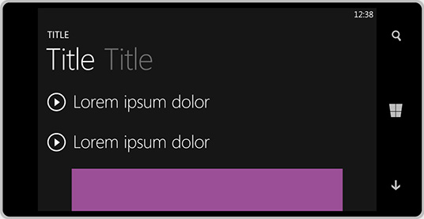

# Unterstützte Größen für Banneranzeigen

>[!WARNING]
> Ab dem 1. Juni 2020 wird die Microsoft AD-Monetarisierungsplattform für Windows UWP-apps heruntergefahren. [Weitere Informationen](https://aka.ms/ad-monetization-shutdown)

Die folgenden Größen für Banneranzeigen werden für universelle Windows Platform (UWP) Apps unterstützt. Wenn Sie das **adcontrol** -Objekt in der APP instanziieren, stellen Sie sicher, dass die Eigenschaften Width und Height auf eine dieser unterstützten Größen festgelegt sind.

Größen sind Breite x Höhe.

* 160 x 600
* 300 x 50
* 300 x 250
* 300 x 600
* 320 x 50
* 640 x 100
* 728 x 90

> [!NOTE]
> Um eine optimale Benutzererfahrung bereitzustellen, empfehlen wir die Verwendung der folgenden Größen für Windows 10 Mobile-Geräte: 300 x 50, 320 x 50 und 640 x 100.

Die folgende Tabelle enthält Beispiele, die jede Banner Ad-Größe veranschaulichen.

<table>
<colgroup>
<col width="20%" />
<col width="80%" />
</colgroup>
<thead>
<tr class="header">
<th align="left">Anzeigengröße</th>
<th align="left">Beispiel</th>
</tr>
</thead>
<tbody>
<tr class="even">
<td align="left">
160 x 600
</td>
<td align="left"></td>
</tr>
<tr class="even">
<td align="left">
300 x 250
</td>
<td align="left"></td>
</tr>
<tr class="odd">
<td align="left">
300 x 600
</td>
<td align="left"></td>
</tr>
<tr class="odd">
<td align="left">
728 x 90
</td>
<td align="left"></td>
</tr>
<tr class="odd">
<td align="left">
300 x 50
</td>
<td align="left"></td>
</tr>
<tr class="even">
<td align="left">
320 x 50
</td>
<td align="left"></td>
</tr>
<tr class="even">
<td align="left">
640 x 100
</td>
<td align="left"></td>
</tr>
</tbody>
</table>

 

 

 
