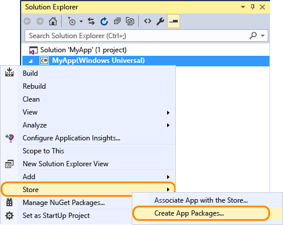

# Verpacken einer UWP-App mit Visual Studio

Um Ihre Universelle Windows Plattform (UWP)-App zu verkaufen oder an andere Benutzer zu verteilen, müssen Sie es verpacken. Wenn Sie Ihre App nicht über den Microsoft Store verteilen möchten, können Sie das App-Paket direkt auf einem Gerät querladen oder über [Web Install](installing-UWP-apps-web.md) verteilen. In diesem Artikel wird das Konfigurieren, Erstellen und Testen von UWP-App-Paketen mit Visual Studio beschrieben. Weitere Informationen zum Verwalten und Bereitstellen von branchenspezifischen Apps (Line-of-Business, LOB) finden Sie unter [Enterprise-App-Verwaltung](https://docs.microsoft.com/windows/client-management/mdm/enterprise-app-management).

Sie können in Windows 10, senden, ein app-Paket, app-Paket oder eine vollständige app-Paketdatei hochladen, [Partner Center](https://partner.microsoft.com/dashboard). Diese Optionen bieten senden eine app-Paketdatei hochladen die bestmögliche Erfahrung.

## App-Pakettypen

- **App-Paket (AppX-Datei oder .msix)**  
    Eine Datei, die Ihre App in einem Format enthält, das auf einem Gerät quergeladen werden kann. Alle einzelnen app-Paketdatei, die von Visual Studio erstellt wird **nicht** zum Partner Center gesendet werden sollen und sollte verwendet werden, für das querladen ausschließlich zu Testzwecken. Wenn Sie Ihre Partner Center-app senden möchten, verwenden Sie die app-Paketdatei hochladen.  

- **App-Bündel (".appxbundle" oder ".msixbundle")**  
    Ein App-Bündel ist ein Pakettyp, der mehrere App-Pakete enthalten kann, von denen jedes so erstellt wurde, dass es eine bestimmte Gerätearchitektur unterstützt. Beispielsweise kann ein App-Bündel drei separate App-Pakete für die Konfigurationen x86, x64 und ARM enthalten. App-Bündel sollten nach Möglichkeit generiert werden, da sie ermöglichen, dass Ihre App auf den verschiedensten Geräten verfügbar ist.  

- **Datei Hochladen des App-Paket (.appxupload oder .msixupload)**  
    Eine einzelne Datei, die mehrere App-Pakete oder ein App-Bündel zur Unterstützung verschiedener Prozessorarchitekturen enthalten kann. Hochladen der app-Paketdatei enthält außerdem eine Symboldatei, [Analysieren der Leistung der app](https://docs.microsoft.com/windows/uwp/publish/analytics) nach Ihrer app in den Microsoft Store veröffentlicht wurde. Diese Datei wird automatisch für Sie erstellt werden, wenn Sie mit dem Ziel Übermittlung an den Partner Center für die Veröffentlichung Ihrer app mit Visual Studio verpacken.

Hier sehen Sie eine Übersicht über die Schritte zum Vorbereiten und Erstellen eines App-Pakets:

1.  [Vor dem Verpacken der App](#before-packaging-your-app). Um sicherzustellen, dass Ihre app für die Übermittlung von Partner Center verpackt werden kann, gehen Sie wie folgt vor.
2.  [Konfigurieren eines App-Pakets](#configure-an-app-package). Verwenden Sie den Visual Studio Manifest-Designer, um das Paket zu konfigurieren. Fügen Sie beispielsweise Kachelbilder hinzu, und wählen Sie die von Ihrer App unterstützten Ausrichtungen aus.
3.  [Erstellen einer App-Paketuploaddatei](#create-an-app-package-upload-file). Verwenden Sie den Visual Studio App-Verpackungsassistenten, um ein App-Paket zu erstellen. Zertifizieren Sie dann Ihr Paket mit dem Zertifizierungskit für Windows-Apps.
4.  [Querladen des App-Pakets](#sideload-your-app-package). Nach dem Querladen Ihrer App auf ein Gerät können Sie testen, ob sie erwartungsgemäß funktioniert.

Nachdem Sie die vorangehenden Schritte abgeschlossen haben, können Sie Ihre App verteilen. Wenn Sie eine Line-of-Business (LOB)-app, die Sie nicht verkaufen möchten verfügen, da es nur für interne Benutzer ist, können Sie auf die per sideload übertragen dieser app aus, um es auf Windows 10-Geräten installieren.

## Vor dem Verpacken der App

1.  **Testen Sie Ihre app ein.** Bevor Sie die app für die Übermittlung von Partner Center Verpacken, stellen Sie sicher, dass sie erwartungsgemäß funktioniert auf allen gerätefamilien, die Sie unterstützen möchten. Diese Gerätefamilien umfassen Desktop-, Mobile-, Surface Hub-, Xbox-, IoT- und andere Geräte. Weitere Informationen zum Bereitstellen und Testen Ihrer app mithilfe von Visual Studio finden Sie unter [bereitstellen und Debuggen von UWP-apps](../debug-test-perf/deploying-and-debugging-uwp-apps.md).
2.  **Optimieren Sie Ihre app ein.** Sie können die Profilerstellungs- und Debugtools von Visual Studio verwenden, um die Leistung Ihrer UWP-App zu optimieren. Zu diesen Tools gehören das Zeitachsentool für „Reaktionsfähigkeit der Benutzeroberfläche“, das Speichernutzungstool, das CPU-Auslastungstool und viele mehr. Weitere Informationen zur Verwendung dieser Tools finden Sie im Thema [Profilerstellungsfeature-Tour](https://docs.microsoft.com/visualstudio/profiling/profiling-feature-tour).
3.  **Überprüfen Sie die .NET Native-Kompatibilität (für VB und C# apps).** Mit der Universelle Windows-Plattform wurde ein neuer systemeigener Compiler eingeführt, der die Laufzeitleistung Ihrer App verbessert. Diese Änderung macht es erforderlich, dass Sie Ihre App in dieser Kompilierungsumgebung testen. Standardmäßig aktiviert die **Release**-Buildkonfiguration die .NET Native-Toolkette. Daher ist es wichtig, die App und das erwartete Verhalten mit dieser **Release**-Konfiguration zu testen. Einige häufige Debugprobleme, die bei .NET Native auftreten können, werden [Native .NET Windows Universal Apps debuggen](https://blogs.msdn.com/b/visualstudioalm/archive/2015/07/29/debugging-net-native-windows-universal-apps.aspx) ausführlich erläutert.

## Konfigurieren eines App-Pakets

Die App-Manifestdatei (Package.appxmanifest.xml) ist eine XML-Datei, die über die Eigenschaften und Einstellungen verfügt, die für die Erstellung des App-Pakets erforderlich sind. Die Eigenschaften in der App-Manifestdatei beschreiben z. B. das Bild, das als App-Kachel verwendet wird, und die Ausrichtungen, die von der App beim Drehen des Geräts unterstützt werden.

Visual Studio verfügt über einen Manifest-Designer, mit dem Sie die Manifestdatei ohne Bearbeitung der XML-Rohdaten der Datei aktualisieren können.

**Konfigurieren eines Pakets mit dem manifest-designer**

1.  Erweitern Sie im **Projektmappen-Explorer** den Projektknoten Ihrer UWP-App.
2.  Doppelklicken Sie auf die Datei **Package.appxmanifest**. Wenn die Manifestdatei bereits in der XML-Codeansicht geöffnet ist, werden Sie von Visual Studio zum Schließen der Datei aufgefordert.
3.  Jetzt können Sie entscheiden, wie Sie Ihre App konfigurieren möchten. Jede Registerkarte enthält Informationen, die Sie für Ihre App konfigurieren können, sowie Links zu weiteren Informationen, wenn notwendig.  
    

    Überprüfen Sie auf der Registerkarte **Visuelle Anlagen**, ob Sie über alle Bilder verfügen, die für eine UWP-App erforderlich sind.

    Auf der Registerkarte **Verpacken** können Sie Veröffentlichungsdaten eingeben. An dieser Stelle können Sie auswählen, welches Zertifikat zur Signierung der App verwendet werden soll. Alle UWP-Apps müssen anhand eines Zertifikats signiert werden.

    >[!IMPORTANT]
    >Wenn Sie Ihre App im Microsoft Store veröffentlichen, wird Ihre App mit einem vertrauenswürdigen Zertifikat für Sie signiert. Dadurch kann der Benutzer Ihre App installieren und ausführen, ohne das zugehörige App-Signaturzertifikat zu installieren.

    Wenn Sie Ihre App nicht veröffentlichen und einfach ein App-Paket querladen möchten, müssen Sie zunächst dem Paket vertrauen. Um dem Paket zu vertrauen, muss das Zertifikat auf dem Gerät des Benutzers installiert sein. Weitere Informationen zum Querladen finden Sie unter [Aktivieren Ihres Geräts für die Entwicklung](https://docs.microsoft.com/windows/uwp/get-started/enable-your-device-for-development).

4.  Speichern Sie die Datei **Package.appxmanifest**, nachdem Sie die erforderlichen Bearbeitungsschritte für die App vorgenommen haben.

Wenn Sie Ihre app über den Microsoft Store verteilen, können Visual Studio das Paket mit dem Store zuordnen. Zu diesem Zweck mit der rechten Maustaste des Projektnamen im Projektmappen-Explorer, und wählen Sie **Store**->**App mit dem Store verknüpfen**. Sie können dies auch tun, der **App-Pakete erstellen** -Assistenten, der im folgenden Abschnitt beschrieben wird. Wenn Sie Ihre App zuordnen, werden einige Felder der Registerkarte „Verpacken“ im Manifest-Designer automatisch aktualisiert.

## Erstellen einer App-Paketuploaddatei

Um eine app über den Microsoft Store zu verteilen, müssen Sie erstellen ein app-Paket (AppX-Datei oder .msix), app-Paket (".appxbundle" oder ".msixbundle") oder Hochladen einer app-Paketdatei (.appxupload oder .msixupload) und [übermitteln der app-Pakete zum Partner Center](https://docs.microsoft.com/windows/uwp/publish/app-submissions). Obwohl es möglich, ein app-Bundle-Paket oder die app zum Partner Center allein zu übermitteln ist, empfehlen wir, dass Sie eine app-Paketdatei hochladen übermitteln. Sie können eine app-Paketdatei hochladen erstellen, mit der **App-Pakete erstellen** -Assistenten in Visual Studio, oder Sie können eine Vorlage manuell über vorhandene app-Pakete oder app-Bündel erstellen.

>[!NOTE]
> Wenn Sie ein app-Paket (AppX-Datei oder .msix) oder die app-Bündel (.appxbundle oder .msixbundle) manuell erstellen möchten, finden Sie unter [erstellen Sie ein app-Paket mit dem Tool MakeAppx.exe](https://docs.microsoft.com/windows/uwp/packaging/create-app-package-with-makeappx-tool).

### Um Ihre app hochladen-Paketdatei mithilfe von Visual Studio zu erstellen.

1.  Öffnen Sie im **Projektmappen-Explorer** die Projektmappe für Ihr UWP-App-Projekt.
2.  Klicken Sie mit der rechten Maustaste auf das Projekt, und wählen Sie **Store**->**App-Pakete erstellen** aus. Wenn diese Option deaktiviert ist oder nicht angezeigt wird, überprüfen Sie, ob es sich beim Projekt um ein Universal Windows-Projekt handelt.  
    

    Der Assistent **App-Pakete erstellen** wird angezeigt.

3.  Wählen Sie **ich möchte Pakete zum Hochladen in den Microsoft Store-mit app-Namen erstellen** im ersten Dialogfeld, und klicken Sie dann auf **Weiter**.  
    

    Wenn Sie Ihr Projekt bereits mit einer app in den Store verknüpft haben, haben Sie auch die Möglichkeit zum Erstellen von Paketen für die zugeordnete Store-app. Auf Wunsch **ich möchte Pakete für das querladen erstellen**, generiert Visual Studio die app-Paket Hochladen (.msixupload oder .appxupload)-Datei für Partner Center-Übermittlungen nicht. Sie können diese Option auswählen, wenn Sie die App lediglich für die Ausführung auf internen Geräten querladen oder für Testzwecke verwenden möchten. Weitere Informationen zum Querladen finden Sie unter [Aktivieren Ihres Geräts für die Entwicklung](https://docs.microsoft.com/windows/uwp/get-started/enable-your-device-for-development).
4.  Melden Sie sich mit Ihrem Entwicklerkonto Partner Center, auf der nächsten Seite. Wenn Sie noch kein Entwicklerkonto besitzen, hilft Ihnen der Assistent bei der Erstellung.
    
5.  Wählen Sie die app-Namen für das Paket aus der Liste der apps, die derzeit mit Ihrem Konto registriert, oder reservieren Sie eine neue, wenn Sie nicht bereits im Partner Center reserviert haben.  
6.  Stellen Sie sicher, dass Sie im Dialogfeld **Auswählen und Konfigurieren von Paketen** alle drei Architekturkonfigurationen (x86, x64 und ARM) auswählen, um zu gewährleisten, dass Ihre App auf einer breiten Palette von Geräten bereitgestellt werden kann. Wählen Sie im Listenfeld **App-Bundle erstellen** die Option **Immer**. Ein app-Bündel (".appxbundle" oder ".msixbundle") wird über eine einzelne app-Paketdatei bevorzugt, da es sich um eine Auflistung von app-Pakete, die so konfiguriert, für jeden Typ von der Prozessorarchitektur enthält. Wenn Sie auswählen, um das app-Bündel generieren, wird das app-Bündel in der endgültigen app-Paket Hochladen (.appxupload oder .msixupload)-Datei zusammen mit Informationen über Debug- und Absturzes analytische berücksichtigt. Wenn Sie nicht sicher sind, welche Architektur(en) Sie auswählen sollen, oder wenn Sie mehr darüber erfahren möchten, welche Architekturen von verschiedenen Geräten verwendet werden, finden Sie weitere Informationen unter [App-Paketarchitekturen](https://docs.microsoft.com/windows/uwp/packaging/device-architecture).  
    
7.  Enthalten die vollständige PDB-Symboldateien für die [Analysieren der Leistung der app](https://docs.microsoft.com/windows/uwp/publish/analytics) von Partner Center, nachdem Ihre app veröffentlicht wurde. Konfigurieren Sie zusätzliche Details wie die Versionsnummer oder den Ausgabespeicherort des Pakets.
9.  Klicken Sie zum Erstellen des App-Pakets auf **Erstellen**. Bei Auswahl eines der **ich möchte Pakete zum Hochladen in den Microsoft Store erstellen** Optionen in Schritt 3 und ein Paket für die Partner Center-Übermittlung erstellen, die vom Assistenten wird eine Paket Hochladen (.appxupload oder .msixupload)-Datei erstellt. Wenn Sie ausgewählt haben **ich möchte Pakete für das querladen erstellen** in Schritt 3 der Assistent entweder ein einzelnes app-Paket oder ein app-Bundle basierend auf Ihrer Auswahl in Schritt 6 erstellt.
10. Wenn Ihre app erfolgreich paketiert wurden, wird dieses Dialogfeld wird angezeigt und können Sie Ihre app-Paketdatei hochladen aus am angegebenen Speicherort abrufen. An diesem Punkt können Sie [Überprüfen des app-Pakets auf dem lokalen Computer oder einem Remotecomputer](#validate-your-app-package).
    

### So erstellen Sie manuell die app-Paketdatei hochladen

1. Speichern Sie die folgenden Dateien in einem Ordner:
    - Eine oder mehrere app-Pakete (.msix oder AppX-Datei) oder ein app-Bündel (.msixbundle oder .appxbundle).
    - Eine .appxsym-Datei. Dies ist eine komprimierte PDB-Datei, die mit öffentlichen Symbolen der app zum [abstürzen Analytics](../publish/health-report.md) im Partner Center. Sie können diese Datei auslassen, wenn Sie dies tun, wird keine analytische oder Debuggen von Absturzinformationen für Ihre app verfügbar sein.
2. Zippen Sie den Ordner an.
3. Der Name der Erweiterung ZIP-Ordner von ZIP .msixupload oder .appxupload zu ändern.

### Überprüfen des app-Pakets

Überprüfen Sie Ihre app, bevor Sie sie zum Partner Center für die Zertifizierung auf einem Computer lokal oder remote übermitteln. Versionsbuilds können nur für Ihr App-Paket, nicht aber für Debugbuilds überprüft werden. Weitere Informationen zum Übermitteln Ihrer app an den Partner Center, finden Sie unter [Übermittlung von Apps](https://docs.microsoft.com/windows/uwp/publish/app-submissions).

**Um Ihre app-Paket lokal überprüfen**

1. In der endgültigen **Paketerstellung abgeschlossen** auf der Seite die **App-Pakete erstellen** Assistenten lassen die **lokalen Computer** Option ausgewählt ist, und klicken Sie auf **starten Windows-Zertifizierungskit für Apps**. Weitere Informationen zum Testen der App mit dem Zertifizierungskit für Windows-Apps finden Sie unter [Zertifizierungskit für Windows-Apps](https://msdn.microsoft.com/library/windows/apps/Mt186449).

    Das Zertifizierungskit für Windows-Apps führt die verschiedene Tests aus und gibt die Ergebnisse zurück. Weitere Informationen finden Sie unter [Tests des Zertifizierungskits für Windows-Apps](https://msdn.microsoft.com/library/windows/apps/mt186450).

    Wenn Sie ein Windows 10-Remotegerät, die Sie zum Testen verwenden möchten haben, müssen Sie die Windows-Zertifizierungskit für Apps auf diesem Gerät manuell zu installieren. Im nächsten Abschnitt werden die erforderlichen Schritte beschrieben. Nachdem Sie damit fertig sind, wählen Sie **Remotecomputer** und klicken auf **Zertifizierungskit für Windows-Apps starten**, um eine Verbindung zum Remotegerät herzustellen und die Überprüfungen ausführen.

2. Nach dem WACK abgeschlossen wurde, und Ihre app verfügt über Zertifizierungen übergeben, können Sie Ihre app zum Partner Center zu übermitteln. Stellen Sie sicher, dass Sie die richtige Datei hochladen. Der Standardspeicherort der Datei finden Sie im Stammordner Ihrer Lösung `\[AppName]\AppPackages` und endet er mit der Dateierweiterung .appxupload oder .msixupload. Der Name des Formulars werden `[AppName]_[AppVersion]_x86_x64_arm_bundle.appxupload` oder `[AppName]_[AppVersion]_x86_x64_arm_bundle.msixupload` Wenn Sie für ein app-Bundle mit allen der ausgewählten Paketarchitektur entschieden haben.

**Zum Überprüfen des app-Pakets auf einem Windows 10-Remotegerät**

1.  Aktivieren Sie Ihr Windows 10-Gerät für die Entwicklung anhand der [Aktivieren von Geräten für die Entwicklung](https://msdn.microsoft.com/library/windows/apps/Dn706236) Anweisungen.
    >[!IMPORTANT]
    > Sie können keine app-Paket auf einem ARM-Remotegerät für Windows 10 überprüfen.
2.  Laden Sie die Remotetools für Visual Studio herunter, und installieren Sie sie. Diese Tools werden verwendet, um das Zertifizierungskit für Windows-Apps remote auszuführen. Weitere Informationen zu diesen Tools einschließlich der Downloadseite finden Sie unter [Ausführen von UWP-Apps auf einem Remotecomputer](https://msdn.microsoft.com/library/hh441469.aspx#BKMK_Starting_the_Remote_Debugger_Monitor).
3.  Laden Sie die erforderlichen [Windows App Certification Kit](https://go.microsoft.com/fwlink/p/?LinkID=309666) und installieren Sie es auf dem Windows 10-Remotegerät.
4.  Aktivieren Sie auf der Seite **Paketerstellung abgeschlossen** des Assistenten das Optionsfeld **Remotecomputer**. Klicken Sie anschließend neben der Schaltfläche **Testverbindung** auf die Schaltfläche mit den Auslassungszeichen.
    >[!NOTE]
    > Die **Remotecomputer** Optionsfeld ist nur verfügbar, wenn Sie mindestens eine Projektmappenkonfiguration ausgewählt haben, die die Validierung unterstützt. Weitere Informationen zum Testen der App mit dem WACK finden Sie unter [Zertifizierungskit für Windows-Apps](https://msdn.microsoft.com/library/windows/apps/Mt186449).
5.  Geben Sie ein Gerät vom Subnetz aus an, oder geben Sie den DNS-Namen (Domain Name Server) oder die IP-Adresse eines Geräts an, das sich außerhalb des Subnetzes befindet.
6.  Wählen Sie in der Liste **Authentifizierungsmodus** die Option **Keiner** aus, wenn Ihr Gerät keine Anmeldung mittels Windows-Anmeldeinformationen erfordert.
7.  Klicken Sie auf die Schaltfläche **Auswählen** und anschließend auf die Schaltfläche **Zertifizierungskit für Windows-Apps starten**. Wenn die Remotetools auf diesem Gerät ausgeführt werden, stellt Visual Studio eine Verbindung mit dem Gerät her und führt die Überprüfungstests aus. Weitere Informationen finden Sie unter [Tests im Zertifizierungskit für Windows-Apps](https://msdn.microsoft.com/library/windows/apps/mt186450).

## Querladen des App-Pakets

Apps werden nicht mit UWP-app-Paketen auf einem Gerät installiert, wie sie mit der desktop-apps sind. In der Regel laden Sie UWP-Apps aus dem Microsoft Store herunter, wodurch die App auch auf Ihrem Gerät installiert wird. Apps können installiert werden, ohne im Store veröffentlicht zu werden (Querladen). Dadurch können Sie das Installieren und Testen von apps mit app-Paket-Datei, die Sie erstellt. Wenn Sie über eine App verfügen, die Sie nicht im Store anbieten möchten (z. B. eine branchenspezifische App), können Sie diese App querladen, um sie für Kollegen im Unternehmen bereitzustellen.

Bevor Sie Ihre app auf einem Zielgerät Sideloaden können, müssen Sie [Aktivieren von Geräten für die Entwicklung](../get-started/enable-your-device-for-development.md).

Zum querladen Ihrer app auf einem Windows 10 Mobile-Gerät verwenden die [WinAppDeployCmd.exe](install-universal-windows-apps-with-the-winappdeploycmd-tool.md) Tool. Führen Sie für Desktops, Laptops und Tablets die folgenden Anweisungen aus.

### Querladen Verpacken der app unter Windows 10 Anniversary Update oder höher

In Windows 10 Anniversary Update (Windows 10, Version 1607) eingeführt wurden, können app-Pakete installiert werden, einfach durch Doppelklicken auf die app-Paketdatei. Verwenden Sie diese Option aus, navigieren zu Ihrer app-Paket oder eine app-Paketdatei, und doppelklicken. [App-Installer](https://docs.microsoft.com/windows/msix/app-installer/app-installer-root) wird gestartet und bietet die grundlegenden app-Informationen sowie eine Schaltfläche "installieren", Statusanzeige für die Installation und alle entsprechenden Fehlermeldungen.

> [!NOTE]
> App-Installer wird davon ausgegangen, dass die app vom Gerät als vertrauenswürdig eingestuft wird. Wenn Sie eine Entwickler- oder Unternehmens-App querladen, müssen Sie das Signaturzertifikat im Speicher für vertrauenswürdige Personen oder vertrauenswürdige Herausgeber auf dem Gerät installieren. Wenn Sie nicht sicher sind, wie Sie hierzu vorgehen, finden Sie unter [Testzertifikate installieren](https://docs.microsoft.com/windows-hardware/drivers/install/installing-test-certificates) weitere Infos.

### Sideloaden der app-Paket in früheren Versionen von Windows

1.  Kopieren Sie die Ordner der zu installierenden App-Version auf das Zielgerät.

    Wenn Sie ein App-Bündel erstellt haben, verfügen Sie über einen Ordnernamen bestehend aus Versionsnummer und dem Zusatz `*_Test`. Zum Beispiel die beiden folgenden Ordner (wobei die Version 1.0.2.0 installiert wird):

    -   `C:\Projects\MyApp\MyApp\AppPackages\MyApp_1.0.2.0`
    -   `C:\Projects\MyApp\MyApp\AppPackages\MyApp_1.0.2.0_Test`

    Wenn Sie über kein App-Bündel verfügen, können Sie den Ordner kopieren, um die richtige Architektur und den entsprechenden `*_Test`-Ordner zu übernehmen. Die beiden Ordner sind ein Beispiel für ein App-Paket mit der x64 Architektur und seinen `*_Test`-Ordner:

    -   `C:\Projects\MyApp\MyApp\AppPackages\MyApp_1.0.2.0_x64`
    -   `C:\Projects\MyApp\MyApp\AppPackages\MyApp_1.0.2.0_x64_Test`

2.  Öffnen Sie den `*_Test`-Ordner auf dem Zielgerät.
3.  Mit der rechten Maustaste auf die **Add-AppDevPackage.ps1**-Datei. Wählen Sie **Mit PowerShell ausführen** und befolgen die Anweisungen.  
    

    Wenn das app-Paket installiert wurde, wird das PowerShell-Fenster diese Meldung angezeigt: **Ihre app wurde erfolgreich installiert.**
    >[!TIP]
    > Um im Kontextmenü auf einem Tablet zu öffnen, berühren Sie den Bildschirm, in dem Sie mit der rechten Maustaste, halten Sie, bis ein vollständiger Kreis angezeigt wird, und starten dann den Finger heben möchten. Das Kontextmenü wird geöffnet, sobald Sie loslassen.

4.  Klicken Sie auf die Schaltfläche „Start“, und geben Sie den Namen der App ein, um sie zu suchen und zu starten.
