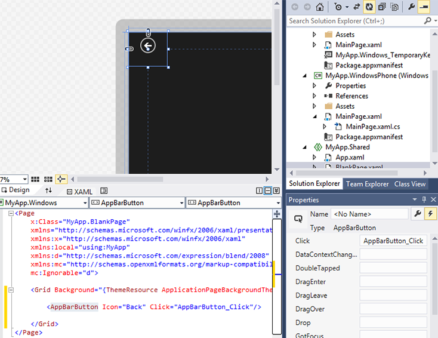

# <a name="getting-started-navigation"></a>Erste Schritte: Navigation


## <a name="adding-navigation"></a>Hinzufügen von Navigation

iOS bietet die **UINavigationController**-Klasse als In-App-Navigationshilfe: Sie erstellen eine Hierarchie von **UIViewControllers**, die Ihre App definieren, durch das Drücken und Aufklappen von Ansichten.

Im Gegensatz dazu benötigt eine Windows 10-APP, die mehrere Ansichten enthält, mehr von einem websiteansatz für die Navigation. Sie können sich vorstellen, wie Benutzer von Seite zu Seite wechseln, indem Sie auf Steuerelemente klicken, um durch die App zu navigieren. Weitere Informationen finden Sie unter [Navigationsdesigngrundlagen](https://docs.microsoft.com/windows/uwp/layout/navigation-basics).

Eine der Möglichkeiten, diese Navigation in einer Windows 10-APP zu verwalten, besteht in der Verwendung der [**Frame**](https://docs.microsoft.com/uwp/api/Windows.UI.Xaml.Controls.Frame) -Klasse. Die folgende exemplarische Vorgehensweise veranschaulicht, wie Sie dies ausprobieren können.

Fahren Sie mit der Lösung aus früheren Schritten fort, öffnen Sie die **MainPage.xaml**-Datei, und fügen Sie eine Schaltfläche in der Ansicht **Entwurf** hinzu. Ändern Sie die **Content**-Eigenschaft der Schaltfläche von „Button“ in „Go To Page“. Erstellen Sie anschließend einen Handler für das **Click**-Ereignis der Schaltfläche, wie in der folgenden Abbildung dargestellt. Wenn Sie nicht mehr wissen, wie das geht, schlagen Sie unter der exemplarischen Vorgehensweise im vorherigen Abschnitt nach (Hinweis: Doppelklicken Sie auf die Schaltfläche in der Ansicht **Entwurf**).


Als Nächstes fügen wir eine neue Seite hinzu. Tippen Sie in der Ansicht **Lösung** auf das Menü **Projekt**, und tippen Sie auf **Neues Element hinzufügen**. Tippen Sie wie in der folgenden Abbildung dargestellt auf **Leere Seite** und dann auf **Hinzufügen**.


Fügen Sie als Nächstes der Datei „BlankPage.xaml“ eine Schaltfläche hinzu. Nun wird das AppBarButton-Steuerelement verwendet und soll ein Bild mit einem Zurück-Pfeil erhalten: Fügen Sie hierzu in der **XAML**-Ansicht ` <AppBarButton Icon="Back"/>` zwischen den `<Grid> </Grid>`-Elementen hinzu.

Nun fügen Sie der Schaltfläche einen Ereignishandler hinzu: Doppelklicken Sie auf das Steuerelement in der **Entwurfs** Ansicht, und Microsoft Visual Studio fügt den Text "appbarbutton\_Click" in das Feld " **Click** " ein, wie in der folgenden Abbildung gezeigt, und fügt dann den entsprechenden Ereignishandler in der BlankPage.XAML.cs-Datei hinzu und zeigt ihn an.



Wenn Sie zur **XAML**-Ansicht der Datei „BlankPage.xaml“ zurückkehren, sollte der Extensible Application Markup Language (XAML)-Code des `<AppBarButton>`-Elements nun wie folgt lauten:

` <AppBarButton Icon="Back" Click="AppBarButton_Click"/>`

Kehren Sie zur Datei „BlankPage.xaml.cs“ zurück, und fügen Sie diesen Code hinzu, damit der Benutzer zur vorherigen Seite zurückkehrt, nachdem er auf die Schaltfläche getippt hat.

```csharp
private void AppBarButton_Click(object sender, RoutedEventArgs e)
{
    // Add the following line of code.    
    Frame.GoBack();
}
```

Öffnen Sie zum Schluss die Datei „MainPage.xaml.cs“, und fügen Sie diesen Code hinzu. Mithilfe dieses Codes wird BlankPage geöffnet, nachdem der Benutzer auf die Schaltfläche getippt hat.

```csharp
private void Button_Click(object sender, RoutedEventArgs e)
{
    // Add the following line of code.
    Frame.Navigate(typeof(BlankPage1));
}
```

Führen Sie nun das Programm aus. Tippen Sie auf die Schaltfläche „Go To Page“, um zu der anderen Seite zu wechseln, und tippen Sie dann auf die Schaltfläche mit dem Zurück-Pfeil, um zur vorherigen Seite zurückzukehren.

Die Seitennavigation wird mithilfe der [**Frame**](https://docs.microsoft.com/uwp/api/Windows.UI.Xaml.Controls.Frame)-Klasse verwaltet. Da die **UINavigationController** -Klasse in ios **pushviewcontroller** -und **popviewcontroller** -Methoden verwendet, stellt die **Frame** -Klasse für UWP-apps [**Navigate**](https://docs.microsoft.com/uwp/api/windows.ui.xaml.controls.frame.navigate) -und [**GoBack**](https://docs.microsoft.com/uwp/api/windows.ui.xaml.controls.frame.goback) -Methoden bereit. Die **Frame**-Klasse verfügt außerdem über eine Methode mit dem Namen [**GoForward**](https://docs.microsoft.com/uwp/api/windows.ui.xaml.controls.frame.goforward), die genau das tut, was Sie vermutlich erwartet haben.

Bei dieser exemplarischen Vorgehensweise wird immer dann eine neue Instanz von BlankPage erstellt, wenn Sie zu dieser Seite navigieren. (Die vorherige Instanz wird automatisch *freigegeben*.) Wenn nicht jedes Mal eine neue Instanz erstellt werden soll, fügen Sie dem Konstruktor der BlankPage-Klasse in der Datei „BlankPage.xaml.cs“ den folgenden Code hinzu. Dadurch wird das [**NavigationCacheMode**](https://docs.microsoft.com/uwp/api/windows.ui.xaml.controls.page.navigationcachemode)-Verhalten aktiviert.

```csharp
public BlankPage()
{
    this.InitializeComponent();
    // Add the following line of code.
    this.NavigationCacheMode = Windows.UI.Xaml.Navigation.NavigationCacheMode.Enabled;
}
```

Sie können auch dieCacheSize[ **-Eigenschaft der** Frame](https://docs.microsoft.com/uwp/api/windows.ui.xaml.controls.frame.cachesize)-Klasse abrufen oder festlegen, um zu definieren, wie viele Seiten im Navigationsverlauf zwischengespeichert werden können.

Weitere Informationen zur Navigation finden Sie unter [Navigation](https://docs.microsoft.com/windows/uwp/layout/navigation-basics) und unter [XAML-Beispiel für Charakteranimationen](https://code.msdn.microsoft.com/windowsapps/Personality-Animations-3f857919).

**Beachten Sie**  Informationen zur Navigation für UWP-apps mit JavaScript und HTML finden Sie unter [Schnellstart: Verwenden der Einzelseiten Navigation](https://docs.microsoft.com/previous-versions/windows/apps/hh452768(v=win.10)).
 
### <a name="next-step"></a>Nächster Schritt

[Einstieg: Animation](getting-started-animation.md)

