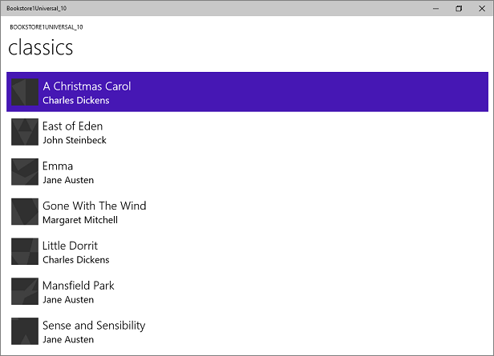

# Windows Runtime 8.x zu UWP – Fallstudie, Bookstore1

Dieses Thema enthält eine Fallstudie für das Portieren einer sehr einfachen universellen 8.1-App zu einer UWP (Universelle Windows-Plattform)-App für Windows 10. Bei einer universellen 8.1-App wird ein App-Paket für Windows 8.1 und ein anderes App-Paket für Windows Phone 8.1 erstellt. Mit Windows 10 können Sie ein einzelnes App-Paket erstellen, das Ihre Kunden auf einer Vielzahl von Geräten installieren können – und genau das werden wir in dieser Fallstudie tun. Weitere Informationen finden Sie unter [Anleitung für UWP-Apps](../get-started/universal-application-platform-guide.md).

Die portierte App besteht aus einem **ListBox**-Element, das an ein Ansichtsmodell gebunden ist. Das Ansichtsmodell verfügt über eine Liste mit Büchern, für die Titel, Autor und Bucheinband angezeigt werden. Für die Bucheinbandbilder ist **Buildvorgang** auf **Inhalt** und **In Ausgabeverzeichnis kopieren** auf **Nicht kopieren** festgelegt.

Die vorherigen Themen in diesem Abschnitt beschreiben die Unterschiede zwischen den Plattformen und bieten umfassende Informationen und Anleitungen zum Portierungsprozess für verschiedene Aspekte einer App, vom XAML-Markup über die Bindung an ein Ansichtsmodell bis hin zum Zugreifen auf Daten. Dieser Leitfaden soll anhand einer Fallstudie ergänzt werden, indem ein praktisches Beispiel vorgestellt wird. Bei den Fallstudien wird davon ausgegangen, dass Sie die Anleitung gelesen haben. Sie wird nicht wiederholt.

**Hinweis**    Wenn Sie Bookstore1Universal \_ 10 in Visual Studio öffnen, wenn die Meldung "Visual Studio-Update erforderlich" angezeigt wird, führen Sie die Schritte in " [targetplatformversion](w8x-to-uwp-troubleshooting.md)" aus.

## Downloads

[Laden Sie die Bookstore1 \_ 81 Universal 8,1-APP herunter](https://codeload.github.com/MicrosoftDocs/windows-topic-specific-samples/zip/Bookstore1_81).

[Laden Sie die \_ app "Bookstore1Universal 10 Windows 10" herunter](https://codeload.github.com/MicrosoftDocs/windows-topic-specific-samples/zip/Bookstore1Universal_10).

## Die universelle 8.1-App

Hier ist Bookstore1 \_ 81 – die APP, die wir portieren werden – sieht wie folgt aus:. Es handelt sich dabei einfach um ein Listenfeld mit Büchern mit vertikalem Bildlauf unter der Überschrift des App-Namens und dem Seitentitel.

Bookstore1 \_ 81 unter Windows

Bookstore1 \_ 81 auf Windows Phone

##  Portieren auf ein Windows 10-Projekt

Die \_ Lösung Bookstore1 81 ist 8,1 ein universelles Universal App-Projekt, das diese Projekte enthält.

-   Bookstore1 \_ 81. Windows. Dies ist das Projekt, das das App-Paket für Windows 8.1 erstellt.
-   Bookstore1 \_ 81. windowsphone. Dies ist das Projekt, das das App-Paket für Windows Phone 8.1 erstellt.
-   Bookstore1 \_ 81. shared. Dies ist das Projekt, das den Quellcode, die Markupdateien und andere Assets und Ressourcen enthält, die von den beiden anderen Projekten verwendet werden.

Für diese Fallstudie verwenden wir die üblichen Optionen, die unter [Bei einer Universal 8.1-App](w8x-to-uwp-root.md) in Bezug auf die zu unterstützenden Geräte beschrieben sind. Die Entscheidung hier ist ganz einfach: Diese App bietet die gleichen Features und verwendet dafür meist denselben Code in Windows 8.1- und Windows Phone 8.1-Formularen. Daher müssen wir den Inhalt des freigegebenen Projekts (und sonstiger Elemente, die wir aus den anderen Projekten benötigen) zu einem Windows 10-Projekt portieren, das auf die universelle Gerätefamilie ausgerichtet ist (eine App, die Sie auf der breitestmöglichen Palette an Geräten installieren können).

Es ist eine sehr schnelle Aufgabe, in Visual Studio ein neues Projekt zu erstellen, Dateien aus Bookstore1 81 zu kopieren \_ und die kopierten Dateien in das neue Projekt einzubeziehen. Erstellen Sie zunächst ein neues Projekt vom Typ „Leere Anwendung“ (Windows Universal). Nennen Sie Sie Bookstore1Universal \_ 10. Dabei handelt es sich um die Dateien, die von Bookstore1 \_ 81 nach Bookstore1Universal 10 kopiert werden müssen \_ .

**Aus dem freigegebenen Projekt**

-   Kopieren Sie den Ordner, der das Buch enthält, das das Buch enthält, das das Buch enthält \\ \\ . Vergewissern Sie sich nach dem Kopieren des Ordners im **Projektmappen-Explorer**, dass **Alle Dateien anzeigen** aktiviert ist. Klicken Sie mit der rechten Maustaste auf den kopierten Ordner, und klicken Sie dann auf **Zu Projekt hinzufügen**. Mit „Einschließen“ von Dateien oder Ordnern in einem Projekt meinen wir diesen Befehl. Klicken Sie jedes Mal, wenn Sie eine Datei oder einen Ordner kopieren, für jede Kopie im **Projektmappen-Explorer** auf **Aktualisieren**, und schließen Sie dann die Datei oder den Ordner in das Projekt ein. Dies ist nicht für Dateien erforderlich, die Sie am Ziel ersetzen.
-   Kopieren Sie den Ordner mit der Quelldatei für das Ansichts Modell (der Ordner ist " \\ ViewModel").
-   Kopieren Sie „MainPage.xaml“, und ersetzen Sie die Datei am Ziel.

**Aus dem Windows-Projekt**

-   Kopieren Sie „BookstoreStyles.xaml“. Wir verwenden diese Datei als Ausgangspunkt, da alle Ressourcenschlüssel in dieser Datei in eine Windows 10-App aufgelöst werden können (einige in der entsprechenden WindowsPhone-Datei werden nicht aufgelöst).

Bearbeiten Sie den Quell Code und die soeben kopierten Markup Dateien, und ändern Sie alle Verweise auf den \_ Namespace Bookstore1 81 auf Bookstore1Universal \_ 10. Eine schnelle Möglichkeit dafür ist die Verwendung des Features **In Dateien ersetzen**. Weder im Ansichtsmodell, noch in einem anderen imperativen Code sind Codeänderungen erforderlich. Wenn Sie jedoch einfacher sehen möchten, welche Version der app ausgeführt wird, ändern Sie den Wert, der von der **Bookstore1Universal \_ 10. bookstoreviewmodel. appname** -Eigenschaft zurückgegeben wird, von "BOOKSTORE1 \_ 81" in "Bookstore1Universal \_ 10".

Jetzt können Sie mit der Erstellung und Ausführung beginnen. Hier ist eine Darstellung der neuen UWP-App, die nahezu ohne Arbeit und Mühe zu Windows 10 portiert wurde.

Die Windows 10-App mit Änderungen am ursprünglichen Quellcode auf einem Desktopgerät

Die Windows 10-App mit Änderungen am ursprünglichen Quellcode auf einem mobilen Gerät

Die Ansicht und das Ansichtsmodell arbeiten ordnungsgemäß zusammen, und das **ListBox**-Element funktioniert. Wir müssen lediglich die Formatierung ändern. Auf einem mobilen Gerät mit hellem Design können wir den Rahmen des Listenfelds sehen, der sich jedoch einfach ausblenden lässt. Und die Schrift ist zu groß, sodass wir die verwendeten Stile ändern. Darüber hinaus sollte die App helle Farben verwenden, wenn sie auf einem Desktopgerät ausgeführt wird, damit sie standardmäßig aussieht. Wir werden dies also ändern.

## Universelle Formatierung

Die Bookstore1 \_ 81-App verwendet zwei verschiedene Ressourcen Wörterbücher (bookstorestyles. XAML), um Ihre Stile an die Windows 8.1-und Windows Phone 8,1-Betriebssysteme anzupassen. Keine dieser beiden BookstoreStyles.xaml-Dateien enthält genau die Stile, die wir für unsere Windows 10-App benötigen. Die gute Nachricht ist jedoch, dass unsere Vorstellungen tatsächlich sehr viel einfacher sind als diese beiden. In den nächsten Schritten werden wir daher hauptsächlich unsere Projektdateien und das Markup entfernen und vereinfachen. Die Schritte finden Sie nachfolgend: Sie können die Links oben in diesem Thema verwenden, um die Projekte herunterzuladen und die Ergebnisse dieser Änderungen zwischen diesem Punkt und dem Ende der Fallstudie anzuzeigen.

-   Um den Abstand zwischen den Elementen zu verkleinern, suchen Sie die `BookTemplate`-Datenvorlage in „MainPage.xaml“, und löschen Sie `Margin="0,0,0,8"` aus dem Stamm-**Grid**.
-   Auch in `BookTemplate`gibt es Verweise auf `BookTemplateTitleTextBlockStyle` und `BookTemplateAuthorTextBlockStyle`. Bookstore1 \_ 81 verwendete diese Schlüssel als Dereferenzierung, sodass ein einzelner Schlüssel in den beiden apps verschiedene Implementierungen enthielt. Diese Dereferenzierung wird nicht mehr benötigt; wir können direkt auf die Systemstile verweisen. Ersetzen Sie daher diese Verweise durch `TitleTextBlockStyle` bzw. `SubtitleTextBlockStyle`.
-   Jetzt müssen wir den Hintergrund von `LayoutRoot` auf den richtigen Standardwert festlegen, damit die App unabhängig vom Design bei der Ausführung auf allen Geräten entsprechend gut aussieht. Ändern Sie den Wert von `"Transparent"` in `"{ThemeResource ApplicationPageBackgroundThemeBrush}"`.
-   Ändern Sie in `TitlePanel` den Verweis auf `TitleTextBlockStyle` (was nun ein wenig zu groß ist) in einen Verweis auf `CaptionTextBlockStyle`. `PageTitleTextBlockStyle` ist eine weitere Bookstore1 81-Dereferenzierung \_ , die wir nicht mehr benötigen. Ändern Sie dies, sodass stattdessen auf `HeaderTextBlockStyle` verwiesen wird.
-   Für **ListBox** müssen keine speziellen Background-, Style- oder ItemContainerStyle-Werte mehr festgelegt werden. Löschen Sie daher diese drei Attribute und deren Werte aus dem Markup. Wir möchten den Rand von **ListBox** ausblenden und fügen daher `BorderBrush="{x:Null}"` hinzu.
-   Wir verweisen nicht mehr auf eine Ressource in der **ResourceDictionary**-Datei namens „BookstoreStyles.xaml“. Sie können alle diese Ressourcen löschen. Löschen Sie jedoch nicht die Datei „BookstoreStyles.xaml“ selbst. Diese können wir noch ein letztes Mal verwenden, wie Sie im nächsten Abschnitt sehen werden.

Nach den letzten Formatierungsvorgängen sieht die App folgendermaßen aus.

Die fast portierte Windows 10-App auf einem Desktopgerät

Die fast portierte Windows 10-App auf einem mobilen Gerät

## Eine optionale Anpassung des Listenfelds für Mobilgeräte

Wenn die App auf einem Mobilgerät ausgeführt wird, ist der Hintergrund eines Listenfelds standardmäßig in beiden Designs hell. Dies ist möglicherweise genau der Stil, den Sie bevorzugen, sodass Sie in diesem Fall nichts weiter unternehmen müssen als aufzuräumen: Löschen Sie dazu die Ressourcenwörterbuchdatei „BookstoreStyles.xaml“ aus dem Projekt, und entfernen Sie das Markup, das sie in „MainPage.xaml“ zusammenführt.

Aber die Steuerelemente sind so konzipiert, dass Sie das Aussehen anpassen können, ohne ihr Verhalten zu ändern. Wenn das Listenfeld durch das dunkle Design dunkel gestaltet werden soll – so wie in der ursprünglichen App vorgesehen – dann finden Sie in diesem Abschnitt eine Beschreibung dafür.

Die Änderung, die wir vornehmen, muss sich nur dann auf die App auswirken, wenn sie auf mobilen Geräten ausgeführt wird. Daher verwenden wir einen leicht angepassten Listenfeldstil, wenn die App auf der Mobilgerätefamilie ausgeführt wird, für alle anderen Geräte verwenden wir weiterhin den Standardstil. Dazu erstellen wir eine Kopie von „BookstoreStyles.xaml“ und geben ihr einen speziellen MRT-qualifizierten Namen, sodass die Kopie nur auf mobilen Geräten geladen wird.

Fügen Sie ein neues **ResourceDictionary**-Projektelement hinzu, und geben Sie ihm den Namen „BookstoreStyles.DeviceFamily Mobile.xaml“. Sie haben jetzt zwei Dateien, die beide den logischen Namen "BookstoreStyles.xaml" haben. (Dies ist der Name, den Sie in Ihrem Markup und Code verwenden.) Die Dateien haben jedoch unterschiedliche physische Namen, sodass sie verschiedene Markups enthalten können. Sie können dieses MRT-qualifizierte Benennungsschema für jede XAML-Datei verwenden. Beachten Sie jedoch, dass sich alle XAML-Dateien mit demselben logischen Namen eine einzelne CodeBehind-Datei („xaml.cs“) teilen, sofern vorhanden.

Bearbeiten Sie eine Kopie der Steuerelementvorlage für das Listenfeld, und speichern Sie sie mit dem Schlüssel von `BookstoreListBoxStyle` im neuen Ressourcenwörterbuch „BookstoreStyles.DeviceFamily-Mobile.xaml“. Jetzt nehmen wir einfache Änderungen an drei der Setter vor.

-   Ändern Sie im Vordergrundsetter den Wert in `"{x:Null}"`. Beachten Sie, dass das direkte Festlegen einer Eigenschaft auf `"{x:Null}"` für ein Element identisch mit der Einstellung `null` im Code ist. Der Wert `"{x:Null}"` in einem Setter hat jedoch einen einzigartigen Effekt: Der Setter im Standardstil (für dieselbe Eigenschaft) wird überschrieben, und der Standardwert der Eigenschaft wird für das Zielelement wiederhergestellt.
-   Ändern Sie im Hintergrundsetter den Wert in `"Transparent"`, um den hellen Hintergrund zu entfernen.
-   Suchen Sie im Vorlagensetter den visuellen Zustand mit dem Namen `Focused`, und löschen Sie das Storyboard, damit sie ein leeres Tag erhalten.
-   Löschen Sie alle anderen Setter aus dem Markup.

Kopieren Sie schließlich `BookstoreListBoxStyle` in „BookstoreStyles.xaml“, und löschen Sie die drei Setter, damit sie ein leeres Tag erhalten. Dies führen wir auf anderen Geräten als mobilen Geräten durch, sodass der Verweis auf „BookstoreStyles.xaml“ und `BookstoreListBoxStyle` weiterhin aufgelöst wird, aber keine Auswirkungen hat.

Die portierte Windows 10-App auf einem mobilen Gerät

## Zusammenfassung

In dieser Fallstudie wurde der Prozess zum Portieren einer einfachen App gezeigt – einer zugegebenermaßen unrealistisch einfachen App. Beispielsweise kann ein Listenfeld für die Auswahl oder die Herstellung eines Navigationskontexts verwendet werden; die App navigiert zu einer Seite mit weiteren Details zum ausgewählten Element. Diese bestimmte App führt keine Aktionen mit der Auswahl des Benutzers aus und verfügt nicht über Navigation. Dennoch diente die Fallstudie dazu, den Portierungsprozess vorzustellen und wichtige Techniken zu veranschaulichen, die Sie in echten UWP-Apps verwenden können.

Wir konnten uns auch davon überzeugen, dass das Portieren von Ansichtsmodellen in der Regel ein reibungsloser Prozess ist. Die Benutzeroberfläche und die Formfaktorunterstützung sind Aspekte, die beim Portieren mit höherer Wahrscheinlichkeit unsere Aufmerksamkeit erfordern.

Die nächste Fallstudie ist [Bookstore2](w8x-to-uwp-case-study-bookstore2.md), in der wir den Zugriff auf und die Anzeige von gruppierten Daten behandeln.