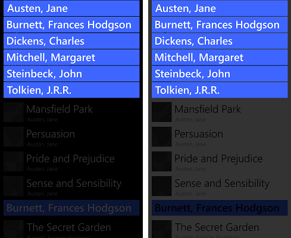

# <a name="windows-runtime-8x-to-uwp-case-study-bookstore2"></a>Windows-Runtime 8.x zu UWP-Fallstudie: Bookstore2


Diese Fallstudie baut auf den Informationen in [Bookstore1](w8x-to-uwp-case-study-bookstore1.md) auf und beginnt mit einer universellen 8.1-App, die gruppierte Daten in einem [**SemanticZoom**](https://msdn.microsoft.com/library/windows/apps/hh702601)-Steuerelement anzeigt. Im Ansichtsmodell stellt jede Instanz der **Author**-Klasse die Gruppe der vom betreffenden Autor verfassten Titel dar. In **SemanticZoom** können wir dann entweder die Bücherliste nach Autoren gruppiert anzeigen oder die Liste verkleinern, um eine Sprungliste der Autoren zu erhalten. Die Sprungliste ermöglicht eine wesentlich schnellere Navigation im Vergleich zum Blättern in der Bücherliste. Wir führen durch die Schritte zum Portieren der app in einer app für Windows 10 universelle Windows-Plattform (UWP).

**Beachten Sie**    beim Öffnen von Bookstore2Universal\_10 in Visual Studio, wenn die Meldung "Visual Studio-Update erforderlich", klicken Sie dann die Schritte in [TargetPlatformVersion](w8x-to-uwp-troubleshooting.md).

## <a name="downloads"></a>Downloads

[Herunterladen der Bookstore2\_81 Universal 8.1 app](https://go.microsoft.com/fwlink/?linkid=532951).

[Herunterladen der Bookstore2Universal\_10 Windows 10-app](https://go.microsoft.com/fwlink/?linkid=532952).

## <a name="the-universal-81-app"></a>Die universelle 8.1-App

Hier ist welche Bookstore2\_81 – die app, die wir an Port jetzt – wie folgt aussieht. Über einen [**SemanticZoom**](https://msdn.microsoft.com/library/windows/apps/hh702601) mit horizontalem Bildlauf (Windows Phone: vertikalem Bildlauf) werden Bücher nach Autoren gruppiert angezeigt. Sie können die Liste auf die Sprungliste verkleinern und von dort aus wieder zurück zu einer beliebigen Gruppe navigieren. Die App besteht aus zwei Hauptteilen: dem Ansichtsmodell, das die gruppierte Datenquelle bereitstellt, und der Benutzeroberfläche, die an dieses Ansichtsmodell gebunden ist. Wie wir sehen werden, beide Teile Port problemlos von WinRT-8.1-Technologie auf Windows 10.


Bookstore2\_81 auf Windows, vergrößerte Ansicht
 


Bookstore2\_81 auf Windows, verkleinerte Ansicht


Bookstore2\_81 auf Windows Phone, vergrößerte Ansicht



Bookstore2\_81 auf Windows Phone, verkleinerte Ansicht

##  <a name="porting-to-a-windows10-project"></a>Portieren auf einem Windows 10-Projekt

Die Bookstore2\_81-Lösung ist ein 8.1 universelle App-Projekt. Die Bookstore2\_81.-Windows-Projekt erstellt das app-Paket für Windows 8.1 und die Bookstore2\_81. WindowsPhone Projektbuilds das app-Paket für Windows Phone 8.1. Bookstore2\_81. freigegeben ist, das Projekt mit Quellcode, Markup-Dateien und anderen Ressourcen und Ressourcen, die sowohl von den anderen beiden Projekten verwendet werden.

Genau wie mit der vorherige Fallstudie, die Option werfen wir (den Adressen, die in beschriebenen [bei einer Universal 8.1-app](w8x-to-uwp-root.md)) besteht darin, den Inhalt des freigegebenen Projekts auf Windows 10 zu portieren, die die universelle Gerätefamilie ausgerichtet ist.

Erstellen Sie zunächst ein neues Projekt vom Typ „Leere Anwendung“ (Windows Universal). Nennen Sie sie Bookstore2Universal\_10. Hierbei handelt es sich um die Dateien kopiert aus Bookstore2\_81 bis Bookstore2Universal\_10.

**Über das freigegebene Projekt**

-   Kopieren Sie den Ordner mit den Buch Cover PNG-Dateien (der Ordner ist \\Assets\\CoverImages). Vergewissern Sie sich nach dem Kopieren des Ordners im **Projektmappen-Explorer**, dass **Alle Dateien anzeigen** aktiviert ist. Klicken Sie mit der rechten Maustaste auf den kopierten Ordner, und klicken Sie dann auf **Zu Projekt hinzufügen**. Mit „Einschließen“ von Dateien oder Ordnern in einem Projekt meinen wir diesen Befehl. Klicken Sie jedes Mal, wenn Sie eine Datei oder einen Ordner kopieren, für jede Kopie im **Projektmappen-Explorer** auf **Aktualisieren**, und schließen Sie dann die Datei oder den Ordner in das Projekt ein. Dies ist nicht für Dateien erforderlich, die Sie am Ziel ersetzen.
-   Kopieren Sie den Ordner, die die Quelldatei des Ansicht-Modell enthält (der Ordner ist \\"ViewModel").
-   Kopieren Sie „MainPage.xaml“, und ersetzen Sie die Datei am Ziel.

**Aus dem Windows-Projekt**

-   Kopieren Sie „BookstoreStyles.xaml“. Wir verwenden beziehungsproblemen wie ein guter Ausgangspunkt, da die Ressourcenschlüssel in dieser Datei in einer Windows 10-app aufgelöst werden; Einige der Werte in die entsprechende WindowsPhone-Datei nicht der Fall ist.
-   Kopieren Sie SeZoUC.xaml und SeZoUC.xaml.cs. Wir beginnen mit der Windows-Version dieser Ansicht, die für breite Fenster geeignet ist, und passen sie später für kleinere Fenster und folglich kleinere Geräte an.

Bearbeiten Sie die Quelldateien von Code und Markup, das Sie gerade kopiert haben, und ändern Sie alle Verweise auf die Bookstore2\_81 Namespace Bookstore2Universal\_10. Eine schnelle Möglichkeit dafür ist die Verwendung des Features **In Dateien ersetzen**. Weder im Ansichtsmodell, noch in einem anderen imperativen Code sind Codeänderungen erforderlich. Aber, nur um ihn leichter sehen, welche Version der app ausgeführt wird, ändern Sie den Rückgabewert von der **Bookstore2Universal\_10.BookstoreViewModel.AppName** Eigenschaft von "Bookstore2\_81" " BOOKSTORE2UNIVERSAL\_10".

Jetzt können Sie mit der Erstellung und Ausführung beginnen. Sieht wie unsere neue UWP-app nach danach keine Arbeit noch, um es auf Windows 10 portieren.


Die Windows 10-app mit Änderungen am Quellcode der ersten Ausführung auf einem Desktopgerät, vergrößerte Ansicht


Die Windows 10-app mit Änderungen am Quellcode der ersten Ausführung auf einem Desktopgerät, verkleinerte Ansicht

Das Ansichtsmodell und die vergrößerten sowie verkleinerten Ansichten arbeiten ordnungsgemäß zusammen, auch wenn man dies nicht auf Anhieb sieht. Ein Problem besteht darin, dass der [**SemanticZoom**](https://msdn.microsoft.com/library/windows/apps/hh702601) keinen Bildlauf durchführt. Dies liegt daran, in den Standardstil der Windows 10 eine [ **GridView** ](https://msdn.microsoft.com/library/windows/apps/br242705) bewirkt, dass sie vertikal angeordnet werden, (und der Windows 10-Entwurf Richtlinien wird empfohlen, dass wir sie auf diese Weise in neu und in der portierten apps verwenden). Allerdings horizontalen Bildlauf der Einstellungen in der benutzerdefinierten Elemente Panel-Vorlage, die wir aus den Bookstore2 kopiert\_81-Projekt (die wurde entwickelt, für die 8.1 app) sind in Konflikt mit vertikalen Bildlauf Einstellungen in den Standardstil für Windows 10, die angewendet durch uns haben zu einer app für Windows 10 portiert. Das zweite Problem besteht darin, dass sich die Benutzeroberfläche der App noch nicht anpasst, um eine bestmögliche Anzeige in verschieden großen Fenstern und auf kleinen Geräten zu ermöglichen. Drittens werden noch nicht die richtigen Stile und Pinsel verwendet, wodurch ein Großteil des Texts nicht sichtbar ist (einschließlich der Gruppenköpfe, auf die Sie zum Verkleinern klicken können). In den nächsten drei Abschnitten ([Designänderungen an semantischem Zoom und GridView](#semanticzoom-and-gridview-design-changes), [Adaptive UI](#adaptive-ui) und [Universelle Formatierung](#universal-styling)) werden wir diese drei Probleme beheben.

## <a name="semanticzoom-and-gridview-design-changes"></a>Designänderungen an SemanticZoom und GridView

In Windows 10, um die Änderungen des Entwurfs der [ **SemanticZoom** ](https://msdn.microsoft.com/library/windows/apps/hh702601) Steuerelement sind im Abschnitt beschriebenen [SemanticZoom Änderungen](w8x-to-uwp-porting-xaml-and-ui.md). In diesem Abschnitt sind keine Überarbeitungen aufgrund der Änderungen erforderlich.

Die Änderungen an [**GridView**](https://msdn.microsoft.com/library/windows/apps/br242705) werden im Abschnitt [Änderungen an „GridView/ListView”](w8x-to-uwp-porting-xaml-and-ui.md) beschrieben. Diese Änderungen erfordern einige geringfügige Anpassungen, die nachfolgend beschrieben werden.

-   Legen Sie in SeZoUC.xaml in der `ZoomedInItemsPanelTemplate``Orientation="Horizontal"` und `GroupPadding="0,0,0,20"` fest.
-   Löschen Sie in SeZoUC.xaml `ZoomedOutItemsPanelTemplate`, und entfernen Sie das `ItemsPanel`- Attribut aus der verkleinerten Ansicht.

Das war’s!

## <a name="adaptive-ui"></a>Adaptive UI

Nach dieser Änderung eignet sich das durch SeZoUC.xaml ermöglichte UI-Layout hervorragend zum Ausführen der App in einem breiten Fenster (nur auf Geräten mit großem Bildschirm möglich). Handelt es sich jedoch um ein schmales Fenster der App (auf kleinen Geräten, kann aber auch auf großen Geräten vorkommen), eignet sich die Benutzerfläche in der Windows Phone Store-App wohl am besten.

Wir können dazu auch das adaptive Visual State-Manager-Feature verwenden. Wir werden Eigenschaften für visuelle Elemente einrichten, sodass die Benutzeroberfläche mit den kleineren Vorlagen, die wir in der Windows Phone Store-App verwenden, standardmäßig im schmalen Zustand angeordnet wird. Dann werden wir erkennen, wann das Fenster der App breiter als eine bestimmte Größe ist bzw. dieser entspricht (gemessen in der Einheit [effektive Pixel](w8x-to-uwp-porting-xaml-and-ui.md)), und als Reaktion darauf die Eigenschaften der visuelle Elemente so ändern, dass wir ein größeres und breiteres Layout erhalten. Wir versetzen diese Eigenschaftsänderungen in einen visuellen Zustand und verwenden einen adaptiven Auslöser, um fortlaufend zu überwachen und zu bestimmen, ob der visuelle Zustand abhängig von der Breite des Fensters in effektiven Pixeln angewendet werden soll. Die Auslösung erfolgt hierbei anhand der Fensterbreite, aber sie kann auch anhand der Fensterhöhe erfolgen.

Eine minimale Fensterbreite von 548 Epx eignet sich in diesem Anwendungsfall, da dies der Größe des kleinsten Geräts entspricht, auf dem wir das breite Layout anzeigen können. Telefone sind in der Regel kleiner als 548 Epx, sodass wir auf solch einem kleinen Gerät das schmale Layout erhalten würden. Auf einem PC wird das Fenster standardmäßig so breit gestartet, dass der Wechsel zum breiten Zustand ausgelöst wird. Dort können Sie das Fenster schmaler ziehen, um zwei Spalten für Elemente der Größe 250 x 250 anzuzeigen. Ist es etwas schmaler, wird der Auslöser deaktiviert, der breite Ansichtszustand wird gelöscht, und das schmale Standardlayout wird aktiviert.

Welche Eigenschaften müssen wir also festlegen – und ändern – um diese beiden unterschiedlichen Layouts zu erreichen? Es gibt zwei Alternativen, für die jeweils ein anderer Ansatz erforderlich ist.

1.  Wir können zwei [**SemanticZoom**](https://msdn.microsoft.com/library/windows/apps/hh702601)-Steuerelemente in unserem Markup platzieren. Eine wäre eine Kopie der das Markup, das wir in der Windows-Runtime 8.x-app verwenden (mit [ **GridView** ](https://msdn.microsoft.com/library/windows/apps/br242705) darin enthaltenen Steuerelemente), und standardmäßig reduziert. Die andere Variante ist eine Kopie des Markups, das wir in der Windows Phone Store-App verwenden (mit [**ListView**](https://msdn.microsoft.com/library/windows/apps/br242878)-Steuerelementen), und das standardmäßig eingeblendet sind. Der visuelle Zustand würde die Sichtbarkeitseigenschaften der beiden **SemanticZoom**-Steuerelemente verändern. Dies wäre keine schwierige Aufgabe, die Technik ist im Allgemeinen jedoch nicht besonders effizient. Wenn Sie sie verwenden, sollten Sie ein Profil Ihrer App erstellen und sicherstellen, dass sie Ihre Leistungsvorgaben noch erfüllt.
2.  Wir können einen einzelnen [**SemanticZoom**](https://msdn.microsoft.com/library/windows/apps/hh702601) mit [**ListView**](https://msdn.microsoft.com/library/windows/apps/br242878)-Steuerelementen verwenden. Zur Umsetzung unserer beiden Layouts würden wir im breiten visuellen Zustand die Eigenschaften der **ListView**-Steuerelemente ändern, einschließlich der darauf angewendeten Vorlagen, damit sie ebenso wie die [**GridView**](https://msdn.microsoft.com/library/windows/apps/br242705) angeordnet werden. Das kann die Leistung verbessern, aber es gibt so viele feine Unterschiede zwischen den verschiedenen Stilen und Vorlagen der **GridView** und **ListView** und ihren verschiedenen Elementtypen, dass diese Lösung schwieriger umzusetzen ist. Diese Lösung ist zu diesem Zeitpunkt eng mit der Zuweisungsart der Standardstile und -vorlagen gekoppelt und daher für künftige Änderungen der Standards anfällig.

In dieser Fallstudie werden wir die erste Alternative untersuchen. Wenn Sie möchten, können Sie aber auch die zweite Variante testen und prüfen, ob diese besser für Sie geeignet ist. Führen Sie die folgenden Schritte aus, um die erste Alternative zu implementieren.

-   Legen Sie für den [**SemanticZoom**](https://msdn.microsoft.com/library/windows/apps/hh702601) im Markup Ihres neuen Projekts `x:Name="wideSeZo"` und `Visibility="Collapsed"` fest.
-   Wechseln Sie zurück zu den Bookstore2\_81. WindowsPhone Projekt und SeZoUC.xaml öffnen. Kopieren Sie das Elementmarkup für den [**SemanticZoom**](https://msdn.microsoft.com/library/windows/apps/hh702601) dieser Datei, und fügen Sie es unmittelbar nach `wideSeZo` in Ihr neues Projekt ein. Geben Sie `x:Name="narrowSeZo"` für das Element ein, das Sie gerade eingefügt haben.
-   Jedoch benötigt `narrowSeZo` einige Stile, die wir noch nicht kopiert haben. Es in Bookstore2\_81.WindowsPhone, die beiden Formate (`AuthorGroupHeaderContainerStyle` und `ZoomedOutAuthorItemContainerStyle`) SeZoUC.xaml und fügen Sie sie in BookstoreStyles.xaml in Ihrem neuen Projekt.
-   Sie verfügen nun über zwei [**SemanticZoom**](https://msdn.microsoft.com/library/windows/apps/hh702601)-Elemente in Ihrer neuen Datei „SeZoUC.xaml“. Umschließen Sie diese beiden Elemente in einem **Grid**.
-   Hängen Sie in „BookstoreStyles.xaml“ in Ihrem neuen Projekt das Wort `Wide` an diese drei Ressourcenschlüssel (und ihre Verweise in „SeZoUC.xaml“, jedoch nur auf die Verweise in `wideSeZo`) an: `AuthorGroupHeaderTemplate`, `ZoomedOutAuthorTemplate` und `BookTemplate`.
-   In der Bookstore2\_BookstoreStyles.xaml 81. WindowsPhone-Projekt zu öffnen. Aus dieser Datei, kopieren Sie diese drei Ressourcen (siehe oben), und die beiden zu wechseln, Liste Element Typkonverter, und die Deklaration des Namespacepräfixes Windows\_UI\_Xaml\_Steuerelemente\_Primitive, und fügen Sie sie alle in BookstoreStyles.xaml in Ihrem neuen Projekt.
-   Fügen Sie in „SeZoUC.xaml“ in Ihrem neuen Projekt dem oben hinzugefügten **Grid** das entsprechende Markup des Visual State-Managers hinzu.

```xml
    <Grid>
        <VisualStateManager.VisualStateGroups>
            <VisualStateGroup>
                <VisualState x:Name="WideState">
                    <VisualState.StateTriggers>
                        <AdaptiveTrigger MinWindowWidth="548"/>
                    </VisualState.StateTriggers>
                    <VisualState.Setters>
                        <Setter Target="wideSeZo.Visibility" Value="Visible"/>
                        <Setter Target="narrowSeZo.Visibility" Value="Collapsed"/>
                    </VisualState.Setters>
                </VisualState>
            </VisualStateGroup>
        </VisualStateManager.VisualStateGroups>

    ...

    </Grid>
```

## <a name="universal-styling"></a>Universelle Formatierung

Nun beheben wir einige Formatierungsprobleme, eines davon haben wir oben beim Kopieren aus dem alten Projekt kennengelernt.

-   Ändern Sie in „MainPage.xaml“ den Hintergrund von `LayoutRoot` in `"{ThemeResource ApplicationPageBackgroundThemeBrush}"`.
-   Legen Sie in „BookstoreStyles.xaml“ den Wert von `TitlePanelMargin` der Ressource auf `0` (oder den Wert, der Ihnen passend erscheint) fest.
-   Legen Sie in „SeZoUC.xaml“ den Rand von `wideSeZo` auf `0` (oder den Wert, der Ihnen passend erscheint) fest.
-   Entfernen Sie in BookstoreStyles.xaml das Rand-Attribut aus der `AuthorGroupHeaderTemplateWide`.
-   Löschen Sie das FontFamily-Attribut aus `AuthorGroupHeaderTemplate` und `ZoomedOutAuthorTemplate`.
-   Bookstore2\_81 verwendet die `BookTemplateTitleTextBlockStyle`, `BookTemplateAuthorTextBlockStyle`, und `PageTitleTextBlockStyle` Ressource Schlüssel als eine Dereferenzierung, damit ein einzelner Schlüssel verschiedene Implementierungen in beiden apps haben. Diese Dereferenzierung wird nicht mehr benötigt; wir können direkt auf die Systemstile verweisen. Ersetzen Sie daher diese Verweise in der gesamten App durch `TitleTextBlockStyle`, `CaptionTextBlockStyle` bzw. `HeaderTextBlockStyle`. Mit der Visual Studio-Funktion **In Dateien ersetzen** können Sie dieses Vorhaben schnell und fehlerfrei umsetzen. Dann können Sie diese drei ungenutzten Ressourcen löschen.
-   Ersetzen Sie in `AuthorGroupHeaderTemplate` das `PhoneAccentBrush`-Element durch `SystemControlBackgroundAccentBrush`, und legen Sie `Foreground="White"` für **TextBlock** fest, damit dies beim Ausführen mit der Mobilgerätfamilie richtig angezeigt wird.
-   Kopieren Sie in `BookTemplateWide` das Foreground-Attribut aus dem zweiten **TextBlock** in den ersten.
-   Ändern Sie in `ZoomedOutAuthorTemplateWide` den Verweis auf `SubheaderTextBlockStyle` (was nun ein wenig zu groß ist) in einen Verweis auf `SubtitleTextBlockStyle`.
-   Da die verkleinerte Ansicht (die Sprungliste) die vergrößerte Ansicht auf der neuen Plattform nicht mehr überlagert, können wir das `Background`-Attribut aus der verkleinerten Ansicht von `narrowSeZo` löschen.
-   Verschieben Sie `ZoomedInItemsPanelTemplate` von „SeZoUC.xaml“ in „BookstoreStyles.xaml“, damit sich alle Stile und Vorlagen in einer Datei befinden.

Nach den letzten Formatierungsvorgängen sieht die App folgendermaßen aus.


Der portierten Windows 10-app auf einem Desktopgerät, vergrößerte Ansicht, Fenster in zwei Größen ausgeführt wird


Der portierten Windows 10-app auf einem Desktopgerät, verkleinerte Ansicht, Fenster in zwei Größen ausgeführt wird


Der portierten Windows 10-app auf einem mobilen Gerät, vergrößerte Ansicht


Der portierten Windows 10-app auf einem mobilen Gerät, verkleinerte Ansicht

## <a name="conclusion"></a>Abschluss

In dieser Fallstudie haben wir es mit einer aufwändigeren Benutzeroberfläche als im vorherigen Beispiel zu tun. Wie bei der vorherigen Fallstudie war für dieses Anzeigemodell kein großer Aufwand erforderlich, und unsere Anstrengungen konzentrierten sich in erster Linie auf die Umgestaltung der Benutzeroberfläche. Einige der Änderungen wurden dadurch erforderlich, dass wir zwei Projekte in eines kombinierten und dennoch viele Formfaktoren (letzten Endes mehr, als zuvor möglich waren) unterstützen wollten. Einige wenige Änderungen aufgrund von Änderungen erforderlich, die an der Plattform vorgenommen wurden.

Die nächsten Fallstudie ist [QuizGame](w8x-to-uwp-case-study-quizgame.md), in der wir den Zugriff auf und die Anzeige von gruppierten Daten behandeln.
