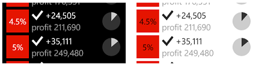

#  <a name="porting-windowsphone-silverlight-xaml-and-ui-to-uwp"></a>Porting Windows Phone Silverlight XAML and UI to UWP


Im vorherigen Thema haben wir uns mit der [Problembehandlung](wpsl-to-uwp-troubleshooting.md) beschäftigt.

The practice of defining UI in the form of declarative XAML markup translates extremely well from Windows Phone Silverlight to Universal Windows Platform (UWP) apps. Sie werden feststellen, dass große Abschnitte Ihres Markups kompatibel sind, sobald Sie Verweise auf Systemressourcenschlüssel aktualisiert, einige Namen von Elementtypen geändert und „clr-namespace“ in „using“ geändert haben. Ein Großteil des imperativen Codes in Ihrer Darstellungsschicht – Ansichtsmodelle und Code, der UI-Elemente ändert, – kann ebenfalls problemlos portiert werden.

## <a name="a-first-look-at-the-xaml-markup"></a>Ein erster Blick auf das XAML-Markup

The previous topic showed you how to copy your XAML and code-behind files into your new Windows 10 Visual Studio project. Eines der ersten Probleme, das im XAML-Designer von Visual Studio hervorgehoben sein könnte, ist die Tatsache, dass das `PhoneApplicationPage`-Element im Stamm der XAML-Datei für ein Projekt der Universellen Windows-Plattform (UWP) ungültig ist. In the previous topic, you saved a copy of the XAML files that Visual Studio generated when it created the Windows 10 project. Wenn Sie diese Version von „MainPage.xaml“ öffnen, sehen Sie im Stamm den Typ [**Page**](https://docs.microsoft.com/uwp/api/Windows.UI.Xaml.Controls.Page), der im [**Windows.UI.Xaml.Controls**](https://docs.microsoft.com/uwp/api/Windows.UI.Xaml.Controls)-Namespace enthalten ist. Sie können also alle `<phone:PhoneApplicationPage>`-Elemente in `<Page>` ändern (denken Sie an die Eigenschaftselementsyntax) und die `xmlns:phone` -Deklaration löschen.

For a more general approach to finding the UWP type that corresponds to a Windows Phone Silverlight type, you can refer to [Namespace and class mappings](wpsl-to-uwp-namespace-and-class-mappings.md).

## <a name="xaml-namespace-prefix-declarations"></a>XAML-Namespacepräfixdeklarationen


Falls Sie in Ihren Ansichten Instanzen von benutzerdefinierten Typen verwenden – vielleicht eine Ansichtsmodellinstanz oder einen Wertkonverter –, enthält Ihr XAML-Markup XAML-Namespacepräfixdeklarationen. The syntax of these differs between Windows Phone Silverlight and the UWP. Einige Beispiele:

```xml
    xmlns:ContosoTradingCore="clr-namespace:ContosoTradingCore;assembly=ContosoTradingCore"
    xmlns:ContosoTradingLocal="clr-namespace:ContosoTradingLocal"
```

Ändern Sie „clr-namespace“ in „using“, und löschen Sie alle Assemblytokens und Semikolons (die Assembly wird abgeleitet). Das Ergebnis sieht wie folgt aus:

```xml
    xmlns:ContosoTradingCore="using:ContosoTradingCore"
    xmlns:ContosoTradingLocal="using:ContosoTradingLocal"
```

Sie haben vielleicht eine Ressource, deren Typ vom System definiert wird:

```xml
    xmlns:System="clr-namespace:System;assembly=mscorlib"
    /* ... */
    <System:Double x:Key="FontSizeLarge">40</System:Double>
```

Lassen Sie in der UWP die Präfixdeklaration „System“ weg, und verwenden Sie stattdessen das (bereits deklarierte) Präfix „x“:

```xml
    <x:Double x:Key="FontSizeLarge">40</x:Double>
```

## <a name="imperative-code"></a>Imperativer Code


Ihre Ansichtsmodelle sind eine der Stellen, an denen imperativer Code auf UI-Typen verweist. In CodeBehind-Dateien, die UI-Elemente direkt ändern, ist dies ebenfalls der Fall. Es kann beispielsweise vorkommen, dass das Kompilieren einer Codezeile wie der folgenden noch nicht möglich ist:


```csharp
    return new BitmapImage(new Uri(this.CoverImagePath, UriKind.Relative));
```

**BitmapImage** is in the **System.Windows.Media.Imaging** namespace in Windows Phone Silverlight, and a using directive in the same file allows **BitmapImage** to be used without namespace qualification as in the snippet above. In einem solchen Fall können Sie in Visual Studio mit der rechten Maustaste auf den Typnamen (**BitmapImage**) klicken und der Datei mit dem Befehl **Resolve** im Kontextmenü eine neue Namespacedirektive hinzufügen. In diesem Fall wird der [**Windows.UI.Xaml.Media.Imaging**](https://docs.microsoft.com/uwp/api/Windows.UI.Xaml.Media.Imaging)-Namespace hinzugefügt, in dem sich der Typ in der UWP befindet. Sie können die using-Direktive **System.Windows.Media.Imaging** entfernen. Mehr müssen Sie nicht tun, um Code wie den im obigen Codeausschnitt zu portieren. When you're done, you'll have removed all Windows Phone Silverlight namespaces.

In einfachen Fällen wie diesem, in denen Sie die Typen in einem alten Namespace den gleichen Typen in einem neuen Namespace zuordnen, können Sie mit dem Visual Studio-Befehl **Suchen und ersetzen** Massenänderungen an Ihrem Quellcode vornehmen. Der Befehl **Resolve** ist eine großartige Methode, um den neuen Namespace eines Typs zu ermitteln. Sie können beispielsweise auch alle Vorkommen von „System.Windows“ durch „Windows.UI.Xaml“ ersetzen. Dadurch werden im Grunde alle Direktiven und vollqualifizierten Typnamen portiert, die auf diesen Namespace verweisen.

Nachdem Sie alle alten using-Direktiven entfernt und die neuen Direktiven hinzugefügt haben, können Sie den Visual Studio-Befehl **Using-Direktiven organisieren** verwenden, um Ihre Direktiven zu sortieren und nicht verwendete Direktiven zu entfernen.

Manchmal müssen Sie zum Reparieren von imperativem Code nur den Typ eines Parameters ändern. Other times, you will need to use UWP APIs instead of .NET APIs for Windows Runtime 8.x apps. To identify which APIs are supported, use the rest of this porting guide in combination with [.NET for Windows Runtime 8.x apps overview](https://docs.microsoft.com/previous-versions/windows/apps/br230302(v=vs.140)) and the [Windows Runtime reference](https://docs.microsoft.com/uwp/api/).

Falls Sie lediglich zu der Phase gelangen möchten, in der Ihr Projekt erstellt wird, können Sie allen nicht unbedingt erforderlichen Code auskommentieren. Gehen Sie anschließend nacheinander die einzelnen Probleme anhand der Informationen in den folgenden Themen dieses Abschnitts (einschließlich des vorherigen Themas [Problembehandlung](wpsl-to-uwp-troubleshooting.md)) durch, bis alle Erstellungs- und Laufzeitprobleme behoben sind und die Portierung abgeschlossen ist.

## <a name="adaptiveresponsive-ui"></a>Adaptive/reaktionsfähige Benutzeroberfläche

Because your Windows 10 app can run on a potentially wide range of devices—each with its own screen size and resolution—you'll want to go beyond the minimal steps to port your app and you'll want to tailor your UI to look its best on those devices. Sie können das adaptive Visual State-Manager-Feature nutzen, um die Fenstergröße dynamisch zu ermitteln und als Reaktion darauf das Layout zu ändern. Ein Beispiel zur Vorgehensweise finden Sie im Abschnitt [Adaptive UI](wpsl-to-uwp-case-study-bookstore2.md) im Thema mit der Bookstore2-Fallstudie.

## <a name="alarms-and-reminders"></a>Alarme und Erinnerungen

Code mit den Klassen **Alarm** oder **Reminder** sollte zur Verwendung der [**BackgroundTaskBuilder**](https://docs.microsoft.com/uwp/api/Windows.ApplicationModel.Background.BackgroundTaskBuilder)-Klasse portiert werden, um eine Hintergrundaufgabe zu erstellen und zu registrieren und zum entsprechenden Zeitpunkt ein Popup anzuzeigen. Siehe [Hintergrundverarbeitung](wpsl-to-uwp-business-and-data.md) und [Popups](#toasts).

## <a name="animation"></a>Animation

Als bevorzugte Alternative zu Keyframeanimationen und Von/Zu-Animationen ist die UWP-Animationsbibliothek für UWP-Apps verfügbar. Diese Animationen wurden speziell entwickelt und optimiert, damit sie flüssig angezeigt werden, großartig aussehen und den Eindruck vermitteln, dass Ihre App in gleichem Maße in Windows integriert ist wie die standardmäßig integrierten Apps. Siehe [Schnellstart: Animieren der Benutzeroberfläche anhand von Bibliotheksanimationen](https://docs.microsoft.com/previous-versions/windows/apps/hh452703(v=win.10)).

Falls Sie Keyframeanimationen oder Von/Zu-Animationen in Ihren UWP-Apps verwenden, sollten Sie sich mit der bei der neuen Plattform eingeführten Unterscheidung zwischen unabhängigen und abhängigen Animationen vertraut machen. Informationen finden Sie unter [Optimieren von Animationen und Medien](https://docs.microsoft.com/windows/uwp/debug-test-perf/optimize-animations-and-media). Im UI-Thread ausgeführte Animationen (z. B. zum Animieren von Layouteigenschaften) werden als abhängige Animationen bezeichnet. Damit diese Animationen auf der neuen Plattform funktionieren, müssen Sie ein oder zwei Schritte ausführen. Sie können sie zum Animieren anderer Eigenschaften (z. B. [**RenderTransform**](https://docs.microsoft.com/uwp/api/windows.ui.xaml.uielement.rendertransform)) neu zuweisen und dadurch zu unabhängigen Animationen machen. Alternativ können Sie `EnableDependentAnimation="True"` für das Animationselement festlegen, um zu bestätigen, dass Sie eine Animation ausführen möchten, deren reibungslose Ausführung nicht garantiert werden kann. Wenn Sie Blend für Visual Studio zum Erstellen neuer Animationen verwenden, wird diese Eigenschaft bei Bedarf für Sie festgelegt.

## <a name="back-button-handling"></a>Behandeln der Schaltfläche „Zurück“

In a Windows 10 app, you can use a single approach to handling the back button and it will work on all devices. Auf mobilen Geräten wird die Schaltfläche für Sie als kapazitive Schaltfläche auf dem Gerät oder als Schaltfläche in der Shell bereitgestellt. Auf einem Desktopgerät fügen Sie den Chromelementen der App eine Schaltfläche hinzu, wenn die Rückwärtsnavigation in der App möglich ist. Sie wird für Apps mit Fenstern in der Titelleiste und im Tabletmodus in der Taskleiste angezeigt. Das Ereignis der Schaltfläche „Zurück“ ist ein universelles Konzept, das für alle Gerätefamilien gilt. Für Schaltflächen, die in Hardware oder Software implementiert werden, wird das gleiche [**BackRequested**](https://docs.microsoft.com/uwp/api/windows.ui.core.systemnavigationmanager.backrequested)-Ereignis ausgelöst.

Das Beispiel unten funktioniert für alle Gerätefamilien und eignet sich gut für Fälle, in denen für alle Seiten die gleiche Verarbeitung gilt und in denen während der Navigation keine Bestätigung erforderlich ist (z. B. bei einer Warnung vor ungespeicherten Änderungen).

```csharp
   // app.xaml.cs

    protected override void OnLaunched(LaunchActivatedEventArgs e)
    {
        [...]

        Windows.UI.Core.SystemNavigationManager.GetForCurrentView().BackRequested += App_BackRequested;
        rootFrame.Navigated += RootFrame_Navigated;
    }

    private void RootFrame_Navigated(object sender, NavigationEventArgs e)
    {
        Frame rootFrame = Window.Current.Content as Frame;

        // Note: On device families that have no title bar, setting AppViewBackButtonVisibility can safely execute 
        // but it will have no effect. Such device families provide a back button UI for you.
        if (rootFrame.CanGoBack)
        {
            Windows.UI.Core.SystemNavigationManager.GetForCurrentView().AppViewBackButtonVisibility = 
                Windows.UI.Core.AppViewBackButtonVisibility.Visible;
        }
        else
        {
            Windows.UI.Core.SystemNavigationManager.GetForCurrentView().AppViewBackButtonVisibility = 
                Windows.UI.Core.AppViewBackButtonVisibility.Collapsed;
        }
    }

    private void App_BackRequested(object sender, Windows.UI.Core.BackRequestedEventArgs e)
    {
        Frame rootFrame = Window.Current.Content as Frame;

        if (rootFrame.CanGoBack)
        {
            rootFrame.GoBack();
        }
    }
```

Es gibt auch einen einheitlichen Ansatz zum programmgesteuerten Beenden der App für alle Gerätefamilien.

```csharp
   Windows.UI.Xaml.Application.Current.Exit();
```

## <a name="binding-and-compiled-bindings-with-xbind"></a>Bindungen und kompilierte Bindungen mit {x:Bind}

Folgende Punkte werden in diesem Thema behandelt:

-   Binden von UI-Elementen an „Daten“ (d. h. an die Eigenschaften und Befehle eines Ansichtsmodells)
-   Binden von UI-Elementen an andere UI-Elemente
-   Erstellen eines Ansichtsmodells, das feststellbar ist (d. h. das Benachrichtigungen auslöst, wenn ein Eigenschaftswert geändert wird und sich die Verfügbarkeit eines Befehls ändert)

All diese Aspekte werden zumeist weiter unterstützt, aber es gibt Unterschiede bei den Namespaces. **System.Windows.Data.Binding** entspricht beispielsweise [**Windows.UI.Xaml.Data.Binding**](https://docs.microsoft.com/uwp/api/Windows.UI.Xaml.Data.Binding), **System.ComponentModel.INotifyPropertyChanged** entspricht [**Windows.UI.Xaml.Data.INotifyPropertyChanged**](https://docs.microsoft.com/uwp/api/Windows.UI.Xaml.Data.INotifyPropertyChanged) und **System.Collections.Specialized.INotifyPropertyChanged** entspricht [**Windows.UI.Xaml.Interop.INotifyCollectionChanged**](https://docs.microsoft.com/uwp/api/Windows.UI.Xaml.Interop.INotifyCollectionChanged).

Windows Phone Silverlight app bars and app bar buttons can't be bound like they can in a UWP app. Sie können imperativen Code verwenden, der die App-Leiste und die zugehörigen Schaltflächen erstellt, diese an Eigenschaften und lokalisierte Zeichenfolgen bindet und ihre Ereignisse behandelt. In diesem Fall haben Sie jetzt die Möglichkeit, den imperativen Code zu portieren, indem Sie ihn durch an Eigenschaften und Befehle gebundenes deklaratives Markup und statische Ressourcenverweise ersetzen. Dadurch können Sie die Sicherheit und Wartbarkeit der App inkrementell verbessern. Sie können UWP-App-Leisten-Schaltflächen wie alle anderen XAML-Elemente mithilfe von Visual Studio oder Blend für Visual Studio binden und formatieren. Beachten Sie, dass Sie in einer UWP-App die Typnamen [**CommandBar**](https://docs.microsoft.com/uwp/api/Windows.UI.Xaml.Controls.CommandBar) und [**AppBarButton**](https://docs.microsoft.com/uwp/api/Windows.UI.Xaml.Controls.AppBarButton) verwenden.

Für bindungsbezogene Features von UWP-Apps gelten momentan die folgenden Einschränkungen:

-   Es gibt keine integrierte Unterstützung für die Überprüfung von Dateneingaben und die Schnittstellen [**IDataErrorInfo**](https://docs.microsoft.com/dotnet/api/system.componentmodel.idataerrorinfo) und [**INotifyDataErrorInfo**](https://docs.microsoft.com/dotnet/api/system.componentmodel.inotifydataerrorinfo).
-   The [**Binding**](https://docs.microsoft.com/uwp/api/Windows.UI.Xaml.Data.Binding) class does not include the extended formatting properties available in Windows Phone Silverlight. Sie können jedoch weiterhin [**IValueConverter**](https://docs.microsoft.com/uwp/api/Windows.UI.Xaml.Data.IValueConverter) implementieren, um eine benutzerdefinierte Formatierung bereitzustellen.
-   Die [**IValueConverter**](https://docs.microsoft.com/uwp/api/Windows.UI.Xaml.Data.IValueConverter)-Methoden akzeptieren Sprachzeichenfolgen als Parameter anstelle von [**CultureInfo**](https://docs.microsoft.com/dotnet/api/system.globalization.cultureinfo)-Objekten.
-   Die [**CollectionViewSource**](https://docs.microsoft.com/uwp/api/Windows.UI.Xaml.Data.CollectionViewSource)-Klasse bietet keine integrierte Unterstützung für Sortier- und Filtervorgänge, und das Gruppieren funktioniert anders. Weitere Informationen finden Sie unter [Datenbindung im Detail](https://docs.microsoft.com/windows/uwp/data-binding/data-binding-in-depth) und im [Beispiel zur Datenbindung](https://github.com/Microsoft/Windows-universal-samples/tree/master/Samples/XamlBind).

Although the same binding features are still largely supported, Windows 10 offers the option of a new and more performant binding mechanism called compiled bindings, which use the {x:Bind} markup extension. Informationen hierzu finden Sie unter [Datenbindung: Stärken der App-Performance dank neuer Verbesserungen bei der XAML-Datenbindung](https://channel9.msdn.com/Events/Build/2015/3-635) und [x:Bind-Beispiel](https://github.com/Microsoft/Windows-universal-samples/tree/master/Samples/XamlBind).

## <a name="binding-an-image-to-a-view-model"></a>Binden eines Bilds an ein Ansichtsmodell

Sie können die [**Image.Source**](https://docs.microsoft.com/uwp/api/windows.ui.xaml.controls.image.source)-Eigenschaft an eine beliebige Eigenschaft eines Ansichtsmodells vom Typ [**ImageSource**](https://docs.microsoft.com/uwp/api/Windows.UI.Xaml.Media.ImageSource) binden. Here's a typical implementation of such a property in a Windows Phone Silverlight app:

```csharp
    // this.BookCoverImagePath contains a path of the form "/Assets/CoverImages/one.png".
    return new BitmapImage(new Uri(this.CoverImagePath, UriKind.Relative));
```

In einer UWP-App verwenden Sie das [URI-Schema](https://docs.microsoft.com/previous-versions/windows/apps/jj655406(v=win.10)) „ms-appx“. Damit Sie den Rest des Codes beibehalten können, können Sie eine andere Überladung des **System.Uri**-Konstruktors verwenden, um das URI-Schema „ms-appx“ in einen Basis-URI einzufügen und den restlichen Pfad anzuhängen. Hier sehen Sie ein Beispiel:

```csharp
    // this.BookCoverImagePath contains a path of the form "/Assets/CoverImages/one.png".
    return new BitmapImage(new Uri(new Uri("ms-appx://"), this.CoverImagePath));
```

Auf diese Weise können der Rest des Ansichtsmodells, die Pfadwerte in der Bildpfadeigenschaft und die Bindungen im XAML-Markup unverändert bleiben.

## <a name="controls-and-control-stylestemplates"></a>Steuerelemente und Steuerelementstile/-vorlagen

Windows Phone Silverlight apps use controls defined in the **Microsoft.Phone.Controls** namespace and the **System.Windows.Controls** namespace. XAML-UWP-Apps verwenden im [**Windows.UI.Xaml.Controls**](https://docs.microsoft.com/uwp/api/Windows.UI.Xaml.Controls)-Namespace definierte Steuerelemente. The architecture and design of XAML controls in the UWP is virtually the same as Windows Phone Silverlight controls. Einige Änderungen wurden allerdings vorgenommen, um die verfügbaren Steuerelemente zu verbessern und mit Windows-Apps zu vereinheitlichen. Spezielle Beispiele:

| Name des Steuerelements | Änderung |
|--------------|--------|
| ApplicationBar | Die Eigenschaft [Page.TopAppBar](https://docs.microsoft.com/uwp/api/windows.ui.xaml.controls.page.topappbar). |
| ApplicationBarIconButton | Das UWP-Äquivalent ist die [Glyph](https://docs.microsoft.com/uwp/api/windows.ui.xaml.controls.fonticon.glyph)-Eigenschaft. PrimaryCommands ist die Inhaltseigenschaft von CommandBar. Der XAML-Parser interpretiert das innere XML des Elements als Wert der Inhaltseigenschaft. |
| ApplicationBarMenuItem | Die UWP-Entsprechung ist das auf den Menüelementtext festgelegte [AppBarButton.Label](https://docs.microsoft.com/uwp/api/windows.ui.xaml.controls.appbarbutton.label). |
| ContextMenu (im Windows Phone-Toolkit) | Verwenden Sie für ein einzelnes Auswahlflyout [Flyout](https://docs.microsoft.com/uwp/api/Windows.UI.Xaml.Controls.Flyout). |
| ControlTiltEffect.TiltEffect-Klasse | Animationen aus der UWP-Animationsbibliothek sind in die Standardstile der allgemeinen Steuerelemente integriert. Siehe [Animieren von Zeigeraktionen](https://docs.microsoft.com/previous-versions/windows/apps/jj649432(v=win.10)). |
| LongListSelector mit gruppierten Daten | The Windows Phone Silverlight LongListSelector functions in two ways, which can be used in concert. Erstens kann es nach einem Schlüssel gruppierte Daten anzeigen, z. B. eine nach dem Anfangsbuchstaben gruppierte Liste mit Namen. Zweitens kann es zwischen zwei semantischen Ansichten „zoomen“: der gruppierten Liste von Elementen (z. B. Namen) und einer Liste, die nur die Gruppenschlüssel selbst enthält (z. B. Anfangsbuchstaben). Bei der UWP können Sie gruppierte Daten mit den [Richtlinien für Listenansicht- und Rasteransichtsteuerelementen anzeigen](https://docs.microsoft.com/windows/uwp/controls-and-patterns/lists). |
| LongListSelector mit flachen Daten | For performance reasons, in the case of very long lists, we recommended LongListSelector instead of a Windows Phone Silverlight list box even for flat, non-grouped data. In einer UWP-App werden [GridView](https://docs.microsoft.com/uwp/api/Windows.UI.Xaml.Controls.GridView) für lange Elementlisten bevorzugt, unabhängig davon, ob die Daten gruppiert werden können. |
| Panorama | The Windows Phone Silverlight Panorama control maps to the [Guidelines for hub controls in Windows Runtime 8.x apps](https://docs.microsoft.com/windows/uwp/controls-and-patterns/hub) and Guidelines for the hub control. <br/> Beachten Sie, dass ein Panorama-Steuerelement aus dem letzten Abschnitt in den ersten Abschnitt umbricht und dass das Hintergrundbild im Parallaxmodus relativ zu den Abschnitten verschoben wird. [Hub](https://docs.microsoft.com/uwp/api/Windows.UI.Xaml.Controls.Hub)-Abschnitte brechen nicht um, und es wird kein Parallax-Modus verwendet. |
| Pivot | The UWP equivalent of the Windows Phone Silverlight Pivot control is [Windows.UI.Xaml.Controls.Pivot](https://docs.microsoft.com/uwp/api/Windows.UI.Xaml.Controls.Pivot). Es ist für alle Gerätefamilien verfügbar. |

**Note**   The PointerOver visual state is relevant in custom styles/templates in Windows 10 apps, but not in Windows Phone Silverlight apps. There are other reasons why your existing custom styles/templates may not be appropriate for Windows 10 apps, including system resource keys you are using, changes to the sets of visual states used, and performance improvements made to the Windows 10 default styles/templates. We recommend that you edit a fresh copy of a control's default template for Windows 10 and then re-apply your style and template customization to that.

Weitere Informationen zu UWP-Steuerelementen finden Sie unter [Steuerelemente nach Funktion](https://docs.microsoft.com/windows/uwp/controls-and-patterns/controls-by-function), [Liste der Steuerelemente](https://docs.microsoft.com/windows/uwp/design/controls-and-patterns/) und [Richtlinien für Steuerelemente](https://docs.microsoft.com/windows/uwp/design/controls-and-patterns/index).

##  <a name="design-language-in-windows10"></a>Design language in Windows 10

There are some differences in design language between Windows Phone Silverlight apps and Windows 10 apps. Alle Details finden Sie unter [Design](https://developer.microsoft.com/en-us/windows/apps/design). Trotz der Änderungen bei der Entwurfssprache gelten nach wie vor dieselben Designprinzipien: Gestalten Sie Ihre App mit Liebe zum Detail, versuchen Sie aber, alles möglichst einfach zu halten, indem Sie sich auf den Inhalt, nicht auf das Chrom konzentrieren, visuelle Elemente weitgehend reduzieren und für die digitale Welt authentisch bleiben. Nutzen Sie insbesondere bei der Typografie eine visuelle Hierarchie. Entwerfen Sie Ihre App basierend auf einem Raster, und erwecken Sie Ihre Benutzeroberflächen mit flüssigen Animationen zum Leben.

## <a name="localization-and-globalization"></a>Lokalisierung und Globalisierung

For localized strings, you can re-use the .resx file from your Windows Phone Silverlight project in your UWP app project. Kopieren Sie die Datei, fügen Sie sie dem Projekt hinzu, und benennen Sie sie in „Resources.resw“ um, damit sie standardmäßig vom Suchmechanismus gefunden wird. Legen Sie **BBuildvorgangn** auf **PRIResource** und **In Ausgabeverzeichnis kopieren** auf **Nicht kopieren** fest. Anschließend können Sie die Zeichenfolgen im Markup verwenden, indem Sie das **X:Uid**-Attribut für Ihre XAML-Elemente angeben. Siehe [Schnellstart: Verwenden von Zeichenfolgenressourcen](https://docs.microsoft.com/previous-versions/windows/apps/hh965329(v=win.10)).

Windows Phone Silverlight apps use the **CultureInfo** class to help globalize an app. UWP-Apps verwenden MRT (Modern Resource Technology), wodurch App-Ressourcen (Lokalisierung, Skalierung und Design) sowohl zur Laufzeit als auch in der Visual Studio-Entwurfsoberfläche dynamisch geladen werden können. Weitere Informationen finden Sie unter [Richtlinien für Dateien, Daten und Globalisierung](https://docs.microsoft.com/windows/uwp/design/usability/index).

Im Thema [**ResourceContext.QualifierValues**](https://docs.microsoft.com/uwp/api/windows.applicationmodel.resources.core.resourcecontext.qualifiervalues) wird beschrieben, wie Sie gerätefamilienspezifische Ressourcen auf der Grundlage des Ressourcenauswahlfaktors für die Gerätefamilie laden.

## <a name="media-and-graphics"></a>Medien und Grafiken

Bedenken Sie bei sämtlichen Informationen zu UWP-Medien und -Grafiken, dass die Windows-Designprinzipien eine radikale Reduktion überflüssiger Elemente nahelegen. Dazu zählen auch grafische Komplexität und unübersichtliche Darstellungen. Das Windows-Design zeichnet sich durch klare und verständliche visuelle Elemente, Typografie und Bewegung aus. Indem Sie diese Prinzipien befolgen, können Sie sicherstellen, dass Ihre App den integrierten Apps ähnelt.

Windows Phone Silverlight has a **RadialGradientBrush** type which is not present in the UWP, although other [**Brush**](/uwp/api/Windows.UI.Xaml.Media.Brush) types are. In einigen Fällen können Sie mit einer Bitmap einen ähnlichen Effekt erzielen. Beachten Sie, dass Sie mit Direct2D einen [radialen Farbverlaufspinsel](https://docs.microsoft.com/windows/desktop/Direct2D/how-to-create-a-radial-gradient-brush) in einer UWP mit [Microsoft DirectX](https://docs.microsoft.com/windows/desktop/directx) , XAML und C++ erstellen können.

Windows Phone Silverlight has the **System.Windows.UIElement.OpacityMask** property, but that property is not a member of the UWP [**UIElement**](https://docs.microsoft.com/uwp/api/Windows.UI.Xaml.UIElement) type. In einigen Fällen können Sie mit einer Bitmap einen ähnlichen Effekt erzielen. Und Sie können mit Direct2D eine [Deckkraftmaske](https://docs.microsoft.com/windows/desktop/Direct2D/opacity-masks-overview) in einer UWP-App mit [Microsoft DirectX](https://docs.microsoft.com/windows/desktop/directx), XAML und C++ erstellen. Häufig wird für **OpacityMask** jedoch eine einzelne Bitmap verwendet, die sich an helle und dunkle Designs anpasst. Für Vektorgrafiken können Sie designabhängige Systempinsel verwenden (z. B. die unten dargestellten Kreisdiagramme). Zum Erstellen einer designabhängigen Bitmap (z. B. die unten dargestellten Häkchen) ist allerdings ein anderer Ansatz erforderlich.



In a Windows Phone Silverlight app, the technique is to use an alpha mask (in the form of a bitmap) as the **OpacityMask** for a **Rectangle** filled with the foreground brush:

```xml
    <Rectangle Fill="{StaticResource PhoneForegroundBrush}" Width="26" Height="26">
        <Rectangle.OpacityMask>
            <ImageBrush ImageSource="/Assets/wpsl_check.png"/>
        </Rectangle.OpacityMask>
    </Rectangle>
```

Die einfachste Methode, um dies zu einer UWP-App zu portieren, besteht darin, wie hier gezeigt ein [**BitmapIcon**](https://docs.microsoft.com/uwp/api/Windows.UI.Xaml.Controls.BitmapIcon) zu verwenden:

```xml
    <BitmapIcon UriSource="Assets/winrt_check.png" Width="21" Height="21"/>
```

Here, winrt\_check.png is an alpha mask in the form of a bitmap just as wpsl\_check.png is, and it could very well be the same file. However, you may want to provide several different sizes of winrt\_check.png to be used for different scaling factors. Weitere Informationen hierzu und eine Erläuterung der Änderungen an den Werten **Width** und **Height** finden Sie unter [Anzeigepixel oder effektive Pixel, Abstand zum Bildschirm und Skalierungsfaktoren](#view-or-effective-pixels-viewing-distance-and-scale-factors) in diesem Thema.

Eine allgemeinere Vorgehensweise, die sich eignet, wenn sich das helle und dunkle Design einer Bitmap unterscheiden, ist die Verwendung von zwei Bildressourcen – einer mit einem dunklen Vordergrund (für das helle Design) und einer mit einem hellen Vordergrund (für das dunkle Design). For further details about how to name this set of bitmap assets, see [Tailor your resources for language, scale, and other qualifiers](../app-resources/tailor-resources-lang-scale-contrast.md). Sobald ein Satz von Bilddateien korrekt benannt wurde, können Sie wie folgt anhand des Stammnamens abstrakt auf sie verweisen:

```xml
    <Image Source="Assets/winrt_check.png" Stretch="None"/>
```

In Windows Phone Silverlight, the **UIElement.Clip** property can be any shape that you can express with a **Geometry** and is typically serialized in XAML markup in the **StreamGeometry** mini-language. In der UWP handelt es sich beim Typ der [**Clip**](https://docs.microsoft.com/uwp/api/windows.ui.xaml.uielement.clip)-Eigenschaft um [**RectangleGeometry**](https://docs.microsoft.com/uwp/api/Windows.UI.Xaml.Media.RectangleGeometry), sodass Sie nur einen rechteckigen Bereich zuschneiden können. Das Definieren eines Rechtecks anhand einer Minisprache zuzulassen, wäre zu wenig einschränkend. Um einen Clippingbereich im Markup zu portieren, ersetzen Sie daher die **Clip**-Attributsyntax wie hier gezeigt durch eine Eigenschaftselementsyntax:

```xml
    <UIElement.Clip>
        <RectangleGeometry Rect="10 10 50 50"/>
    </UIElement.Clip>
```

Beachten Sie, dass Sie mit Direct2D [beliebige Geometrie als Maske in einer Ebene](https://docs.microsoft.com/windows/desktop/Direct2D/direct2d-layers-overview) in einer UWP-App mit [Microsoft DirectX](https://docs.microsoft.com/windows/desktop/directx), XAML und C++ verwenden können.

## <a name="navigation"></a>Navigation

When you navigate to a page in a Windows Phone Silverlight app, you use a Uniform Resource Identifier (URI) addressing scheme:

```csharp
    NavigationService.Navigate(new Uri("/AnotherPage.xaml", UriKind.Relative)/*, navigationState*/);
```

In einer UWP-App rufen Sie die [**Frame.Navigate**](https://docs.microsoft.com/uwp/api/windows.ui.xaml.controls.frame.navigate)-Methode auf und geben den Typ der Zielseite (gemäß dem **x:Class**-Attribut der XAML-Markupdefinition der Seite) an:


```csharp
    // In a page:
    this.Frame.Navigate(typeof(AnotherPage)/*, parameter*/);

    // In a view model, perhaps inside an ICommand implementation:
    var rootFrame = Windows.UI.Xaml.Window.Current.Content as Windows.UI.Xaml.Controls.Frame;
    rootFrame.Navigate(typeof(AnotherPage)/*, parameter*/);
```

You define the startup page for a Windows Phone Silverlight app in WMAppManifest.xml:

```xml
    <DefaultTask Name="_default" NavigationPage="MainPage.xaml" />
```

In einer UWP-App verwenden Sie imperativen Code zum Definieren der Startseite. Hier sehen Sie Code aus „App.xaml.cs“, der dies veranschaulicht:

```csharp
    if (!rootFrame.Navigate(typeof(MainPage), e.Arguments))
```

URI-Zuordnung und Fragmentnavigation sind URI-Navigationstechniken und gelten daher nicht für UWP-Navigation, die nicht auf URIs basiert. Die URI-Zuordnung wird aufgrund der schwachen Typisierung der Identifizierung einer Zielseite mit einer URI-Zeichenfolge verwendet, die zu Fragilitäts- und Wartbarkeitsproblemen führt, wenn die Seite in einen anderen Ordner und somit an einen anderen relativen Pfad verschoben wird. UWP-Apps verwenden eine stark typisierte, durch einen Compiler überprüfte typbasierte Navigation, bei der das durch die URI-Zuordnung gelöste Problem nicht vorliegt. Fragmentnavigation wird verwendet, um Kontext an die Zielseite zu übergeben, damit ein bestimmtes Fragment des Inhalts der Seite per Bildlauf oder auf andere Weise angezeigt werden kann. Dasselbe Ergebnis erzielen Sie, indem Sie beim Aufrufen der [**Navigate**](https://docs.microsoft.com/uwp/api/windows.ui.xaml.controls.frame.navigate)-Methode einen Navigationsparameter übergeben.

Weitere Informationen finden Sie unter [Navigation](https://docs.microsoft.com/windows/uwp/layout/navigation-basics).

## <a name="resource-key-reference"></a>Ressourcenschlüsselverweis

The design language has evolved for Windows 10 and consequently certain system styles have changed, and many system resource keys have been removed or renamed. Der XAML-Markup-Editor in Visual Studio hebt Verweise auf Ressourcenschlüssel hervor, die nicht aufgelöst werden können. Der XAML-Markup-Editor unterstreicht z. B. einen Verweis auf den Stilschlüssel `PhoneTextNormalStyle` mit einer roten Wellenlinie. Wird dieser Fehler nicht behoben, wird die App sofort beendet, wenn Sie versuchen, sie im Emulator oder auf dem Gerät bereitzustellen. Daher ist es wichtig, die Richtigkeit des XAML-Markups sicherzustellen. Sie werden feststellen, dass sich solche Fehler mit Visual Studio hervorragend abfangen lassen.

Weitere Informationen finden Sie unten unter [Text](#text).

## <a name="status-bar-system-tray"></a>Statusleiste (Taskleiste)

Die Taskleiste (festgelegt im XAML-Markup mit `shell:SystemTray.IsVisible`) heißt jetzt Statusleiste und wird standardmäßig angezeigt. Sie können die Sichtbarkeit in imperativem Code steuern, indem Sie die Methoden [**Windows.UI.ViewManagement.StatusBar.ShowAsync**](https://docs.microsoft.com/uwp/api/windows.ui.viewmanagement.statusbar.showasync) und [**HideAsync**](https://docs.microsoft.com/uwp/api/windows.ui.viewmanagement.statusbar.hideasync) aufrufen.

## <a name="text"></a>Text

Der Text (bzw. die Typografie) ist ein wichtiger Aspekt einer UWP-App. Beim Portieren ist es ratsam, das grafische Design Ihrer Ansichten noch einmal darauf zu prüfen, ob es zur neuen Entwurfssprache passt. Verwenden Sie die folgenden Abbildungen, um nach verfügbaren UWP- **TextBlock**-Systemstilen zu suchen. Find the ones that correspond to the Windows Phone Silverlight styles you used. Alternatively, you can create your own universal styles and copy the properties from the Windows Phone Silverlight system styles into those.


System TextBlock styles for Windows 10 apps

In a Windows Phone Silverlight app, the default font family is Segoe WP. In a Windows 10 app, the default font family is Segoe UI. Daher kann die Schriftartmetrik in Ihrer App Unterschiede aufweisen. If you want to reproduce the look of your Windows Phone Silverlight text, you can set your own metrics using properties such as [**LineHeight**](https://docs.microsoft.com/uwp/api/windows.ui.xaml.controls.textblock.lineheight) and [**LineStackingStrategy**](https://docs.microsoft.com/uwp/api/windows.ui.xaml.controls.textblock.linestackingstrategy). Weitere Informationen finden Sie unter [Richtlinien für Schriftarten](https://docs.microsoft.com/windows/uwp/controls-and-patterns/fonts) und [Entwerfen von UWP-Apps](https://developer.microsoft.com/en-us/windows/apps/design).

## <a name="theme-changes"></a>Designänderungen

For a Windows Phone Silverlight app, the default theme is dark by default. For Windows 10 devices, the default theme has changed, but you can control the theme used by declaring a requested theme in App.xaml. Wenn Sie z. B. auf allen Geräten ein dunkles Design verwenden möchten, fügen Sie dem Stammelement der App `RequestedTheme="Dark"` hinzu.

## <a name="tiles"></a>Kacheln

Tiles for UWP apps have behaviors similar to Live Tiles for Windows Phone Silverlight apps, although there are some differences. Code, der die **Microsoft.Phone.Shell.ShellTile.Create**-Methode zum Erstellen von sekundären Kacheln aufruft, sollte beispielsweise zum Aufrufen von [**SecondaryTile.RequestCreateAsync**](https://docs.microsoft.com/uwp/api/windows.ui.startscreen.secondarytile.requestcreateasync) portiert werden. Here is a before-and-after example, first the Windows Phone Silverlight version:


```csharp
    var tileData = new IconicTileData()
    {
        Title = this.selectedBookSku.Title,
        WideContent1 = this.selectedBookSku.Title,
        WideContent2 = this.selectedBookSku.Author,
        SmallIconImage = this.SmallIconImageAsUri,
        IconImage = this.IconImageAsUri
    };

    ShellTile.Create(this.selectedBookSku.NavigationUri, tileData, true);
```

Und hier die UWP-Entsprechung:

```csharp
    var tile = new SecondaryTile(
        this.selectedBookSku.Title.Replace(" ", string.Empty),
        this.selectedBookSku.Title,
        this.selectedBookSku.ArgumentString,
        this.IconImageAsUri,
        TileSize.Square150x150);

    await tile.RequestCreateAsync();
```

Code, der eine Kachel mit der **Microsoft.Phone.Shell.ShellTile.Update**-Methode oder der **Microsoft.Phone.Shell.ShellTileSchedule**-Klasse aktualisiert, sollte zur Verwendung der Klassen [**TileUpdateManager**](https://docs.microsoft.com/uwp/api/Windows.UI.Notifications.TileUpdateManager), [**TileUpdater**](https://docs.microsoft.com/uwp/api/Windows.UI.Notifications.TileUpdater), [**TileNotification**](https://docs.microsoft.com/uwp/api/Windows.UI.Notifications.TileNotification) und/oder [**ScheduledTileNotification**](https://docs.microsoft.com/uwp/api/Windows.UI.Notifications.ScheduledTileNotification) portiert werden.

Weitere Informationen zu Kacheln, Popups, Signalen, Bannern und Benachrichtigungen finden Sie unter [Erstellen von Kacheln](https://docs.microsoft.com/previous-versions/windows/apps/hh868260(v=win.10)) und [Verwenden von Kacheln, Signalen und Popupbenachrichtigungen](https://docs.microsoft.com/previous-versions/windows/apps/hh868259(v=win.10)). Ausführliche Informationen zu den Größen von visuellen Ressourcen für UWP-Kacheln finden Sie unter [Visuelle Ressourcen für Kacheln und Popups](https://docs.microsoft.com/previous-versions/windows/apps/hh781198(v=win.10)).

## <a name="toasts"></a>Popups

Code, der ein Popup mit der **Microsoft.Phone.Shell.ShellToast**-Klasse anzeigt, sollte zur Verwendung der Klassen [**ToastNotificationManager**](https://docs.microsoft.com/uwp/api/Windows.UI.Notifications.ToastNotificationManager), [**ToastNotifier**](https://docs.microsoft.com/uwp/api/Windows.UI.Notifications.ToastNotifier), [**ToastNotification**](https://docs.microsoft.com/uwp/api/Windows.UI.Notifications.ToastNotification) und/der [**ScheduledToastNotification**](https://docs.microsoft.com/uwp/api/Windows.UI.Notifications.ScheduledToastNotification) portiert werden. Beachten Sie, dass der verbraucherorientierte Begriff für „Popup“ auf mobilen Geräten „Banner“ lautet.

Weitere Informationen finden Sie unter [Verwenden von Kacheln, Signalen und Popupbenachrichtigungen](https://docs.microsoft.com/previous-versions/windows/apps/hh868259(v=win.10)).

## <a name="view-or-effective-pixels-viewing-distance-and-scale-factors"></a>Anzeigepixel oder effektive Pixel, Abstand zum Bildschirm und Skalierungsfaktoren

Windows Phone Silverlight apps and Windows 10 apps differ in the way they abstract the size and layout of UI elements away from the actual physical size and resolution of devices. A Windows Phone Silverlight app uses view pixels to do this. With Windows 10, the concept of view pixels has been refined into that of effective pixels. Unten wird dieser Begriff erklärt und beschrieben, was er bedeutet und welcher zusätzliche Nutzen damit verbunden ist.

Der Begriff „Auflösung“ bezeichnet ein Maß für die Pixeldichte und nicht wie allgemein angenommen für die Pixelanzahl. Die „effektive Auflösung“ ist die Art und Weise, wie die physischen Pixel, aus denen sich ein Bild oder eine Glyphe zusammensetzt, je nach Abstand zum Bildschirm und physischer Pixelgröße des Geräts für das Auge des Betrachters aufgelöst werden (die Pixeldichte ist der Kehrwert der physischen Pixelgröße). Die effektive Auflösung ist benutzerorientiert und somit eine gute Metrik für die Erstellung einer Benutzeroberfläche. Wenn Sie diese Faktoren verstehen und die Größe von UI-Elementen entsprechend steuern, können Sie eine optimale Benutzerfreundlichkeit erreichen.

To a Windows Phone Silverlight app, all phone screens are exactly 480 view pixels wide, without exception, no matter how many physical pixels the screen has, nor what its pixel density or physical size is. This means that an **Image** element with `Width="48"` will be exactly one tenth of the width of the screen of any phone that can run the Windows Phone Silverlight app.

To a Windows 10 app, it is *not* the case that all devices are some fixed number of effective pixels wide. Dies ist angesichts der Vielzahl von Geräten, auf denen eine UWP-App ausgeführt werden kann, auch einleuchtend. Unterschiedliche Geräte besitzen eine unterschiedliche effektive Breite (angegeben in der Anzahl von Pixeln) – von 320 Epx bei besonders kleinen Geräten bis hin zu 1024 Epx bei Monitoren mittlerer Größe (und weit darüber hinaus für eine noch größere Breite). Sie müssen lediglich weiterhin Elemente mit automatischer Größenanpassung und dynamische Layoutbereiche verwenden. Im bestimmten Fällen werden die Eigenschaften der UI-Elemente im XAML-Markup auf eine feste Größe festgelegt. Auf Ihre App wird abhängig davon, auf welchem Gerät sie ausgeführt wird und welche Anzeigeeinstellungen der Benutzer festgelegt hat, automatisch ein Skalierungsfaktor angewendet. Dieser Skalierungsfaktor bewirkt, dass UI-Elemente mit fester Größe trotz unterschiedlicher Bildschirmgröße als Touchziel (und Leseziel) mit mehr oder weniger konstanter Größe angezeigt werden. In Kombination mit dem dynamischen Layout wird Ihre Benutzeroberfläche nicht nur auf verschiedenen Geräten optisch skaliert, auch die Inhaltsmenge wird an den verfügbaren Platz angepasst.

Because 480 was formerly the fixed width in view pixels for a phone-sized screen, and that value is now typically smaller in effective pixels, a rule of thumb is to multiply any dimension in your Windows Phone Silverlight app markup by a factor of 0.8.

Damit Ihre App auf allen Displays optimal funktioniert, empfiehlt es sich, die einzelnen Bitmap-Ressourcen in verschiedenen Größen zu erstellen, die jeweils für einen bestimmten Skalierungsfaktor geeignet sind. Durch die Bereitstellung von Ressourcen mit einer Skalierung von 100 %, 200 % und 400 % (in dieser Prioritätsreihenfolge) erhalten Sie in den meisten Fällen auch bei allen Skalierungsfaktoren dazwischen hervorragende Ergebnisse.

**Note**  If, for whatever reason, you cannot create assets in more than one size, then create 100%-scale assets. In Microsoft Visual Studio bietet die Standardprojektvorlage für UWP-Apps Brandingressourcen (Bilder für Kacheln und Logos) in nur einer Größe, jedoch nicht mit einer Skalierung von 100 %. Befolgen Sie bei der Erstellung von Ressourcen für Ihre eigene App die Informationen in diesem Abschnitt, stellen Sie die Ressourcen mit einer Skalierung von 100 %, 200 % und 400 % bereit, und verwenden Sie Ressourcenpakete.

Falls Sie komplexe Grafiken verwenden, sollten Sie mehr Skalierungen bereitstellen. Wenn Sie mit Vektorgrafiken beginnen, ist es relativ einfach, qualitativ hochwertige Ressourcen für beliebige Skalierungsfaktoren zu generieren.

We don't recommend that you try to support all of the scale factors, but the full list of scale factors for Windows 10 apps is 100%, 125%, 150%, 200%, 250%, 300%, and 400%. Wenn Sie sie bereitstellen, wählt der Store für jedes Gerät die Ressourcen mit der passenden Größe aus, und es werden nur diese Ressourcen heruntergeladen. Die Auswahl der herunterzuladenden Ressourcen erfolgt auf Grundlage des DPI-Werts eines Geräts.

Weitere Informationen finden Sie unter [Reaktionsfähiges Design – Grundlagen für UWP-Apps](https://docs.microsoft.com/windows/uwp/layout/screen-sizes-and-breakpoints-for-responsive-design).

## <a name="window-size"></a>Fenstergröße

In Ihrer UWP-App können Sie eine Mindestgröße (Breite und Höhe) mit imperativem Code angeben. Die Standardmindestgröße beträgt 500 x 320 Epx. Dies ist auch die kleinste zulässige Mindestgröße. Die größte zulässige Mindestgröße ist 500 x 500 Epx.

```csharp
   Windows.UI.ViewManagement.ApplicationView.GetForCurrentView().SetPreferredMinSize
        (new Size { Width = 500, Height = 500 });
```

Das nächste Thema ist [Portieren: E/A, Gerät und App-Modell](wpsl-to-uwp-input-and-sensors.md).

## <a name="related-topics"></a>Verwandte Themen

* [Namespace and class mappings](wpsl-to-uwp-namespace-and-class-mappings.md)
