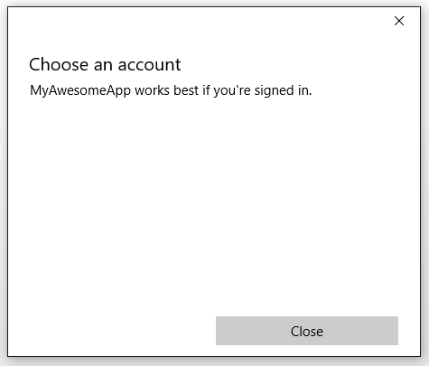

# <a name="web-account-manager"></a>Web Account Manager

In diesem Artikel wird beschrieben, wie Sie mit **[accountsettingspane](https://docs.microsoft.com/uwp/api/Windows.UI.ApplicationSettings.AccountsSettingsPane)** ihre universelle Windows-Plattform-app (UWP) mit externen Identitäts Anbietern wie Microsoft oder Facebook verbinden, indem Sie die Windows 10-Webkonto-Manager-APIs verwenden. Sie erfahren, wie Sie die Berechtigung eines Benutzers anfordern, seinen Microsoft-Konto zu verwenden, ein Zugriffs Token abzurufen und dieses zum Ausführen grundlegender Vorgänge (z. b. Abrufen von Profildaten oder Hochladen von Dateien in das onedrive-Konto) zu verwenden. Die Schritte ähneln denen, die zum Abrufen einer Benutzerberechtigung und für den Zugriff über einen beliebigen Identitätsanbieter ausgeführt werden, der Web Account Manager unterstützt.

> [!NOTE]
> Ein umfassendes Codebeispiel finden Sie im [webaccountmanagement-Beispiel auf GitHub](https://github.com/Microsoft/Windows-universal-samples/tree/master/Samples/WebAccountManagement).

## <a name="get-set-up"></a>Einrichtung

Erstellen Sie zunächst eine neue leere App in Visual Studio. 

Um eine Verbindung mit Identitätsanbietern herzustellen, müssen Sie die App als Nächstes mit dem Store verknüpfen. Klicken Sie dazu mit der rechten Maustaste auf Ihr Projekt, wählen Sie **Store**  >  -**App mit Store verknüpfen**aus, und befolgen Sie die Anweisungen des Assistenten. 

Erstellen Sie drittens eine allgemein verwendete Benutzeroberfläche, die eine einfache XAML-Schaltfläche und zwei Textfelder umfasst.

```XML
<StackPanel HorizontalAlignment="Center" VerticalAlignment="Center">
    <Button x:Name="LoginButton" Content="Log in" Click="LoginButton_Click" />
    <TextBlock x:Name="UserIdTextBlock"/>
    <TextBlock x:Name="UserNameTextBlock"/>
</StackPanel>
```

Im CodeBehind ist ein Ereignishandler an die Schaltfläche angefügt:

```csharp
private void LoginButton_Click(object sender, RoutedEventArgs e)
{   
}
```

Fügen Sie zum Schluss die folgenden Namespaces hinzu, damit später keine Verweisprobleme auftreten: 

```csharp
using System;
using Windows.Security.Authentication.Web.Core;
using Windows.System;
using Windows.UI.ApplicationSettings;
using Windows.UI.Xaml;
using Windows.UI.Xaml.Controls;
using Windows.Data.Json;
using Windows.UI.Xaml.Navigation;
using Windows.Web.Http;
```

## <a name="show-the-accounts-settings-pane"></a>Fenster "Kontoeinstellungen" anzeigen

Das System verfügt über eine integrierte Benutzeroberfläche zum Verwalten von Identitäts Anbietern und Webkonten namens **accountsettingspane**. Sie können sie wie folgt anzeigen:

```csharp
private void LoginButton_Click(object sender, RoutedEventArgs e)
{
    AccountsSettingsPane.Show(); 
}
```

Wenn Sie Ihre App ausführen und auf die Anmeldeschaltfläche klicken, sollte ein leeres Fenster angezeigt werden. 


Der Bereich ist leer, weil das System nur eine UI-Shell bereitstellt. Der Entwickler kann den Bereich programmgesteuert mit Identitätsanbietern auffüllen. 

> [!TIP]
> Optional können Sie **[showaddaccountasync](https://docs.microsoft.com/uwp/api/windows.ui.applicationsettings.accountssettingspane.showaddaccountasync)** anstelle von **[Show](https://docs.microsoft.com/uwp/api/windows.ui.applicationsettings.accountssettingspane.show#Windows_UI_ApplicationSettings_AccountsSettingsPane_Show)** verwenden, wodurch eine **[iasyncaction-Aktion](https://docs.microsoft.com/uwp/api/Windows.Foundation.IAsyncAction)** zurückgegeben wird, um den Status des Vorgangs abzufragen. 

## <a name="register-for-accountcommandsrequested"></a>Registrieren für AccountCommandsRequested

Um dem Bereich Befehle hinzuzufügen, führen wir zunächst eine Registrierung für den AccountCommandsRequested-Ereignishandler durch. Dadurch wird dem System mitgeteilt, dass die buildlogik ausgeführt werden soll, wenn der Benutzer aufgefordert wird, den Bereich anzuzeigen (z. b. Klicken auf unsere XAML-Schaltfläche) 

Überschreiben Sie im CodeBehind das OnNavigatedTo-Ereignis und das OnNavigatedFrom-Ereignis, und fügen Sie ihnen den folgenden Code hinzu: 

```csharp
protected override void OnNavigatedTo(NavigationEventArgs e)
{
    AccountsSettingsPane.GetForCurrentView().AccountCommandsRequested += BuildPaneAsync; 
}
```

```csharp
protected override void OnNavigatedFrom(NavigationEventArgs e)
{
    AccountsSettingsPane.GetForCurrentView().AccountCommandsRequested -= BuildPaneAsync; 
}
```

Da Benutzer nicht sehr häufig mit Konten interagieren, empfiehlt es sich, den Ereignishandler in der beschriebenen Weise zu registrieren bzw. seine Registrierung aufzuheben, um Arbeitsspeicherverluste zu vermeiden. Dadurch wird der angepasste Bereich nur im Arbeitsspeicher vorgehalten, wenn eine hohe Wahrscheinlichkeit vorliegt, dass er vom Benutzer angefordert wird (der Benutzer befindet sich z. B. auf der Seite „Einstellungen“ oder „Anmelden“). 

## <a name="build-the-account-settings-pane"></a>Erstellen des Bereichs mit Kontoeinstellungen

Die buildpaneasync-Methode wird immer dann aufgerufen, wenn **accountsettingspane** angezeigt wird. Dort legen wir den Code zur Anpassung der im Bereich angezeigten Befehle ab. 

Sie beginnen, indem Sie eine Verzögerung abrufen. Dies weist das System an, die **accountorsettingspane** zu verzögern, bis der Vorgang abgeschlossen ist.

```csharp
private async void BuildPaneAsync(AccountsSettingsPane s,
    AccountsSettingsPaneCommandsRequestedEventArgs e)
{
    var deferral = e.GetDeferral();
        
    deferral.Complete(); 
}
```

Als Nächstes rufen Sie einen Anbieter mit der WebAuthenticationCoreManager.FindAccountProviderAsync-Methode ab. Die Anbieter-URL ist je nach Anbieter verschieden und kann in der Anbieterdokumentation nachgeschlagen werden. Bei Microsoft-Konten und Azure Active Directory ist das "HTTPS \: //Login.Microsoft.com". 

```csharp
private async void BuildPaneAsync(AccountsSettingsPane s,
    AccountsSettingsPaneCommandsRequestedEventArgs e)
{
    var deferral = e.GetDeferral();
        
    var msaProvider = await WebAuthenticationCoreManager.FindAccountProviderAsync(
        "https://login.microsoft.com", "consumers"); 
        
    deferral.Complete(); 
}
```

Beachten Sie, dass auch die Zeichenfolge „consumers“ an den optionalen *authority*-Parameter übergeben wird. Dies liegt daran, dass Microsoft zwei verschiedene Authentifizierungsmethoden bereitstellt: Microsoft-Konten (MSA) für „Heimanwender“ und Azure Active Directory (AAD) für „Organisationen“. Die Autorität „consumers“ gibt an, dass die MSA-Option verwendet werden soll. Wenn Sie eine Unternehmens-App entwickeln, verwenden Sie stattdessen die Zeichenfolge „organizations“.

Fügen Sie schließlich den Anbieter der **accountsettingspane** hinzu, indem Sie einen neuen **[webaccountprovidercommand](https://docs.microsoft.com/uwp/api/windows.ui.applicationsettings.webaccountprovidercommand)** wie den folgenden erstellen: 

```csharp
private async void BuildPaneAsync(AccountsSettingsPane s,
    AccountsSettingsPaneCommandsRequestedEventArgs e)
{
    var deferral = e.GetDeferral();

    var msaProvider = await WebAuthenticationCoreManager.FindAccountProviderAsync(
        "https://login.microsoft.com", "consumers");

    var command = new WebAccountProviderCommand(msaProvider, GetMsaTokenAsync);  

    e.WebAccountProviderCommands.Add(command);

    deferral.Complete(); 
}
```

Die getmsatoken-Methode, die wir an unseren neuen **webaccountprovidercommand** weitergegeben haben, ist noch nicht vorhanden (wir erstellen dies im nächsten Schritt). Daher können Sie Sie jetzt als leere Methode hinzufügen.

Führen Sie den vorangehenden Code aus. Der Bereich sollte jetzt wie folgt aussehen: 


### <a name="request-a-token"></a>Anfordern eines Tokens

Wenn die Option "Microsoft-Konto" in " **accounzsettingspane**" angezeigt wird, müssen wir behandeln, was geschieht, wenn der Benutzer die Option auswählt. Die GetMsaToken-Methode wurde so registriert, dass sie ausgelöst wird, wenn sich der Benutzer für die Anmeldung mit seinem Microsoft-Konto entscheidet. Deshalb fordern wir an dieser Stelle das Token an. 

Um ein Token anzufordern, verwenden Sie die RequestTokenAsync-Methode wie folgt: 

```csharp
private async void GetMsaTokenAsync(WebAccountProviderCommand command)
{
    WebTokenRequest request = new WebTokenRequest(command.WebAccountProvider, "wl.basic");
    WebTokenRequestResult result = await WebAuthenticationCoreManager.RequestTokenAsync(request);
}
```

In diesem Beispiel übergeben wir die Zeichenfolge "wl. Basic" an den _Scope_ -Parameter. „scope“ steht für den Typ von Informationen, die Sie vom bereitstellenden Dienst für einen bestimmten Benutzer anfordern. Bestimmte Bereiche ermöglichen nur den Zugriff auf die grundlegenden Informationen eines Benutzers, z. b. Name und e-Mail-Adresse. andere Bereiche gewähren möglicherweise Zugriff auf vertrauliche Informationen, wie z. b. die Fotos oder den e-Mail- Im Allgemeinen sollte Ihre APP den geringsten Gültigkeitsbereich verwenden, der erforderlich ist, um ihre Funktion zu erreichen. Dienstanbieter bieten Dokumentation dazu, welche Bereiche erforderlich sind, um Token für die Verwendung mit Ihren Diensten zu erhalten. 

* Informationen zu Microsoft 365-und Outlook.com-Bereichen finden Sie unter [use the Outlook Rest API (Version 2,0)](/previous-versions/office/office-365-api/api/version-2.0/use-outlook-rest-api). 
* Informationen zu onedrive-Bereichen finden Sie [unter onedrive-Authentifizierung und-Anmeldung](https://dev.onedrive.com/auth/msa_oauth.htm#authentication-scopes). 

> [!TIP]
> Wenn Ihre APP einen Anmelde Hinweis verwendet (zum Auffüllen des Benutzer Felds mit einer Standard-e-Mail-Adresse) oder eine andere spezielle Eigenschaft im Zusammenhang mit dem Anmeldevorgang, können Sie Sie optional in der Eigenschaft **[webtokenrequest. appproperties](https://docs.microsoft.com/uwp/api/windows.security.authentication.web.core.webtokenrequest.appproperties#Windows_Security_Authentication_Web_Core_WebTokenRequest_AppProperties)** auflisten. Dies bewirkt, dass das System die Eigenschaft ignoriert, wenn das Webkonto zwischengespeichert wird, wodurch nicht übereinstimmende Konten im Cache verhindert werden.

Wenn Sie eine Unternehmens-App entwickeln, möchten Sie wahrscheinlich eine Verbindung mit einer Azure Active Directory (AAD)-Instanz herstellen und die Microsoft Graph-API anstelle regulärer MSA-Dienste verwenden. Verwenden Sie in diesem Szenario stattdessen folgenden Code: 

```csharp
private async void GetAadTokenAsync(WebAccountProviderCommand command)
{
    string clientId = "your_guid_here"; // Obtain your clientId from the Azure Portal
    WebTokenRequest request = new WebTokenRequest(provider, "User.Read", clientId);
    request.Properties.Add("resource", "https://graph.microsoft.com");
    WebTokenRequestResult result = await WebAuthenticationCoreManager.RequestTokenAsync(request);
}
```

Im weiteren Verlauf dieses Artikels wird das MSA-Szenario beschrieben, der Code für AAD ist allerdings sehr ähnlich. Weitere Informationen zu AAD/Graph einschließlich eines vollständigen Beispiels auf GitHub finden Sie in der [Microsoft Graph-Dokumentation](https://developer.microsoft.com/graph).

## <a name="use-the-token"></a>Verwenden des Tokens

Die RequestTokenAsync-Methode gibt ein WebTokenRequestResult-Objekt zurück, das die Ergebnisse für Ihre Anforderung enthält. Wenn die Anforderung erfolgreich war, enthält sie ein Token.  

```csharp
private async void GetMsaTokenAsync(WebAccountProviderCommand command)
{
    WebTokenRequest request = new WebTokenRequest(command.WebAccountProvider, "wl.basic");
    WebTokenRequestResult result = await WebAuthenticationCoreManager.RequestTokenAsync(request);
    
    if (result.ResponseStatus == WebTokenRequestStatus.Success)
    {
        string token = result.ResponseData[0].Token; 
    }
}
```

> [!NOTE]
> Wenn Sie beim Anfordern eines Tokens einen Fehler erhalten, stellen Sie sicher, dass Sie die APP mit dem Store verknüpft haben, wie in Schritt 1 beschrieben. Ihre App wird nicht in der Lage sein, ein Token abzurufen, wenn Sie diesen Schritt übersprungen haben. 

Sobald Sie im Besitz des Tokens sind, können Sie darüber die API Ihres Anbieters aufrufen. Im folgenden Code wird die [Microsoft Live-API für Benutzerinformationen](https://docs.microsoft.com/office/) aufgerufen, um grundlegende Informationen über den Benutzer zu erhalten und in der Benutzeroberfläche anzuzeigen. Beachten Sie jedoch, dass es in den meisten Fällen empfehlenswert ist, das Token nach dem Abruf zu speichern und dann in einer separaten Methode zu verwenden.

```csharp
private async void GetMsaTokenAsync(WebAccountProviderCommand command)
{
    WebTokenRequest request = new WebTokenRequest(command.WebAccountProvider, "wl.basic");
    WebTokenRequestResult result = await WebAuthenticationCoreManager.RequestTokenAsync(request);
    
    if (result.ResponseStatus == WebTokenRequestStatus.Success)
    {
        string token = result.ResponseData[0].Token; 
        
        var restApi = new Uri(@"https://apis.live.net/v5.0/me?access_token=" + token);

        using (var client = new HttpClient())
        {
            var infoResult = await client.GetAsync(restApi);
            string content = await infoResult.Content.ReadAsStringAsync();

            var jsonObject = JsonObject.Parse(content);
            string id = jsonObject["id"].GetString();
            string name = jsonObject["name"].GetString();

            UserIdTextBlock.Text = "Id: " + id; 
            UserNameTextBlock.Text = "Name: " + name;
        }
    }
}
```

Die Methode zum Aufrufen verschiedener REST-APIs ist je nach Anbieter verschieden. Informationen zur Verwendung des Tokens finden Sie in der API-Dokumentation des Anbieters. 

## <a name="store-the-account-for-future-use"></a>Speichern Sie das Konto für die spätere Verwendung.

Token sind hilfreich, um sofort Informationen über einen Benutzer abzurufen, in der Regel haben sie jedoch unterschiedliche Ablaufzeiten. MSA-Token sind beispielsweise nur wenige Stunden gültig. Glücklicherweise müssen Sie die **accountionsettingspane** nicht jedes Mal erneut anzeigen, wenn ein Token abläuft. Nachdem Ihre App einmal von einem Benutzer autorisiert wurde, können Sie die Kontoinformationen des Benutzers für die zukünftige Verwendung speichern. 

Verwenden Sie hierzu die **[WebAccount](https://docs.microsoft.com/uwp/api/windows.security.credentials.webaccount)** -Klasse. Ein **Webkonto** wird von derselben Methode zurückgegeben, die Sie zum Anfordern des Tokens verwendet haben:

```csharp
private async void GetMsaTokenAsync(WebAccountProviderCommand command)
{
    WebTokenRequest request = new WebTokenRequest(command.WebAccountProvider, "wl.basic");
    WebTokenRequestResult result = await WebAuthenticationCoreManager.RequestTokenAsync(request);
    
    if (result.ResponseStatus == WebTokenRequestStatus.Success)
    {
        WebAccount account = result.ResponseData[0].WebAccount; 
    }
}
```

Sobald Sie über eine **WebAccount** -Instanz verfügen, können Sie Sie problemlos speichern. Im folgenden Beispiel verwenden wir LocalSettings. Weitere Informationen zur Verwendung von LocalSettings und anderen Methoden zum Speichern von Benutzerdaten finden Sie unter [Speichern und Abrufen von App-Einstellungen und Daten](https://docs.microsoft.com/windows/uwp/app-settings/store-and-retrieve-app-data).

```csharp
private async void StoreWebAccount(WebAccount account)
{
    ApplicationData.Current.LocalSettings.Values["CurrentUserProviderId"] = account.WebAccountProvider.Id;
    ApplicationData.Current.LocalSettings.Values["CurrentUserId"] = account.Id; 
}
```

Anschließend können Sie eine asynchrone Methode wie die folgende verwenden, um zu versuchen, ein Token im Hintergrund mit dem gespeicherten **Webkonto**abzurufen.

```csharp
private async Task<string> GetTokenSilentlyAsync()
{
    string providerId = ApplicationData.Current.LocalSettings.Values["CurrentUserProviderId"]?.ToString();
    string accountId = ApplicationData.Current.LocalSettings.Values["CurrentUserId"]?.ToString();

    if (null == providerId || null == accountId)
    {
        return null; 
    }

    WebAccountProvider provider = await WebAuthenticationCoreManager.FindAccountProviderAsync(providerId);
    WebAccount account = await WebAuthenticationCoreManager.FindAccountAsync(provider, accountId);

    WebTokenRequest request = new WebTokenRequest(provider, "wl.basic");

    WebTokenRequestResult result = await WebAuthenticationCoreManager.GetTokenSilentlyAsync(request, account);
    if (result.ResponseStatus == WebTokenRequestStatus.UserInteractionRequired)
    {
        // Unable to get a token silently - you'll need to show the UI
        return null; 
    }
    else if (result.ResponseStatus == WebTokenRequestStatus.Success)
    {
        // Success
        return result.ResponseData[0].Token;
    }
    else
    {
        // Other error 
        return null; 
    }
}
```

Platzieren Sie die obige Methode direkt vor dem Code, der **accounzsettingspane**erstellt. Wenn das Token im Hintergrund abgerufen wird, muss der Bereich nicht angezeigt werden. 

```csharp
private void LoginButton_Click(object sender, RoutedEventArgs e)
{
    string silentToken = await GetMsaTokenSilentlyAsync();

    if (silentToken != null)
    {
        // the token was obtained. store a reference to it or do something with it here.
    }
    else
    {
        // the token could not be obtained silently. Show the AccountsSettingsPane
        AccountsSettingsPane.Show();
    }
}
```

Da der Tokenabruf im Hintergrund sehr einfach ist, sollten Sie diese Methode verwenden, um Ihr Token zwischen Sitzungen zu aktualisieren, anstatt ein vorhandenes Token zwischenzuspeichern (da das Token jederzeit ablaufen kann).

> [!NOTE]
> Im obigen Beispiel werden nur grundlegende Erfolgs-und Fehlerfälle behandelt. Ihre App sollte auch außergewöhnliche Szenarien berücksichtigen (z. B. wenn ein Benutzer die Berechtigung für die App widerruft oder das Konto aus Windows entfernt) und sie angemessen behandeln.  

## <a name="remove-a-stored-account"></a>Entfernen eines gespeicherten Kontos

Wenn Sie ein Webkonto persistent speichern, können Sie Ihren Benutzern die Möglichkeit einräumen, Ihr Konto mit Ihrer APP zu trennen. Auf diese Weise können Sie die APP effektiv "Abmelden": Ihre Kontoinformationen werden beim Start nicht mehr automatisch geladen. Entfernen Sie zu diesem Zweck zunächst alle gespeicherten Konto-und Anbieter Informationen aus dem Speicher. Anschließend können Sie **[signoutasync](https://docs.microsoft.com/uwp/api/windows.security.credentials.webaccount.SignOutAsync)** aufrufen, um den Cache zu löschen und alle vorhandenen Token, die Ihre APP möglicherweise besitzt, ungültig zu machen 

```csharp
private async Task SignOutAccountAsync(WebAccount account)
{
    ApplicationData.Current.LocalSettings.Values.Remove("CurrentUserProviderId");
    ApplicationData.Current.LocalSettings.Values.Remove("CurrentUserId"); 
    account.SignOutAsync(); 
}
```

## <a name="add-providers-that-dont-support-webaccountmanager"></a>Hinzufügen von Anbietern, die WebAccountManager nicht unterstützen

Wenn Sie die Authentifizierung von einem Dienst in Ihre APP integrieren möchten, der Dienst webaccountmanager-Google + oder Twitter jedoch nicht unterstützt, können Sie den Anbieter trotzdem manuell zu **accountionsettingspane**hinzufügen. Erstellen Sie dazu ein neues webaccountprovider-Objekt, geben Sie einen eigenen Namen und ein. PNG-Symbol an, und fügen Sie es der webaccountprovidercommands-Liste hinzu. Stubcode-Beispiel: 

 ```csharp
private async void BuildPaneAsync(AccountsSettingsPane s, AccountsSettingsPaneCommandsRequestedEventArgs e)
{
    // other code here 

    var twitterProvider = new WebAccountProvider("twitter", "Twitter", new Uri(@"ms-appx:///Assets/twitter-auth-icon.png")); 
    var twitterCmd = new WebAccountProviderCommand(twitterProvider, GetTwitterTokenAsync);
    e.WebAccountProviderCommands.Add(twitterCmd);   
    
    // other code here
}

private async void GetTwitterTokenAsync(WebAccountProviderCommand command)
{
    // Manually handle Twitter login here
}

```

> [!NOTE] 
> Dadurch wird der **accountsettingspane** nur ein Symbol hinzugefügt, und die Methode wird ausgeführt, die Sie beim Klicken auf das Symbol angeben (in diesem Fall gettwitterdekenasync). Sie müssen den Code angeben, durch den die eigentliche Authentifizierung behandelt wird. Weitere Informationen finden Sie unter [Web Authentication Broker](web-authentication-broker.md), der Hilfsmethoden zum Authentifizieren mithilfe von Rest-Diensten bereitstellt. 

## <a name="add-a-custom-header"></a>Hinzufügen eines benutzerdefinierten Headers

Sie können den Bereich mit den Kontoeinstellungen mithilfe der HeaderText-Eigenschaft wie folgt anpassen: 

```csharp
private async void BuildPaneAsync(AccountsSettingsPane s, AccountsSettingsPaneCommandsRequestedEventArgs e)
{
    // other code here 
    
    args.HeaderText = "MyAwesomeApp works best if you're signed in.";   
    
    // other code here
}
```



Halten Sie Headertext kurz und einfach, und vermeiden Sie überflüssige Informationen. Wenn der Anmeldevorgang komplex ist und weitere Informationen angezeigt werden müssen, verknüpfen Sie den Benutzer über einen benutzerdefinierten Link mit einer separaten Seite. 

## <a name="add-custom-links"></a>Hinzufügen von benutzerdefinierten Links

Sie können dem AccountsSettingsPane benutzerdefinierte Befehle hinzufügen, die als Links unter den unterstützten WebAccountProviders angezeigt werden. Benutzerdefinierte Befehle eignen sich hervorragend für einfache Aufgaben in Verbindung mit Benutzerkonten, z. B. das Anzeigen einer Datenschutzrichtlinie oder das Öffnen einer Supportseite, wenn auf Benutzerseite ein Problem auftritt. 

Hier sehen Sie ein Beispiel: 

```csharp
private async void BuildPaneAsync(AccountsSettingsPane s, AccountsSettingsPaneCommandsRequestedEventArgs e)
{
    // other code here 
    
    var settingsCmd = new SettingsCommand(
        "settings_privacy", 
        "Privacy policy", 
        async (x) => await Launcher.LaunchUriAsync(new Uri(@"https://privacy.microsoft.com/en-US/"))); 

    e.Commands.Add(settingsCmd); 
    
    // other code here
}
```


Einstellungsbefehle lassen sich grundsätzlich überall verwenden. Es wird jedoch empfohlen, diese Art Befehle auf die oben beschriebenen intuitiven Kontoszenarien zu beschränken. 

## <a name="see-also"></a>Weitere Informationen

[Windows.Security.Authentication.Web.Core-Namespace](https://docs.microsoft.com/uwp/api/windows.security.authentication.web.core)

[Windows.Security.Credentials-Namespace](https://docs.microsoft.com/uwp/api/windows.security.credentials)

[Accountorsettingspane-Klasse](https://docs.microsoft.com/uwp/api/windows.ui.applicationsettings.accountssettingspane)

[Webauthentifizierungsbroker](web-authentication-broker.md)

[Beispiel für die Webkonto Verwaltung](https://github.com/Microsoft/Windows-universal-samples/tree/master/Samples/WebAccountManagement)

[Lunch Scheduler-App](https://github.com/Microsoft/Windows-appsample-lunch-scheduler)
