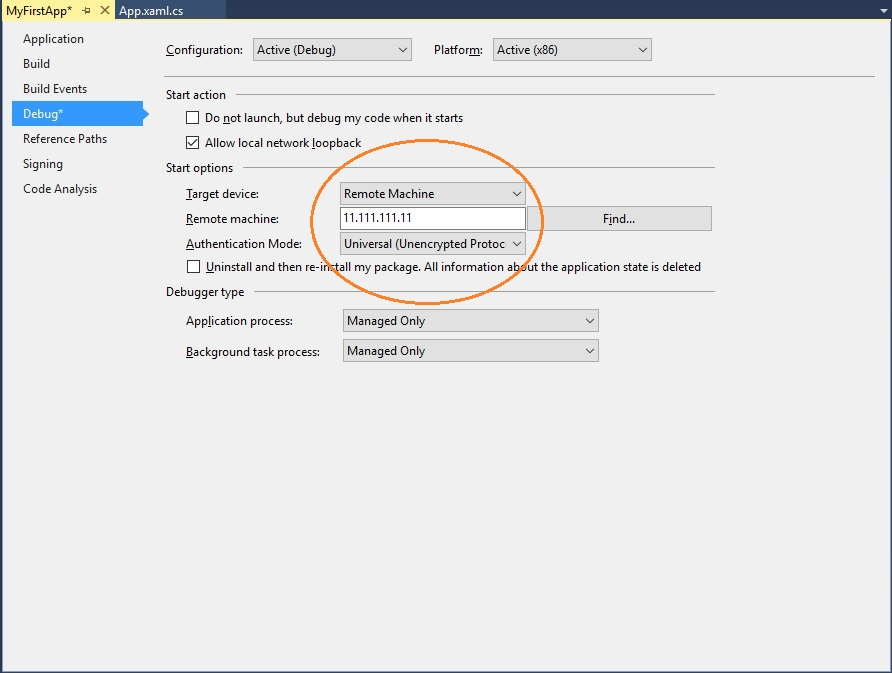

# Einrichten der UWP-Entwicklungsumgebung auf Xbox

Die Umgebung für die UWP-Entwicklung (Universelle Windows-Plattform) auf Xbox besteht aus einem Entwicklungscomputer, der über ein lokales Netzwerk mit einer Xbox One-Konsole verbunden ist.
Der Entwicklungs-PC erfordert Visual Studio 2015 Update 3, Visual Studio 2017 oder Visual Studio 2019.
Der Entwicklungs-PC erfordert auch Windows 10, den Windows 10 SDK-Build 14393 oder höher sowie eine Reihe unterstützter Tools.

In diesem Artikel werden die Schritte zum Einrichten und Testen der Entwicklungsumgebung beschrieben.

## Setup von Visual Studio

1. Installieren Sie Visual Studio 2015 Update 3, Visual Studio 2017 oder Visual Studio 2019. Weitere Informationen und Downloads für die Installation finden Sie unter [Downloads und Tools für Windows 10](https://dev.windows.com/downloads). Es wird empfohlen, dass Sie die neueste Version von Visual Studio verwenden, damit Sie die neuesten Updates für Entwickler und Sicherheit erhalten.

2. Wenn Sie Visual Studio 2017 oder Visual Studio 2019 installieren, stellen Sie sicher, dass Sie die Arbeitsauslastung für die **universelle Windows-Plattform Entwicklung** auswählen. Wenn Sie ein C++-Entwickler sind, stellen Sie sicher, dass Sie auch das Kontrollkästchen **C++ universelle Windows-Plattform Tools** im **Zusammenfassungs** Bereich auf der rechten Seite unter **universelle Windows-Plattform Development**auswählen. Sie ist nicht Teil der Standardinstallation.

    

    Wenn Sie Visual Studio 2015 Update 3 installieren, stellen Sie sicher, dass das Kontrollkästchen **universelle Windows-App-Entwicklungs Tools** aktiviert ist.

    

## Einrichten des Windows 10 SDK

Installieren Sie das aktuelle Windows 10 SDK. Dies ist in Ihrer Visual Studio-Installation der Fall, wenn Sie Sie jedoch separat herunterladen möchten, finden Sie weitere Informationen unter [Windows 10 SDK](https://developer.microsoft.com/windows/downloads/windows-10-sdk).

## Aktivieren des Entwicklermodus

Bevor Sie apps von Ihrem Entwicklungs-PC aus bereitstellen können, müssen Sie den Entwicklermodus aktivieren. Navigieren Sie in der App " **Einstellungen** " zu **Update & Sicherheit**  /  **für Entwickler**, und wählen Sie unter **Entwickler Features verwenden**den **Entwicklermodus**aus.

## Einrichten Ihrer Xbox One

Bevor Sie eine App auf Ihrer Xbox One bereitstellen können, muss ein Benutzer auf der Konsole angemeldet sein. Sie können entweder ein vorhandenes Xbox Live-Konto verwenden oder ein neues Konto für Ihre Konsole im Entwicklermodus erstellen. 

## Erstellen Ihrer ersten App

1. Stellen Sie sicher, dass sich der Entwicklungscomputer in demselben lokalen Netzwerk wie die gewünschte Xbox One befindet. Dies bedeutet normalerweise, dass beide denselben Router verwenden und sich im gleichen Subnetz befinden. Es wird eine drahtgebundene Netzwerkverbindung empfohlen.

2. Stellen Sie sicher, dass sich die Xbox One-Konsole im Entwicklermodus befindet.  Weitere Informationen finden Sie unter [Xbox One Developer Mode Activation](devkit-activation.md).

3. Legen Sie die Programmiersprache fest, die Sie für Ihre UWP-App verwenden möchten.

4. Wählen Sie auf dem Entwicklungs-PC in Visual Studio **neu**> Projekt aus.

5. Wählen Sie im Fenster **Neues Projekt** die Option **Windows Universal/leere app (universelle Windows-APP)** aus.

### Starten eines C#-Projekts

  

1. Wählen Sie im Dialogfeld **Neues universelles Windows-Projekt** in der Dropdown Liste **minimale Version** die Option Build 14393 oder höher aus. Wählen Sie das neueste SDK in der Dropdown Liste **Ziel Version** aus. Wenn das Dialogfeld **Entwicklermodus** angezeigt wird, klicken Sie auf **OK**. Es wird eine neue leere App erstellt.

2. Konfigurieren Sie die Entwicklungsumgebung für das Remotedebuggen:

    a. Klicken Sie im **Projektmappen-Explorer**mit der rechten Maustaste auf das Projekt, und wählen Sie dann **Eigenschaften**aus.

    b. Ändern Sie auf der Registerkarte **Debuggen** die **Plattform** in **x64**. (x86 ist nicht mehr eine unterstützte Plattform auf Xbox.)

    c. Ändern Sie unter **Start Optionen**das **Zielgerät** in **Remote Computer**.

    d. Geben Sie in **Remotecomputer** die System-IP-Adresse oder den Hostnamen der Xbox One-Konsole ein. Informationen zum Ermitteln der IP-Adresse oder des Hostnamens finden Sie unter [Einführung in Xbox One-Tools](introduction-to-xbox-tools.md).

    e. Wählen Sie in der Dropdownliste **Authentifizierungsmodus** den Eintrag **Universell (unverschlüsseltes Protokoll)** aus.

    

### Starten eines C++-Projekts

  

1. Wählen Sie im Dialogfeld **Neues universelles Windows-Projekt** in der Dropdown Liste **minimale Version** die Option Build 14393 oder höher aus. Wählen Sie das neueste SDK in der Dropdown Liste **Ziel Version** aus. Wenn das Dialogfeld **Entwicklermodus** angezeigt wird, klicken Sie auf **OK**. Es wird eine neue leere App erstellt.

2. Konfigurieren Sie die Entwicklungsumgebung für das Remotedebuggen:

   a. Klicken Sie im **Projektmappen-Explorer**mit der rechten Maustaste auf das Projekt, und wählen Sie dann **Eigenschaften**aus.

   b. Ändern Sie **Zu startender Debugger** auf der Registerkarte **Debuggen** in **Remotecomputer**.

   c. Geben Sie in **Computername** die System-IP-Adresse oder den Hostnamen der Xbox One-Konsole ein. Informationen zum Ermitteln der IP-Adresse oder des Hostnamens finden Sie unter [Einführung in Xbox One-Tools](introduction-to-xbox-tools.md).

   d. Wählen Sie in der Dropdownliste **Authentifizierungstyp** den Eintrag **Universell (unverschlüsseltes Protokoll)** aus.

   e. Wählen Sie in der Dropdown-Dropdown- **Plattform** **x64**aus.

    

### Anheften Ihres Geräts mit Visual Studio

1. Speichern Sie die Einstellungen, und stellen Sie sicher, dass sich die Xbox One-Konsole im Entwicklermodus befindet.

2. Wenn Ihr Projekt in Visual Studio geöffnet ist, drücken Sie F5.

3. Wenn dies Ihre erste Bereitstellung ist, werden Sie in einem Dialogfeld in Visual Studio aufgefordert, Ihr Gerät per PIN zu koppeln.

    a. Um eine PIN abzurufen, öffnen Sie auf der Startseite der Xbox One-Konsole **Dev Home**.

    b. Wählen Sie auf der Registerkarte **Startseite** unter **schnelle Aktionen**die Option **Visual Studio-Pin anzeigen**aus.
  
    

    c. Geben Sie im Dialogfeld **Mit Visual Studio koppeln** die PIN ein. Die folgende PIN ist nur ein Beispiel und stimmt nicht mit Ihrer PIN überein.

    

    d. Gegebenenfalls auftretende Bereitstellungsfehler werden im Fenster **Ausgabe** angezeigt.

Herzlichen Glückwunsch! Sie haben Ihre erste UWP-App auf Xbox erfolgreich erstellt und bereitgestellt!

## Weitere Informationen
- [Aktivierung des Xbox One-Entwicklermodus](devkit-activation.md)  
- [Downloads und Tools für Windows 10](https://developer.microsoft.com/windows/downloads)  
- [Windows-Insider-Programm](https://insider.windows.com/)  
- [Einführung in Xbox One-Tools](introduction-to-xbox-tools.md) 
- [UWP auf Xbox One](index.md)