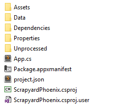

# <a name="unity-version-control-your-uwp-project"></a>Unity: Versionskontrolle für Ihr UWP-Projekt

Sie haben Ihr Unity-Spiel für Xbox noch immer nicht in die universelle Windows-Plattform (UWP) portiert?  Lesen Sie zunächst [Portieren von Unity-Spielen für Xbox auf die UWP](development-lanes-unity.md).

Es gibt verschiedene Gründe dafür, Teile Ihres generierten UWP-Verzeichnisses der Versionskontrolle hinzuzufügen. Hierzu zählt unter anderem das Hinzufügen von Abhängigkeiten (z. B. Xbox Live SDK).  Dieses Szenario wird in diesem Lernprogramm als Beispiel herangezogen und hilft Ihnen hoffentlich dabei, die individuellen Anforderungen Ihres Projekts zu erfüllen.

***Haftungsausschluss: Wir verwenden git als Lösung für die Versionskontrolle.  Wenn Sie sich unterscheiden, sollten die Konzepte weiterhin übersetzt werden.** _

Um den Arbeitsspeicher zu aktualisieren, sieht das Verzeichnis für das Spiel, _*_scrapyardphoenix_*_, wie folgt aus:


Und unser UWP-Verzeichnis sieht wie folgt aus:


In diesem Verzeichnis geht es nur um einen Ordner, den Ordner " _*_scrapyardphoenix_*_ " (fügen Sie hier den Namen Ihres Spiels ein).  Alles andere ist für unsere Versionskontrolle nicht relevant.

_*_Sie sind nicht vertraut, was eine gitignore-Datei ist?  Weitere Informationen finden Sie unter [gitignore](https://git-scm.com/docs/gitignore)._*_

```console
##################################################################
# The original .gitignore file can be found at
# https://github.com/github/gitignore/blob/master/Unity.gitignore
##################################################################

# standard ignores for a Unity Project
...

# ignore the whole UWP directory
/UWP/_*

# except we want to keep... (this line will be modified and removed further down)
!/UWP/ScrapyardPhoenix/
```

Wir möchten einige unterschiedliche Dateien und Ordner aus dem Ordner **UWP/ScrapyardPhoenix** auswählen und unserer Versionskontrolle hinzufügen.  Sehen wir uns das Ganze erst einmal im Detail an:

  

## <a name="folders"></a>Ordner  

| Ordnername | Einstellung | BESCHREIBUNG |
|-------------|---------|-------------|
| `Assets` | **_Include_* _ | Enthält Microsoft Store Bilder |
| `Data` | _*_Ignorieren_*_ | Wenn Unity das Projekt in kompiliert (Szenen, Shader, Skripts, Prefabs usw.) |
| `Dependencies` | _*_Darunter_*_ | Dieser Ordner wurde erstellt, um alle UWP-Abhängigkeiten beizubehalten (z. b. XboxLiveSDK.dll). |
| `Properties` | _*_Darunter_*_ | Enthält erweiterte Einstellungen, die vom Entwickler geändert werden können. |
| `Unprocessed` | _*_Ignorieren_*_ | Enthält Unity `.dll` und `.pdb` Dateien |

## <a name="files"></a>Dateien  

| Ordnername | Einstellung | BESCHREIBUNG |
|-------------|---------|-------------|
| `App.cs` | _*_Einschließen_*_ | Einstiegspunkt für Ihre UWP-Anwendung Diese kann geändert und mit anderen Quelldateien erweitert werden. |
| `Package.appxmanifest` | _*_Darunter_*_ | App-Paket Manifest-Quelldatei für das msix-oder AppX-Paket |
| `project.json` | _*_Darunter_*_ | Beschreibt die nuget-Pakete, von denen Sie `_.csproj` abhängig sind |
| `ScrapyardPhoenix.csproj` | ***Include** _ | Beschreibt das UWP-Buildziel. Wenn Sie dem UWP-Projekt zusätzliche Abhängigkeiten hinzufügen, `_.csproj` enthält diese Datei diese Informationen. |
| `ScrapyardPhoenix.csproj.user` | ***Ignorieren** _ | Diese Datei enthält lokale Benutzerinformationen. |

## <a name="resulting-gitignore"></a>Resultierende GITIGNORE-Datei

```console
##################################################################
# The original .gitignore file can be found at
# https://github.com/github/gitignore/blob/master/Unity.gitignore
##################################################################

# standard ignores for a Unity Project
...

# ignore the whole UWP directory
/UWP/_*

# except we want to keep...
!/UWP/ScrapyardPhoenix/Assets/*
!/UWP/ScrapyardPhoenix/Dependencies/*
!/UWP/ScrapyardPhoenix/Properties/*
!/UWP/ScrapyardPhoenix/App.cs
!/UWP/ScrapyardPhoenix/Package.appxmanifest
!/UWP/ScrapyardPhoenix/project.json
!/UWP/ScrapyardPhoenix/ScrapyardPhoenix.csproj
```

Geschafft: Ihre Teammitglieder sind nun mit dem von Ihnen generierten UWP-Projekt synchronisiert. Nun können Sie Ihrem UWP-Projekt problemlos zusätzliche Ressourcen, Quellen und Abhängigkeiten hinzufügen.

Einige weitere Versionsverwaltungsbeispiele für den UWP-Ordner finden Sie [hier](https://bitbucket.org/Unity-Technologies/windowsstoreappssamples/overview).

## <a name="adding-dependencies-to-your-uwp-app"></a>Hinzufügen von Abhängigkeiten zu Ihrer UWP-App

Fügen Sie Abhängigkeiten zu DLL- und WINMD-Dateien hinzu, indem Sie diese im Unterordner **Unity Assets** des Ordners **Plug-Ins** ablegen und auswählen. Legen Sie anschließend im Paketprüfungstool die Plattform-Zieleinstellungen fest.


**_Scrapyardphoenix (universelles Windows)_** ist das Projekt, zu dem Sie einen Verweis hinzufügen würden, z. b. das Xbox Live SDK.

## <a name="see-also"></a>Weitere Informationen

- [Portieren vorhandener Spiele zu Xbox](development-lanes-landing.md)
- [UWP auf Xbox One](index.md)
