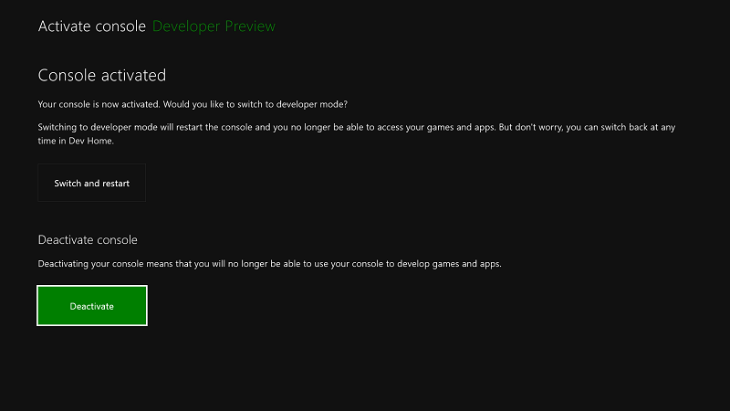

# Deaktivierung des Xbox One-Entwicklermodus

Wenn Sie die Konsole nicht mehr für die Entwicklung verwenden möchten, führen Sie die folgenden Schritte aus, um den Entwicklermodus zu deaktivieren.

## Wechseln zum Einzelhandelsmodus

Setzen Sie zunächst die Xbox One-Konsole in den Einzelhandelsmodus zurück.

1. Öffnen Sie **Dev Home**.

2. Wählen Sie Entwicklungs **Modus verlassen**aus.  Die Konsole wird im Einzelhandelsmodus neu gestartet.  

   

Deaktivieren Sie jetzt die Konsole mithilfe einer der folgenden Methoden.

## Deaktivieren der Konsole mit der DevMode-Aktivierungsapp

Die bevorzugte Methode zum Deaktivieren des Entwicklermodus auf Ihrer Konsole ist die Verwendung der APP **dev Mode Activation** . 

1. Navigieren Sie zu **Games & apps**  >  **apps**.
  
       
   
2.  Öffnen Sie die DevMode-Aktivierungs-App.

3.  Wählen Sie **Deaktivieren**aus.
  
    

Weitere Informationen zur Entwickler **Modus-Aktivierungs** -App finden Sie unter [Xbox One Developer Mode Activation](devkit-activation.md) . 

## Zurücksetzen der Konsole

Sie können den Entwicklermodus auch deaktivieren, indem Sie die Konsole zurücksetzen.  

> [!NOTE]
> Wenn Sie die Konsole zurücksetzen, gehen alle lokal gespeicherten Spieldaten verloren.

Führen Sie zum Zurücksetzen der Konsole die folgenden Schritte aus:

1.  Wechseln Sie zu **My games & apps**.

2.  Wählen Sie **Apps** und dann **Einstellungen**.

3.  Wechseln Sie im linken Bereich zu **System** , und wählen Sie dann im rechten Bereich **Konsolen Informationen** aus.   
   
      
    
4.  Wählen Sie **Konsole zurücksetzen**aus.
    
    
    
5.  Wählen Sie als nächstes alle **Zurücksetzen**aus. Mit dieser Option wird die Konsole in den ursprünglichen Einzelhandelszustand zurückgesetzt.  Alle Apps, Spiele und lokal gespeicherten Daten werden gelöscht. Beachten Sie, dass die Konsole nicht aus dem Entwicklerprogramm gelöscht wird, wenn Sie die andere Option, **Reset and keep my games & apps**, auswählen.  
   
    

## Deaktivieren der Konsole mithilfe von Partner Center

Wenn Sie aus irgendeinem Grund auf Ihre Konsole nicht zugreifen können, können Sie auch den Entwicklermodus in der Konsole mithilfe von Partner Center deaktivieren.

1. Navigieren Sie in Partner Center zur Seite [Xbox One-Konsolen verwalten](https://partner.microsoft.com/xboxconfig/devices) . Sie werden unter Umständen aufgefordert, sich anzumelden.

2. Suchen Sie in der Liste der Konsolen die Konsole, die Sie deaktivieren möchten, anhand der Seriennummer, Konsolen-ID oder Geräte-ID.  

3. Klicken Sie auf **Deaktivieren**.  
  

Wenn Sie Ihre Xbox One-Konsole nicht bereits in den Einzelhandels Modus zurückgeschaltet haben, können Sie dies jetzt tun, wie in [Wechsel zum Einzelhandels Modus](#switch-to-retail-mode)beschrieben.

## Weitere Informationen
- [Aktivierung des Xbox One-Entwicklermodus](devkit-activation.md)
- [UWP auf Xbox One](index.md)
