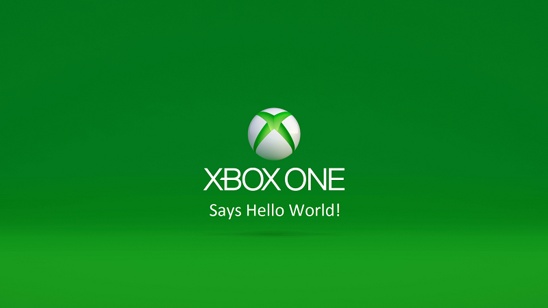

# Erste Schritte bei der Entwicklung von UWP-Apps auf Xbox One

Führen Sie die folgenden Schritte **sorgfältig** aus, um Ihren PC und Xbox One erfolgreich für die Entwicklung für die Universelle Windows-Plattform einzurichten. Lesen Sie nach der Einrichtung die Seite [UWP für Xbox One](index.md), um mehr über den Entwicklermodus auf Xbox One und das Erstellen von UWP-Apps zu erfahren. 

## Vorbereitung

Bevor Sie beginnen, müssen Sie die folgenden Schritte ausführen:
-   Richten Sie einen PC mit der neuesten Version von Windows 10 ein.
<!-- -  Install Microsoft Visual Studio 2015 Update 3 or Microsoft Visual Studio 2019.

    > [!NOTE]
    > Visual Studio 2019 is required if you are using the Windows 10, build 15063 SDK. -->

- Sorgen Sie für mindestens 5 GB freien Speicherplatz auf Ihrer Xbox One.

## Einrichten des Entwicklungs-PCs

1.  Installieren Sie Visual Studio 2015 Update 3, Visual Studio 2017 oder Visual Studio 2019.

    Wenn Sie Visual Studio 2015 Update 3 installieren, stellen Sie sicher, dass Sie **benutzerdefinierte** Installation auswählen, und aktivieren Sie das Kontrollkästchen **universelle Windows-App-Entwicklungs Tools** – es ist nicht Teil der Standardinstallation. Achten Sie als C++-Entwickler darauf, **Benutzerdefinierte Installation** auszuwählen. Wählen Sie **C++** aus.

    Wenn Sie Visual Studio 2017 oder Visual Studio 2019 installieren, stellen Sie sicher, dass Sie die Arbeitsauslastung für die **universelle Windows-Plattform Entwicklung** auswählen. Wenn Sie ein C++-Entwickler sind, stellen Sie im **Zusammenfassungs** Bereich auf der rechten Seite unter **universelle Windows-Plattform Development**sicher, dass Sie das Kontrollkästchen **C++ universelle Windows-Plattform Tools** aktivieren. Sie ist nicht Teil der Standardinstallation.

    Weitere Informationen finden Sie unter [Einrichten der UWP in der Xbox-Entwicklungsumgebung](development-environment-setup.md).

2.  Installieren Sie das neueste [Windows 10-SDK](https://developer.microsoft.com/windows/downloads/windows-10-sdk).

3.  Aktivieren Sie den Entwicklermodus für ihren Entwicklungs-PC (**Einstellungen/Update & Sicherheit/für Entwickler/verwenden Sie Entwickler Features/Entwicklermodus**).

Nachdem Ihr Entwicklungs-PC nun bereit ist, können Sie dieses Video ansehen oder fortfahren, um zu erfahren, wie Sie Ihre Xbox One für die Entwicklung einrichten und eine UWP-App für die Entwicklung erstellen und bereitstellen.
 
 
<iframe src="https://channel9.msdn.com/Events/Xbox/App-Dev-on-Xbox/Get-started-with-App-Dev-on-Xbox/player#time=51s:paused" width="600" height="338"  allowFullScreen frameBorder="0"></iframe>

## Einrichten Ihrer Xbox One-Konsole

1.  Aktivieren Sie den Entwicklermodus auf der Xbox One. Laden Sie die APP herunter, erhalten Sie den Aktivierungscode, und geben Sie Sie dann in Ihr Partner Center-App-Entwicklerkonto auf der Seite " **Xbox One-Konsolen verwalten" ein** . Weitere Informationen finden Sie unter [Xbox One Developer Mode Activation](devkit-activation.md). 

2.  Öffnen Sie die Entwickler **Modus-Aktivierungs** -APP, und wählen Sie **Switch und Restart**aus. Herzlichen Glückwunsch! Ihre Xbox One befindet sich nun im Entwicklermodus.
  
  > [!NOTE]
  > Ihre Einzelhandelsspiele und -Apps werden im Entwicklermodus nicht ausgeführt, die von Ihnen erstellten Apps oder Spiele werden jedoch ausgeführt. Wechseln Sie zurück in den Einzelhandelsmodus, um Ihre Lieblingsspiele und -Apps auszuführen.
    
  > [!NOTE]
  > Damit Sie eine App auf der Xbox One-Konsole im Entwicklermodus bereitstellen können, muss ein Benutzer an der Konsole angemeldet sein. Sie können entweder ein vorhandenes Xbox Live-Konto verwenden oder ein neues Konto für Ihre Konsole im Entwicklermodus erstellen. 

## Erstellen Ihres ersten Projekts in Visual Studio

Ausführlichere Informationen finden Sie unter [Einrichten der UWP in der Xbox-Entwicklungsumgebung](development-environment-setup.md).

1.  **Für c#**: Erstellen Sie ein neues universelles Windows-Projekt, und klicken Sie im **Projektmappen-Explorer**mit der rechten Maustaste auf das Projekt, und wählen Sie **Eigenschaften**aus. Wählen Sie die Registerkarte **Debuggen** aus, ändern Sie **Zielgerät** zu **Remote Computer**, geben Sie die IP-Adresse oder den Hostnamen Ihrer Xbox One-Konsole in das Feld **Remote Computer** ein, und wählen Sie in der Dropdown Liste **Authentifizierungsmodus** die Option **Universal (unverschlüsseltes Protokoll)**   

    Die IP-Adresse Ihrer Xbox One finden Sie, indem Sie Dev Home auf der Konsole starten (die große Kachel auf der rechten Seite der Startseite) und in der oberen linken Ecke suchen. Weitere Informationen zu Dev Home finden Sie unter [Einführung in Xbox One-Tools](introduction-to-xbox-tools.md).  

2.  **Für C++-und HTML/JavaScript-Projekte**verwenden Sie einen ähnlichen Pfad wie c#-Projekte. wechseln Sie in den Projekteigenschaften zur Registerkarte **Debuggen** , wählen Sie im Debugger **Remote Computer** aus, um die Dropdown Liste zu öffnen, geben Sie die IP-Adresse oder den Hostnamen der Konsole **in das** Feld **Computer Name** ein, und wählen Sie im Feld **Authentifizierungstyp** die Option

3. Wählen Sie **x64** in der Dropdown Liste links neben der grünen Wiedergabe Schaltfläche in der oberen Menüleiste aus.
   
4.  Wenn Sie F5 drücken, wird Ihre App erstellt, und die Bereitstellung auf der Xbox One wird gestartet.
  
5.  Wenn Sie diesen Vorgang zum ersten Mal durchführen, fordert Visual Studio Sie zur Eingabe einer PIN für Ihre Xbox One auf. Sie können eine PIN erhalten, indem Sie dev Home auf Ihrer Xbox One starten und die Schaltfläche **Visual Studio-Pin anzeigen** auswählen.
  
6.  Nach der Kopplung wird die Bereitstellung der App gestartet. Beim ersten Mal kann diese Bereitstellung ein wenig langsam sein (da alle Tools auf Ihre Xbox kopiert werden müssen). Wenn dieser Vorgang jedoch länger als wenige Minuten dauert, ist wahrscheinlich ein Problem aufgetreten. Stellen Sie sicher, dass Sie alle oben genannten Schritte ausgeführt haben – haben Sie den **Authentifizierungsmodus** auf **Universell** festgelegt? Vergewissern Sie sich außerdem, dass Sie eine drahtgebundene Netzwerkverbindung mit der Xbox One verwenden.  

7. Lehnen Sie sich nun ganz entspannt zurück. Viel Spaß mit Ihrer ersten App auf der Konsole!  

## Das war's.

## Weitere Informationen  
- [Häufig gestellte Fragen](frequently-asked-questions.md)  
- [Bekannte Probleme mit UWP im Zusammenhang mit dem Xbox-Entwicklerprogramm](known-issues.md)
- [UWP auf Xbox One](index.md) 
